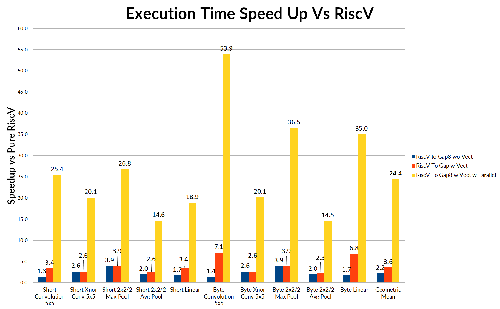
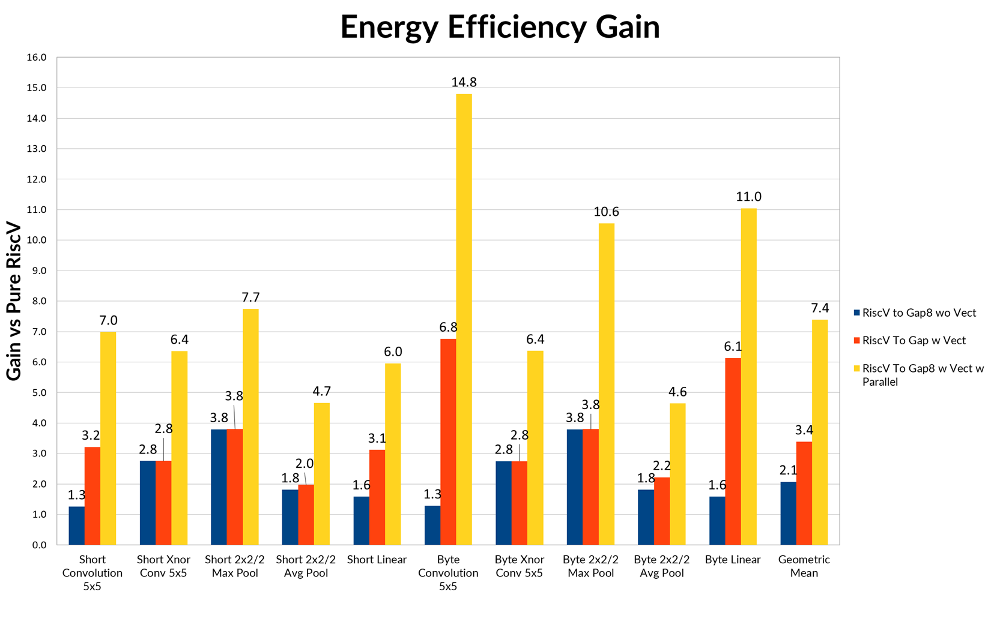
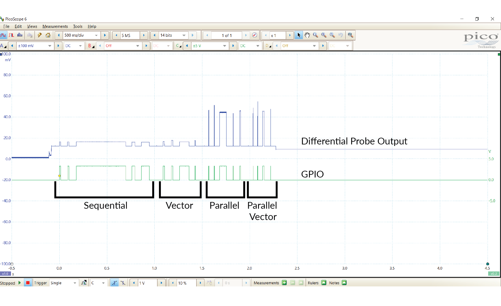

# GAP8 CNN Benchmarks

The GAP8 CNN Benchmark package provides a test suite to evaluate the performance and energy efficiency of GAP8's cluster on a representative subset of Convolution Neural Networks (CNN) Layers. This guide shows you how to run the benchmarks and check cycle and energy results.

## Benchmarks Description

Here the list of benchmarks in this test suite:

- 2x2 stride 2 Max Pooling Layer
- 2x2 stride 2 Average Pooling Layer
- 5x5 stride 1 Convolutional Layer
- 5x5 stride 1 Xnor Convolutional Layer
- Linear (Fully Connected) Layer

The benchmarks can be executed in 2 scenarios:

1. Pure RISC-V Standard ISA - Provides a baseline performance for a non-optimized core.
2. GAP8 ISA (RISC-V Std ISA + Gap8 ISA extensions \*)
    - Single Core
    - Single Core with Vectorization (Byte or Short)
    - Parallel (8 Cores) with Vectorization (Byte or Short)

In the second scenario we show the three optimizations that Gap8 has with respect to pure RISC-V single core: ISA extensions, vector units and cluster cores.

Each GAP8 Cluster core embeds a vector unit capable of 4 byte operations or 2 short operations per cycle*.

\* A list of all ISA extensions of GAP8 can be found in section "Device components description" of the [GAP8 Reference Manual](https://greenwaves-technologies.com/sdk-manuals/)

## Benchmarks Results

The performance and energy results measured on the GAPuino Board are reported in this section. In following sections we explain how to reproduce these results with your GAPuino Board.

The following chart shows the execution time speed-up of GAP8. The baseline is the Pure RISC-V ISA. All the experiment were conducted on a GAPuino Board.

As we can see GAP8 benefits from all the 3 optimization steps: Gap8 ISA extensions, vectorization and parallelization. The combined speed up is between 14.5x and 53.9x. Which means that, for instance, at max GAP8 frequency **for a 5x5 byte convolutional layer on a 112x112 grayscale input image with 100 output filters, on GAP8 it takes only 12.8 ms while on a single core standard RISC-V ISA 729.4 ms**.

The next analysis shows the energy efficiency gain with respect to pure RISC-V Standard ISA.

Here the results shows that for a given benchmark, we have a benefit from the GAP8 ISA extensions (blue bar), from the vector units (red bar) and from parallelism (yellow bar). The parallelism, exploiting shared instruction cache and shared memory, gives an additional ~2x gain in energy efficiency.

## How to run the Benchmarks

To run the benchmarks with RISC-V Std ISA + Gap8 ISA extensions you can just type:

~~~sh
$ make clean all run
~~~

This will be the output that you get:

~~~sh

                      --------------------------------------------------------
                      --------------------------------------------------------
                      ---------------   GAP8 benchmarks   --------------------
                      --------------------------------------------------------
                      --------------------------------------------------------

Gap8 Input Voltage    : 1.2 Volts
Fabric Controller Freq: 250 MhZ
Cluster  Freq         : 175 MhZ

Number of iterations for each benchmark: 100

                      ---------------        Sequential   ---------------
                2x2/2 Max Pool Input: 112x112 (x100 iterations) Time:      14557 uSec. Cycles:    2573762
                2x2/2 Avg Pool Input: 112x112 (x100 iterations) Time:      14527 uSec. Cycles:    2573659
              5x5 Convolutions Input: 112x112 (x100 iterations) Time:     520813 uSec. Cycles:   92241320
                        Linear Input: 1024x16 (x100 iterations) Time:      32532 uSec. Cycles:    5765099
                 Xnor Conv 5x5 Input: 100x100 (x100 iterations) Time:      80994 uSec. Cycles:   14349428

                      ---------------            Vector   ---------------
                2x2/2 Max Pool Input: 112x112 (x100 iterations) Time:      16174 uSec. Cycles:    2864082
                2x2/2 Avg Pool Input: 112x112 (x100 iterations) Time:      12696 uSec. Cycles:    2249276
              5x5 Convolutions Input: 112x112 (x100 iterations) Time:     100067 uSec. Cycles:   17741015
                        Linear Input: 1024x16 (x100 iterations) Time:       8270 uSec. Cycles:    1465880

                      ---------------          Parallel   ---------------
                2x2/2 Max Pool Input: 112x112 (x100 iterations) Time:       2167 uSec. Cycles:     382837
                2x2/2 Avg Pool Input: 112x112 (x100 iterations) Time:       2136 uSec. Cycles:     380589
              5x5 Convolutions Input: 112x112 (x100 iterations) Time:      72052 uSec. Cycles:   12810568
                        Linear Input: 1024x16 (x100 iterations) Time:       4425 uSec. Cycles:     790475
                 Xnor Conv 5x5 Input: 100x100 (x100 iterations) Time:       9704 uSec. Cycles:    1729797

                      ---------------   Parallel Vector   ---------------
                2x2/2 Max Pool Input: 112x112 (x100 iterations) Time:       2014 uSec. Cycles:     355563
                2x2/2 Avg Pool Input: 112x112 (x100 iterations) Time:       1861 uSec. Cycles:     332328
              5x5 Convolutions Input: 112x112 (x100 iterations) Time:      12848 uSec. Cycles:    2281309
                        Linear Input: 1024x16 (x100 iterations) Time:       1252 uSec. Cycles:     223484

~~~

### To run the benchmarks in pure RISC-V Standard ISA mode (only single core)

~~~sh
make clean all run RISCV_FLAGS="-march=rv32imc -DRISCV"
~~~

### Change Benchmarks Parameters

To switch input data between Byte and Short a define has been placed at beginning of AllTest.c file. Comment it out to test it with shorts.

~~~sh
#define BYTE
~~~

To change the number of iterations executed by each benchmark you can change the value of this define:

~~~sh
#define ITERATIONS 100
~~~

To change Fabric Controller and Cluster Frequencies you can use following defines. Both of then can be powered at 1 or 1.2 Volts.

~~~c
#define ALIM_1_VOLT 1
#define FREQ_FC (50 * 1000000)
#define FREQ_CL (50 * 1000000)
~~~

Here is a table of the supported maximum frequencies:

| Input Voltage | Fabric Controller Max Freq | Cluster Max Freq   |
|    ---        |           ---              |         ---        |
| 1.0 V         |             150 MhZ        |           90 MhZ   |
| 1.2 V         |             250 MhZ        |          175 MhZ   |

## How to measure Power Consumption on the GAPuino Board

The energy consumed by each benchmark can be measured using a differential probe connected to an oscilloscope. The differential probe is connected to the tests point 5 and 6 (TP5 and TP6). A 1 Ohm resistor is already placed between the two test points on the board. Before each kernel is launched the benchmark asserts the GPIO 17 and once each single benchmark is finished de-asserts it. So this GPIO can be used as trigger for the energy measurements. In the following figure a description of the physical pins on Gapuino board:

To enable the GPIO PIN this define should be commented out:

~~~c
#define NOGPIO
~~~

The results presented in the previous section are sampled with a PicoScope 4444 using 1 probe connected to GPIO 17 and 1 differential probe to measure the voltage drop. The voltage drop can be directly converted to current thanks to the 1 Ohm resistor (I = V / R, where R is 1).

Here an example of the PicoScope output screen of the benchmarks:

The GPIO indicates the starting and ending point of each benchmark. Using the measurement tool of the picoscope user interface the user can then measure the mean energy of each benchmark, exploiting the GPIO to correctly position the starting and ending point. 
