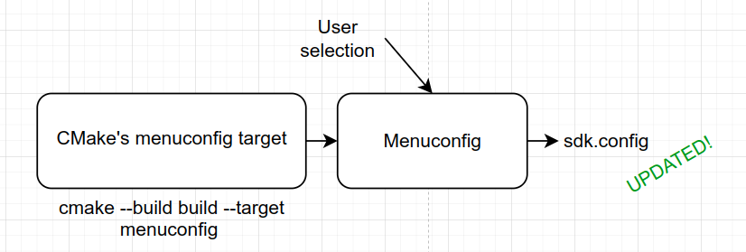
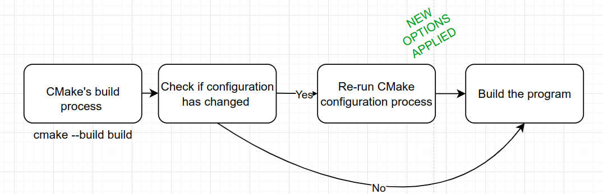

.. _How to use CMake guide:

How to use CMake
================

Description
-----------

CMake is a cross-platform tool that manages the build process of a software. 
It intends to be an alternative way to build the SDK compared to actual Makefile way.
CMake process is performed in two steps :

- Configuration: Setup cmake environnement. 
- Build: Building the software using a specific build system (Unix Makefile, MinGW Makefile, Ninja, Visual Studio, ...)

In this release, CMake is implemented with FreeRTOS and GVSOC.

Prerequisites
-------------

- Please run the sourceme.sh script before using Cmake. Select the GAP9_V2 configuration.

Use CMake to build your application
-----------------------------------

In order to configure your application with CMake, you  need first to create a ``CMakeList.txt`` file next to it.

This file intends to tells CMake what are your application's sources then call SDK's root CMakeList.txt file. 

This file must be implemented as the following way.

Please, have a look to the hello example before continuing this guide : ``gap_sdk/rtos/pmsis/tests/api/quick/hello``
Basically, you must adapt the "Panel control" section to your application. 
Here is a more detailled description of what does this file :

- In the "panel control" section, you need to specify your application name in the macro ``TARGET_NAME`` and add your application's source in the macro ``TARGET_SRCS``. 
- The "CMake pre initialization" section will call for CMake files that setup the environnement :
-  
    - Build menuconfig target
    - Select flags depending on what board is used.
    - Find RISCV toolchain
   
- The "App's options interpretation" section consists in read the output of the KConfig configuration. For more information, check :ref:`Kconfig guide`
- Finally, the "CMake post initialization" section will setup the follwing features:
  
    - Setup the OS (set name and path to call the dedicated CMakeList.txt file)
    - Link OS's CMake library to your application
    - Find GAPY tool
    - Build targets such as ``dump_dis`` ``dump_size`` ``image`` ``flash`` and ``run``

CMake commands
--------------

To compile your project with CMake, you need to run the following commands :

- ``cmake -B <name_of_your_binary_directory>`` Configure CMake in the specified directory. It is usually : ``cmake -B build``
- ``cmake --build <name_of_your_binary_directory> --target menuconfig`` Run the SDK configuration step. It calls for menuconfig interface. Here you can select what options you want for your application. See :ref:`Kconfig guide` for more informations.
- ``cmake --build <name_of_your_binary_directory> --target run`` Build your application then run it.

Here is a graphical view detailling what these three steps do. 

- Step 1
 
.. image:: ../images/cmake_step1.png
   :width: 800
   :alt: CMake Step1

- Step 2
 

- Step 3

