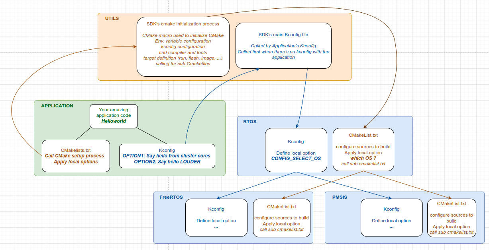

.. _Kconfig guide:

How to use Kconfig
==================

Description
-----------

KConfig is a language that describe application's settings. It is used here to describe how we want the SDK to behave. 

KConfig comes with a graphical interface, menuconfig, to configure these settings according to your application. 

This release of KConfig features works only by building your application with CMake. See :ref:`How to use CMake guide` guide for more information

Prerequisites
-------------

- Kconfig uses ``GAP_SDK_HOME`` environnement. Be sure that it has been set before running menuconfig command. 
- You need to add export the following environnement variable. Please add it to your .bashrc or its equivalent.

.. code-block:: shell 

    export KCONFIG_CONFIG="sdk.config"

How it works
------------

Menuconfig graphical interface is built from SDK's Kconfig files. Each one describes a list of options. It is recommended to distributed KConfig options into several Kconfig files, one per SDK stage. 

KConfig files are organized as a tree. It means that a root Kconfig file will call sub Kconfig file and so on. At the end, all Kconfig file's content will be visible from menuconfig interface.  

Here is an example of a KConfig file related to the RTOS folder of the SDK. 

.. code-block:: shell 

    menu "RTOS Menu"
        choice PMSIS_OS
            prompt "OS Selection"
            config PMSIS_OS_FREERTOS
                bool "Freertos"
                help
                    Select FreeRTOS as GAP SDK OS. Default value
            config PMSIS_OS_PULPOS
                bool "Pulpos"
                help
                    Select Pulp OS as GAP SDK OS
        endchoice
        if PMSIS_OS_FREERTOS
            source "$(GAP_SDK_HOME)/rtos/freeRTOS/Kconfig"        
        endif
        if PMSIS_OS_PULPOS
            # TODO: Source PulpOS Kconfig here 
        endif
        menu "PMSIS Menu"
            source "$(GAP_SDK_HOME)/rtos/pmsis/Kconfig"
            source "$(GAP_SDK_HOME)/rtos/freeRTOS/vendors/gwt/gap9/pmsis/Kconfig"
            source "$(GAP_SDK_HOME)/rtos/freeRTOS/vendors/gwt/pmsis/rtos/Kconfig"
        endmenu
        source "$(GAP_SDK_HOME)/rtos/pmsis/bsp/Kconfig"
    endmenu

Menuconfig interface is executed from CMake command. See :ref:`How to use CMake guide` guide for more information. 
Here, you can select what options you want to set for your application. 

Once you are done, Menuconfig produces an output file named ``sdk.config``. This file described all enabled options. 

Here is an example of what the sdk.config file look like

.. code-block:: shell

    #
    # Helloworld Menu
    #
    CONFIG_HELLOWORLD_CLUSTER=y
    # end of Helloworld Menu
    #
    # GAP SDK Menu
    #
    # General options
    #
    CONFIG_CHIP_FAMILY_GAP9=y
    # CONFIG_CHIP_FAMILY_GAP8 is not set
    CONFIG_PLATFORM_GVSOC=y
    # CONFIG_PLATFORM_BOARD is not set
    CONFIG_BOARD_GAP9_EVK=y
    # CONFIG_BOARD_GAP9_EVK_AUDIO_ADDON is not set
    # CONFIG_BOARD_GAP9_V2 is not set

Then, CMake uses a python script to parse this output file to be able to read it. Basically, it consists in setting variable to a specific value in a new file named ``cmake.config``

Here is an example of what ``cmake.config`` look like:

.. code-block:: shell

    # Helloworld Menu
    set(CONFIG_HELLOWORLD_CLUSTER y)
    # GAP SDK Menu
    set(CONFIG_CHIP_FAMILY_GAP9 y)
    set(CONFIG_PLATFORM_GVSOC y)
    set(CONFIG_BOARD_GAP9_EVK y)

These variables are then tested in CMake configuration process to add sources to compile of add flags to the compilation process. 

How to add a new option
-----------------------

Depending on what is the purpose of your option, you need first to identify where it belong. Usually, it will be discribed in a Kconfig file located next to the files that will be impacted by your option. 

- Assuming that you will create an option for a SDK's software component that has not been covered yet, you need first to create the Kconfig file. 
- In it, create a ``menu`` with a revelant name and describe your options. Check "Resources" section to learn kconfig syntax.
- Then, you need to link your new Kconfig file with an existing one that will be its parent using the ``source`` keyword. At this point, your options are visible in the menuconfig interface.
- Then you need to apply effects related to your option. In a CMakeLists.txt file located next to your Kconfig file and your option's related source files, you can check your option in the following way :
  
.. code-block:: shell

    if(DEFINED CONFIG_<your_option_name>)
        #Add flag
        target_compile_options(<your_target> PRIVATE "-Dyour_flag")
        list(APPEND TARGET_SOURCE_FILES "another_src_file_to_compile.c")
    endif()

In the helloworld example, An option consists in enabling cluster cores to print hello as the fabric controller.  

.. code-block:: shell

    if(DEFINED CONFIG_HELLOWORLD_CLUSTER)
        message(STATUS "[${TARGET_NAME} Options] Cluster enabled")
        target_compile_options(${TARGET_NAME} PRIVATE "-DCONFIG_HELLOWORLD_CLUSTER=1")
    else()
        message(STATUS "[${TARGET_NAME} Options] Cluster disabled")
    endif()

.. warning:: 

        During the generation of sdk.config, all options name are prepend by ``CONFIG_``. Please don't forget to add it while testing your options in CMakeList files.
        In the future this feature can be canceled in the python parsing process. 

In the helloworld example, the flag ``CONFIG_HELLOWORLD_CLUSTER`` is then tested in a #ifdef preprocessor macro. 

.. code-block:: c
    
    #if defined(CONFIG_HELLOWORLD_CLUSTER)
    void pe_entry(void *arg)
    {
        printf("Hello from (%d, %d)\n", pi_cluster_id(), pi_core_id());
    }

    void cluster_entry(void *arg)
    {
        pi_cl_team_fork(0, pe_entry, 0);
    }
    #endif

    static int test_entry()
    {
    #if defined(CONFIG_HELLOWORLD_CLUSTER)
        struct pi_device cluster_dev;
        struct pi_cluster_conf cl_conf;
        struct pi_cluster_task cl_task;

        pi_cluster_conf_init(&cl_conf);
        pi_open_from_conf(&cluster_dev, &cl_conf);
        if (pi_cluster_open(&cluster_dev))
        {
            return -1;
        }
        pi_cluster_send_task_to_cl(&cluster_dev, pi_cluster_task(&cl_task, cluster_entry, NULL));
        pi_cluster_close(&cluster_dev);
    #endif

        printf("Hello\n");

        return 0;
    }

    static void test_kickoff(void *arg)
    {
        int ret = test_entry();
        pmsis_exit(ret);
    }

    int main()
    {
        return pmsis_kickoff((void *)test_kickoff);
    }

Create options related to your application
------------------------------------------

When it is about creating options for your application, you need to understand how Kconfig files include each others. 
During its configuration process, CMake search for the "Root Kconfig" a.k.a the main one.
It can be the SDK one located in utils/kconfig/ directory or the application one located next to
your application. In this last scenario, application Kconfig must call for the SDK one with the "source" keyword.
Otherwise, You will not see any option in your menuconfig interface. 
Then, SDK's kconfig will call for sub kconfig files as seen before. 

Check hello example's Kconfig file located here in the SDK : rtos/pmsis/tests/api/quick/hello/Kconfig

Here is an schematic about how Kconfig and Cmake files are organized in the SDK : 

Resources
---------

Kconfig documentation : https://www.kernel.org/doc/html/latest/kbuild/kconfig-language.html