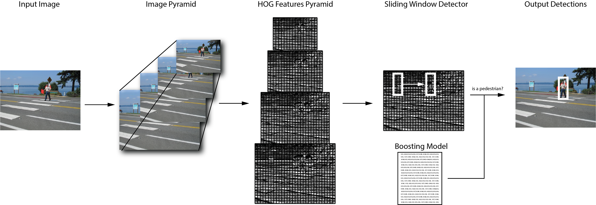

# Pedestrian Detection (HoG)

## Introduction

The Pedestrian detection example included in the GAP8 SDK is implemented using a fixed point implementation of Histogram of Oriented Gradients (HOG) (See citation 1 below). The machine learning scheme used to classify HoG descriptor is a window-based boosting technique (See citation 2 below). [Figure 1] shows an algorithm overview.

{ width=500px }

The diagram shows the main steps of Pedestrian Detection on GAP8. First the image is sub-sampled multiple times to create an pyramid of images. Then on each layer of the pyramid the HOG features are computed. A fixed size sliding windows detector is employed on each of the feature pyramid layers to determine if the features window belongs to a pedestrian or not. The detector compares the feature with a pre-trained model with a fast boosted decision tree scheme.

### Histogram of Oriented Gradients (HoG)

Histogram of oriented gradients (HOG) is a well known features extractor algorithm. The algorithm is composed of two hierarchical parts. The image is divided in tiles (in this example 8 x 8 pixels) called Cells and then on each cell the Histogram of Gradients is computed on 9 different angles. Thus the histogram has 9 bins.

Once this step is done for each cell, the cells are grouped in blocks (in this example 2 x 2 cells with stride of one cell). For each block the feature is normalized and an output of 36 bins (4 * 9) is produced.

For a more detailed explanation of the algorithm you can refer to these resources:

* [Learn OpenCV Website](https://www.learnopencv.com/histogram-of-oriented-gradients/)
* [Original Dalal and Triggs Paper](http://ieeexplore.ieee.org/document/1467360/)

### Sliding Window Detector

The sliding windows detector tests for the existence of a pedestrian in each location in the input feature with a given stride. The windows is 128 x 64 pixels which gives a feature size of 3780 values. The machine learning algorithm used to classify pedestrians is based on small boosted trees.

\newpage

## What in this Folder:

Application files:

| Name                |         Description             |
|---------------------|---------------------------------|
|Main.c               | Application entry code          |
|Makefile             | Makefile of the application     |
|HoGParameters.h      | HOG configuration parameters    |
|Pedestrian.ppm       | A sample input image            |
|HoGIO {.c .h}        | PPM/PGM img format handle       |
|HyperFlashFS {.c .h} | Flash API to load the image     |
|helper.h             | I/O helper functions            |
|BoostModel.h         | Boosting model                  |
|Boosting.h           | Boosting typedefs               |
|README.md            | This read me file               |

Auto-tiler files:

| Name                           |         Description             |
|--------------------------------|---------------------------------|
|HoGBoostingModelExample.c       | Generator caller                |
|HoGBoostingGenerator {.c .h}    | Auto-tiler model                |
|HoGBasicKernels {.c .h}         | HOG basic kernels               |
|HoGBoostingBasicKernels {.c .h} | Boosting basic kernels          |

## How to Build and Execute the Application

Please configure your shell for the SDK by running the `GAP` command as indicated in the GAP8 SDK Getting Started Guide.

To run the example using the simulator type:

~~~~~sh
make clean all run
~~~~~

The make file calls the auto-tiler to generate the kernel calls and then runs the application on the simulator.

## Auto-Tiler Code Generation

To generate the code for the auto-tiler we need to think at the data-flow of the algorithm and how this can be stacked up on the basis of its data flow.

The application is composed of two main parts: the HoG feature computation and the detection made by an boosting algorithm on several feature images. These two parts are presented in the following sections.

### HOG

#### Auto-tiler Model

The HoG feature extraction model is divided into two User Kernels, grouped in a kernel group, we explain this architecture below.

HoG has two different tile sizes to work on. The first one is the cells, usually (but not limited to) 8 x 8 pixels on which the histograms are computed. The second one are the blocks, a group of cells (usually but not limited to 2 x 2 cells, so 16 x 16 px). In order to have a HoG feature we need to compute the histogram for each cell and then group them into a block.

There are two possible main solutions to compute the HoG feature from an image: create two separate user kernels, first computing all the cells and store into memory and then compute the block and the HoG feature. The second solution is while computing the cells to compute the blocks as well. The latter is the fastest in term of cycles and requires less memory and thus less memory transfers. This is the solution described here.

The tiler, by its nature, is working on a fixed size of the input image in each loop of each user kernel and producing a fixed size output. This means that the relationship between input and output is fixed. To compute the blocks while computing the cell we need a start-up user kernel, that we call Prime. This user kernel takes care of computing the first n lines of cells, where n is the vertical size of a block in the cells. Then in the body for each new line of cells that arrives we can compute a new line of blocks and so a new chunk of the output features.

##### Prime and Body User Kernel

The prime kernel is in charge of computing the first two lines of cells, and then in the epilog the first line of blocks. After this initialization step the body user kernel is called. The body user kernel computes a line of cells and a line of blocks to produce a chunk of the output feature in each loop.

#### Basic Kernels

HoG is composed of two basic kernels:

1. KerProcessCellLine, in charge of computing a line of Cells.

Lines from the input image (In) comes in full width (W) strips, height of the strip is CellLineCount * HOG_CELLSIZE + 2, the extra 2 comes from the Sobel filter extension.

Before calling the function that computes the cells ( ProcessOneCell ) the kernel reorders the output lines. LineCellArray contains HOG_BLOCK_SIZE of evaluated lines of cells. Each time a new line is evaluated we pushed it into LineCellArray, if CellLineIndex is >= HOG_BLOCK_SIZE we shift all the lines down by one position.

2. KerProcessBlockLine, in charge of computing a line of blocks and the corresponding output feature.

Before creating the output feature the kernel normalizes all the cells of block. This is implemented in the ProcessOneBlock function.

### Boosting Window Detection

The Boosting Window detection passes through each fixed size window of the feature output (in the example 128 x 64 px, 15 x 7 blocks) checking the response of the boosting model.

#### Auto-tiler Model

The auto-tiler model for this kernel is quite simple. It is a single user kernel taking the feature and the model as inputs and returning a response map. This response map is the response of the model on each window. The single user kernel is tiled horizontally to save on dynamic memory.

#### Basic Kernels

The Boosting Window Detection is composed of just one kernel, KerBoost. This kernel receives one vertical slice of the image per time and computes the model's response for each window.

### Main code: Image Loading and Kernel Calls

The image loading can be done with the HoGIO api:

~~~~c
unsigned char *ReadImageFromFile(char *ImageName, unsigned int *W, unsigned int *H,
                     unsigned char *InBuffer, unsigned int BuffSize);
~~~~

This function takes care of reading an image by calling the HyperFlashFS API.

All the kernel calls all in the function:

~~~~c
int ProcessOneLevel(unsigned char *ImageIn, unsigned int W, unsigned int H,
  unsigned short *HoGFeatures, int *EstimOut, Kernel_T *ConfHOG, Kernel_T *ConfHOGEstim)
~~~~

### Change Input Image

To change the input image the following two steps are required.

In the main.c file change the name of the input file:

~~~~c
char *ImageName = "MyNewImage.ppm";
~~~~

In the Makefile change the following line:

~~~~Makefile
override CONFIG_OPT += hyperflash hyperflash/fs/files=$(CURDIR)/MyNewImage.ppm

~~~~

## Citations

1. Dalal, Triggs, "Histograms of Oriented Gradients for Human Detection",  [Link](https://www.google.fr/url?sa=t&rct=j&q=&esrc=s&source=web&cd=1&ved=0ahUKEwjY4JWW35jXAhVEOMAKHc7tDbkQFggqMAA&url=https%3A%2F%2Fhal.inria.fr%2Finria-00548512%2Fdocument%2F&usg=AOvVaw1O2xQKr0vIq4SsT-R30rK4)
2. Y. Freund, R.E. Schapire, "A Decision-Theoretic Generalization of On-Line Learning and an Application to Boosting",  [Link](https://www.google.fr/url?sa=t&rct=j&q=&esrc=s&source=web&cd=1&ved=0ahUKEwi8q7fI4ZjXAhXFXRoKHUYEDLUQFggqMAA&url=http%3A%2F%2Fwww.face-rec.org%2Falgorithms%2FBoosting-Ensemble%2Fdecision-theoretic_generalization.pdf&usg=AOvVaw0L8cuezqaEAoVdWJhXaxho)
