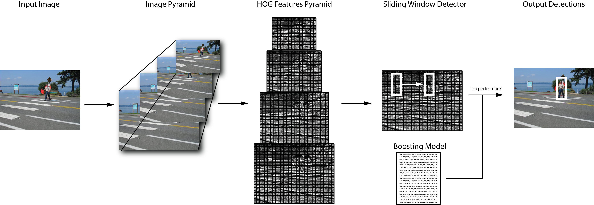

# Multiscale Pedestrian Detection

## Introduction

The Pedestrian detection example included in the GAP8 SDK is implemented using a fixed point implementation of Histogram of Oriented Gradients (HOG) (See citation 1 below). The machine learning scheme used to classify HoG descriptor is a window-based boosting technique (See citation 2 below). [Figure 1] shows an algorithm overview.

{ width=500px }

The diagram shows the main steps of Pedestrian Detection on GAP8. First the image is sub-sampled multiple times to create an pyramid of images. Then on each layer of the pyramid the HOG features are computed. A fixed size sliding windows detector is employed on each of the feature pyramid layers to determine if the features window belongs to a pedestrian or not. The detector compares the feature with a pre-trained model with a fast boosted decision tree scheme.

### Histogram of Oriented Gradients (HoG)

Histogram of oriented gradients (HOG) is a well known features extractor algorithm. The algorithm is composed of two hierarchical parts. The image is divided in tiles (in this example 8 x 8 pixels) called Cells and then on each cell the Histogram of Gradients is computed on 9 different angles. Thus the histogram has 9 bins.

Once this step is done for each cell, the cells are grouped in blocks (in this example 2 x 2 cells with stride of one cell). For each block the feature is normalized and an output of 36 bins (4 * 9) is produced.

For a more detailed explanation of the algorithm you can refer to these resources:

* [Learn OpenCV Website](https://www.learnopencv.com/histogram-of-oriented-gradients/)
* [Original Dalal and Triggs Paper](http://ieeexplore.ieee.org/document/1467360/)

### Sliding Window Detector

The sliding windows detector tests for the existence of a pedestrian in each location in the input feature with a given stride. The windows is 128 x 64 pixels which gives a feature size of 3780 values. The machine learning algorithm used to classify pedestrians is based on small boosted trees.

\newpage

## Algorithm configuration:

The detector is configured to recognize pedestrian from 96x48 pixel size to 176x88 pixel size. This is achieved using 6 pyramid layers.

## How to Build and Execute the Application

Please configure your shell for the SDK by running the `GAP` command as indicated in the GAP8 SDK Getting Started Guide.

To run the example type:

~~~~~sh
make clean all run
~~~~~

### Change Input-Output Configuration

The example can run with two input-output configurations:

1.  **Input and Output from file on host PC (default configuration)**
2.  **Input from Camera and output to LCD screen**

There are no additional requirements for mode 1, while for mode two the Himax camera must be connected to cpi camera interface and an additional LCD screen must be mounted on the arduino connector. The driver included in this example supports [2.8 TFT LCD Shield based on ili9341 controller](https://www.adafruit.com/products/1947).

To select between confiration 1 and 2 a define must be changed within the file HoGEstim.c.
To select configuration 1:

~~~~~c
#define FROM_FILE 1
~~~~~
and to select configuration 2

~~~~~c
#define FROM_FILE 0
~~~~~

After changing configuration the project must be rebuilt and run:

~~~~~sh
make clean all run
~~~~~

### Change Input Image

To change the input image the following two steps are required.

In the main.c file change the name of the input file:

~~~~c
char *Imagefile = "MyNewImage.ppm";
~~~~

So far only images of 324x244 size are supported.

## Citations

1. Dalal, Triggs, "Histograms of Oriented Gradients for Human Detection",  [Link](https://www.google.fr/url?sa=t&rct=j&q=&esrc=s&source=web&cd=1&ved=0ahUKEwjY4JWW35jXAhVEOMAKHc7tDbkQFggqMAA&url=https%3A%2F%2Fhal.inria.fr%2Finria-00548512%2Fdocument%2F&usg=AOvVaw1O2xQKr0vIq4SsT-R30rK4)
2. Y. Freund, R.E. Schapire, "A Decision-Theoretic Generalization of On-Line Learning and an Application to Boosting",  [Link](https://www.google.fr/url?sa=t&rct=j&q=&esrc=s&source=web&cd=1&ved=0ahUKEwi8q7fI4ZjXAhXFXRoKHUYEDLUQFggqMAA&url=http%3A%2F%2Fwww.face-rec.org%2Falgorithms%2FBoosting-Ensemble%2Fdecision-theoretic_generalization.pdf&usg=AOvVaw0L8cuezqaEAoVdWJhXaxho)
