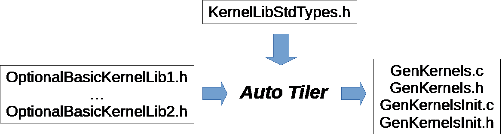

# Introduction

The Auto-tiler is a tool that runs on users PCs before GAP8 code compilation and automatically generates GAP8 code for memory tiling and transfers between all memory levels: GAP8 has two levels in-chip memory (L1 and L2) and an external optional 3rd level (L3).

From a user perspective, the purpose of the auto-tiler is twofold:

1. Use the generators provided in the GAP8 SDK which contains several ready to go optimized algorithms like CNN layers, sound and image processing.

2. Create new generators with your own algorithms.

For several of the use cases the former will be enough to build your own application.

# Use generators provided within the SDK

To exploit generators provided in the sdk, all the user needs to do is to write his own model.

In the SDK we provide several examples on how to write your own model:

~~~~~sh
$ cd  $GAP_SDK_HOME/examples/pulp-examples/autotiler_examples/
~~~~~

[Here you can browse them on github.](https://github.com/GreenWaves-Technologies/gap_sdk/tree/master/examples/pulp-examples/autotiler_examples)

Here is a list of generators provided within the SDK:

- Convolutional Neural Network Layers
    - 2D convolution (FP8 and FP16)
    - Relu Activation (FP8 and FP16)
    - Max and Average Pooling (FP8 and FP16)
    - Addition  (FP8 and FP16)
- 2D Fast Fourier Transform
- FIR Filtering
- Integral Image
- Image Resize
- Matrix Addition and Multiplication

All the generators source code can be found here:

~~~~~sh
$ cd  $GAP_SDK_HOME/tools/autotiler/generators
~~~~~
[You can browse it here on github.](https://github.com/GreenWaves-Technologies/autotiler/tree/master/generators )

# Create your own generators aka the complete auto-tiler guide

If you want to extend the generators suite that we provide in our SDK in this paragraph we explain all the auto-tiler fundamentals.

## GAP8's memory hierarchy

GAP8's memory hierarchy is made up of three levels:

1. Shared level 1 memory  
  Internal and tightly coupled with GAP8 cluster, it can deliver up to 8 parallel memory accesses in a single cycle. This is by far GAP8's fastest memory and has the highest bandwidth. As it is quite costly, its size has had to be kept relatively small, 64 Kbytes in the current configuration.

2. Level 2 memory  
  Internal memory significantly larger than level 1, but with higher access latency (approximately 6 cycles) and lower bandwidth. Its primary role is to store programs that are then fetched by the different instruction caches attached to GAP8's various cores and to store relatively large data structures. In the current version its size is 512 Kbytes.

3. Level 3 memory  
  External and optional (in the case of RAM). It is either read only (Flash) or read/write (RAM). Read only memory is mapped onto either the quad-SPI or HyperBus interfaces. Read/write memory is mapped onto the HyperBus interface. The latency, the access time and the bandwidth is even more limited than the other 2 memory areas and importantly accesses to level 3 memory consume more energy.

There are two DMA units. The micro-DMA unit, responsible for transfers to and
from peripherals into the level 2 memory and the cluster-DMA unit, which can be
used to schedule unattended transfers between level 2 and level 1 memory.

The level 1 and level 2 memories are also directly accessible by all the  cores in the chip.

To keep the size of the chip as small as possible and to reduce the amount of energy spent in memory accesses GAP8 does not use data caching. Level 3 memory is the most constrained since data must be moved into the chip level 2 memory with the micro-DMA unit (streaming).

## Auto-tiler architecture

The ideal memory model for a developer is to view memory as one large
continuous area that is as big and as fast as possible. This is normally
achieved by a data cache which automatically moves data between memory areas.
Since GAP8 does not implement data caching and since GAP8's cluster is
optimized for processing data in a linear or piece-wise linear fashion, we provide a software tool, the GAP8 auto-tiler, to help the developer by
automating memory movements for programs of this type.

The auto-tiler uses defined patterns of data access to anticipate data
movements ensuring that the right data is available in level 1 memory when needed. Since GAP8's cluster-DMA and micro-DMA units operate in parallel with all the GAP8 cores, the auto-tiler can use these units to make these pipelined memory transfers quasi-invisible from a performance point of view. The auto-tiler decomposes 1, 2, 3 and 4-dimensional data structures into a set of tiles (2-dimensional structures) and generates the C code necessary to move these tiles in and out of shared level 1 memory. The developer concentrates on the code that handles simple 2D tiles and the auto-tiler takes care of moving tiles into and out of level 1 memory as necessary and calling the developer's code.

Below is a list of the entities that make up the configuration or data model necessary for the GAP8 auto-tiler to generate functioning code. We refer extensively to a 'model' which is used to indicate the use of the auto-tiler API to declare the signature of developer functions (basic kernels) and define iterated assemblies of basic kernels which actually cause the auto-tiler to generate code.

1. Basic kernels  
  Pure C functions, these are written by the developer as if all the data structures they access can fit into shared level 1 memory (data tiles). Basic kernels can also use arguments that are prepositioned in memory (not tiled). Basic kernel functions are modeled, their call template formally described, by basic kernel models. This allows the GAP8 auto-tiler to generate code that calls them. They are described in detail in the section [Basic kernels].

2. User kernels  
  User kernel models group calls to basic kernels and allow the GAP8 auto-tiler to generate a C function for that grouping. A user kernel defines the different, predefined ways in which of 2, 3 or 4-dimensional data is traversed, and one or more basic kernels are called. A user kernel model takes arguments that describe the input, working and output data that needs to be modeled.

  User kernels consume and process data through these user kernel arguments. Kernel argument models describe argument location in the memory hierarchy (level 3, level 2 or level 1), direction (in, out, in out, pure buffer), inner dimension (width and height), dimensionality (1D, 2D, 3D, 4D).  Kernel argument models include several other attributes that are used to constrain the tiles that are generated from the argument (preferred size, odd/even size, etc.) or to provide hints that control the double or triple-buffering strategy used in the generated code. Calls to basic kernels can be inserted in different places in the generated iterative code (inner loop, loop prologue, loop epilogue, etc.). The calls are bound to arguments which can either be from the kernel argument model described above, direct C arguments or immediates. User kernels are described in detail in the section [User kernels].

3. User kernel groups  
  User kernel groups are models that combines or groups several user kernels together in a given order. A C function is generated from the user kernel group whose body contains calls to the sequence of user kernels with proper argument bindings between them. User kernel groups are described in detail in the section [User kernel groups].

4. Model control  
  Model control contains configuration elements such as available memory, compilation hints, consumed and produced files, basic kernels loaded as libraries and an ordered list of user kernels and/or user kernel groups. Model control is described in the section [Controlling tiled code generation].

The auto-tiler model is created through a series of calls to functions from the auto-tiler library. In addition to these calls, the developer can add whatever application specific code needed. Compiling and running the model on the build system creates a set of C source files that are then compiled and run on GAP8.

The basic object on which the GAP8 auto-tiler works is a 2D space that we call a data plane. Each user kernel argument corresponds to a data plane and potentially each user kernel argument can have a different width and height. For example, if the kernel we want to write produces one output for each 2x2 input sub region the input argument will be a data plane of WxH in size and the output argument will be a data plane of size (W/2)x(H/2).

This basic data plane can then be extended to 3 or 4 dimensions. Extending the dimension of a data plane is simply a repletion of the 2-dimensional basic data plane.

The GAP8 auto-tiler splits basic data planes into tiles, the number of tiles for each user kernel argument is identical but their dimension can vary from one argument to the other.

The GAP8 auto-tiler makes the following hypothesis about the user algorithm:

~~~~~c
OutputDataPlane = Kernel(InputDataPlane1, InputDataPlane2, ...)
~~~~~

Which can be rewritten as:

~~~~~c
For i in [0..NumberOfTiles-1]
  Tile(OutputDataPlane, i) =
    Kernel(Tile(InputDataPlane1, i), Tile(InputDataPlane2, i), ...)
~~~~~

Not all algorithms fits into this template but we believe it captures a large family of useful algorithms.

The illustrative examples below show how an entire auto-tiler model is constructed. Don't worry if they are confusing at the start. As you read the other sections of the manual the examples should become clear.

### Illustrative example 1 - Matrix addition

In this example, we want to add two integer matrices and store the result in a third matrix.

You can see the full code for the example in autotiler/examples/MatrixAdd

The basic kernel that does the job of addition is MatSumPar. It takes arguments of pointers to two input tiles and one output tile, these three tiles are expected to have the same dimensions which are passed as W and H. It is expected that the 3 matrices fit into shared level 1 memory.

The basic kernel for this example is shown in the basic kernel section below.

We first model the template of basic kernel MatSumPar function call.

~~~~~c
LibKernel("MatSumPar", CALL_PARALLEL,
  CArgs(5,
    TCArg("Word32 * __restrict__", "In1"),
    TCArg("Word32 * __restrict__", "In2"),
    TCArg("Word32 * __restrict__", "Out"),
    TCArg("unsigned int", "W"),
    TCArg("unsigned int", "H")
  ),
  "MatrixAdd_Arg_T"
);
~~~~~

And then we model a user kernel generator with no restrictions on the matrices dimensions (of course they need to fit into the level 2 memory). This describes the input and output parameters of the generated function and the way that the data is iterated.

~~~~~c
void MatAddGenerator(char *UserKernelName, int W, int H)

~~~~~

During our build process the generator code is compiled and `MatAddGenerator("MatAdd", 200, 300)` is called. The GAP8 auto-tiler generates the following code:

~~~~~c
void MatAdd(
  Word32 * __restrict__ In1,
  Word32 * __restrict__ In2,
  Word32 * __restrict__ Out,
  Kernel_T *Ker)

{
  /* Local variables used by this kernel */
  int DmaR_Evt1;
  int DmaR_Evt2;
  int DmaW_Evt1;
  int Iter, Last, NextLast, NextNextLast, InPlane, OutPlane=0;
  int N_Ti = 0, N_TiIp = 0;
  MatrixAdd_Arg_T S_KerArg0, *KerArg0 = &S_KerArg0;

  /* Initialize KerArg, Kernel invariant arguments */
  KerArg0->W = (unsigned int) (200);
  KerArg0->H = (unsigned int) (10);
  /* ================Read First Tile================ */
  /* Initial reads in L2, O_DB or O_BUFF */
  DmaR_Evt1 =  gap8_dma_memcpy((unsigned int) In1+(0),
        (unsigned int) (L1_Memory + 0)+0, 8000, DMA_COPY_IN);
  DmaR_Evt2 =  gap8_dma_memcpy((unsigned int) In2+(0),
        (unsigned int) (L1_Memory + 16000)+0, 8000, DMA_COPY_IN);
  /* ================End Read First Tile================ */
  /* Kernel Iteration Loop on tiled inner space */
  for (Iter=0; Iter<30; Iter++) {
    /* Loop Iteration Body on tiled inner space */
    /* Elaborate Last, Next_Last, Next_Next_Last */
    Last = ((Iter+1) == 30);
    NextLast = ((Iter+2) == 30);
    NextNextLast = ((Iter+3) == 30);
    /* ================Read Next Tile================ */
    gap8_dma_wait(DmaR_Evt1);
    gap8_dma_wait(DmaR_Evt2);
    if (!Last) {
      DmaR_Evt1 =  gap8_dma_memcpy((unsigned int) In1 + ((Iter+1)*8000),
          (unsigned int) (L1_Memory + 0) + 8000*((N_Ti+1) % 2), 8000, DMA_COPY_IN);
      DmaR_Evt2 =  gap8_dma_memcpy((unsigned int) In2 + ((Iter+1)*8000),
          (unsigned int) (L1_Memory + 16000) + 8000*((N_Ti+1) % 2), 8000, DMA_COPY_IN);
    }
    /* ================End Read Next Tile================ */
    /* Call Kernel LOC_INNER_LOOP */
    KerArg0->In1 = (Word32 * __restrict__)
      ((unsigned int) (L1_Memory + 0) + 8000*(N_Ti % 2));
    KerArg0->In2 = (Word32 * __restrict__)
      ((unsigned int) (L1_Memory + 16000) + 8000*(N_Ti % 2));
    KerArg0->Out = (Word32 * __restrict__)
      ((unsigned int) (L1_Memory + 32000) + 8000*(N_Ti % 2));
    gap8_task_dispatch((1<<gap8_ncore())-1, MatrixAdd, (unsigned int) KerArg0);
    MatrixAdd(KerArg0);
    /* ================Write Tile================ */
    if (Iter) {
      gap8_dma_wait(DmaW_Evt1);
    }
    DmaW_Evt1 =  gap8_dma_memcpy((unsigned int) Out + ((Iter)*8000),
      (unsigned int) (L1_Memory + 32000) + 8000*(N_Ti % 2), 8000, DMA_COPY_OUT);
    /* ================End Write Tile================ */
    N_Ti++;
    /* End Kernel Iteration Loop on tiled inner space */
  }
  Iter=30;
  /* ================Write Last Tile================ */
  gap8_dma_wait(DmaW_Evt1);
  /* ================End Write Last Tile================ */
}
~~~~~

### Illustrative example 2 - Searching the maximum in a 2D matrix

This user kernel also operates on a 2D integer matrix but returns the maximum value in this matrix. Here we model a classic parallel map/reduce algorithm to accomplish the task. We use a basic kernel, `KerMatrixMax`, which operates on a tile. `KerMatrixMax` takes as arguments: a pointer to a tile `In`, the dimensions of this tile (`W` and `H`), a pointer to the vector `Out` (a buffer whose dimension is the number of tiles) to store the max for each tile. `KerMatrixMax` also takes an argument `CompareWithOut`, which indicates if a valid maximum is already available in the output vector and should be compared against the maximum calculated in the current tile.

Each basic kernel call will return the maximum in a sub section of the full input matrix. To get the final result we have to reduce the set of sub-results into a single result. This is our second kernel: `KerMatrixMaxReduction`. As a first argument `In` it takes the vector of maximums produced by the first basic kernel as well as its dimension `Ntile`. It produces a pointer to a single maximum in `Out` (a 1 x 1 tile). It should be executed when we are done with all the tiles so the call is inserted in the inner space iterator prologue (see the user model below).

The 2 basic kernels are first modeled.

~~~~~c
LibKernel("KerMatrixMax", CALL_PARALLEL,      // A parallel call
  CArgs(6,
    // A tile
    TCArg("Word32 * __restrict__", "In"),   
    // A vector of maximums
    TCArg("Word32 * __restrict__", "Out"),  
    TCArg("unsigned int", "W"),     // Tile width
    TCArg("unsigned int", "H"),     // Tile Height
    // Which Tile - index into Out for result
    TCArg("unsigned int", "TileIndex"),   
    // Out[TileIndex] contains a Max
    TCArg("unsigned int", "CompareWithOut")
  ),
  "MatrixMax_Arg_T"
);
LibKernel("KerMatrixMaxReduction", CALL_SEQUENTIAL,   // A sequential call
  CArgs(3,
    TCArg("Word32 * __restrict__", "In"),   // A vector of Maximums
    TCArg("Word32 * __restrict__", "Out"),  // Pointer to the unique Maximum
    TCArg("unsigned int", "Ntile")    // Number of entries into In
  ),
  "MatrixMaxReduction_Arg_T"
);
~~~~~

Then the Matrix Max user kernel generator:

~~~~~c
/* A user kernel generator computing the max of a 2D plain matrix of size WxH */
void MatrixMax(char *Name, unsigned int W, unsigned int H)

{
  UserKernel(Name,
    // Dimension is WxH
    KernelDimensions(1, W, H, 1),
    // 2D iteration space
    KernelIterationOrder(KER_DIM2, KER_TILE),
    // Tile horizontally
    TILE_HOR,
    // User kernel C template
    CArgs(2,
      TCArg("int * __restrict__", "In"),
      TCArg("int * __restrict__", "Out")
    ),
    // 2 calls to basic kernels
    Calls(2,
      // First KerMatrixMax in the inner iterator
      Call("KerMatrixMax", LOC_INNER_LOOP,
        Bindings(6,
          K_Arg("In", KER_ARG_TILE), K_Arg("TiledOut", KER_ARG_TILE),
          K_Arg("In", KER_ARG_TILE_W), K_Arg("In", KER_ARG_TILE_H),
          K_Arg("In", KER_ARG_TILEINDEX), Imm(0))
        ),
      // Second  KerMatrixMaxReduction after we have consumed all tiles.
      // Final result goes directly to *Out thanks to C_Arg("Out")
      Call("KerMatrixMaxReduction", LOC_INNER_LOOP_EPILOG,
        Bindings(3,
          K_Arg("TiledOut", KER_ARG), C_Arg("Out"),
          K_Arg("TiledOut", KER_ARG_NTILES))
      )
    ),
    // 2 User kernel arguments
    KerArgs(2,
      // A double buffered input taken from level 2 memory
      // bound to C user kernel In
      KerArg("In", OBJ_IN_DB, W, H,
        sizeof(int), 0, 0, 0, "In", 0),
      // A dynamic buffer declared as W=1 and height=H but H will
      // be reduced to the number of used tiles
      KerArg("TiledOut", OBJ_BUFFER_DYN,
        1, H, sizeof(int), 0, 0, 0, 0, 0)
    )
  );
}
~~~~~

And here is the code that is generated by the auto-tiler after a call to MatrixMax("MatMax", 200, 300)

~~~~~c
void MatMax(
                int * __restrict__ In,
                int * __restrict__ Out,
                Kernel_T *Ker)

{
  /* Local variables used by this kernel */
  int DmaR_Evt1;
  int Iter, Last, NextLast, NextNextLast, InPlane, OutPlane=0;
  int N_Ti = 0, N_TiIp = 0;
  MatrixMax_Arg_T S_KerArg0, *KerArg0 = &S_KerArg0;

  /* Initialize KerArg, Kernel invariant arguments */
  KerArg0->W = (unsigned int) (200);
  KerArg0->CompareWithOut = (unsigned int) (0);
  /* ================Read First Tile================ */
  /* Initial reads in L2, O_DB or O_BUFF */
  DmaR_Evt1 =  gap8_dma_memcpy((unsigned int) In+(0),
      (unsigned int) (L1_Memory + 0)+0, 24800, DMA_COPY_IN);
  /* ================End Read First Tile================ */
  /* Kernel Iteration Loop on tiled inner space */
  for (Iter=0; Iter<10; Iter++) {
    /* Loop Iteration Body on tiled inner space */
    /* Elaborate Last, Next_Last, Next_Next_Last */
    Last = ((Iter+1) == 10);
    NextLast = ((Iter+2) == 10);
    NextNextLast = ((Iter+3) == 10);
    /* ================Read Next Tile================ */
    gap8_dma_wait(DmaR_Evt1);
    if (!Last) {
      DmaR_Evt1 =  gap8_dma_memcpy(
        (unsigned int) In + ((Iter+1)*24800),
        (unsigned int) (L1_Memory + 0) + 24800*((N_Ti+1) % 2),
        NextLast?16800:24800, DMA_COPY_IN);
    }
    /* ================End Read Next Tile================ */
    /* Call Kernel LOC_INNER_LOOP */
    KerArg0->In = (Word32 * __restrict__)
      ((unsigned int) (L1_Memory + 0) + 24800*(N_Ti % 2));
    KerArg0->Out = (Word32 * __restrict__)
      ((unsigned int) (L1_Memory + 49600) + 0 + (Iter)*4);
    KerArg0->H = (unsigned int) (Last?21:31);
    KerArg0->TileIndex = (unsigned int) Iter;
    gap8_task_dispatch((1<<gap8_ncore())-1, KerMatrixMax,
      (unsigned int) KerArg0);
    KerMatrixMax(KerArg0);
    N_Ti++;
    /* End Kernel Iteration Loop on tiled inner space */
  }
  Iter=10;
  /* Call Kernel LOC_INNER_LOOP_EPILOG */
  KerMatrixMaxReduction(
    (Word32 * __restrict__)
      ((unsigned int) (L1_Memory + 49600) + 0),
    (Out),
    (unsigned int)10
  );
}
~~~~~

## Basic kernels

Basic kernels are written assuming all their data can fit into the shared level 1 memory. Usually a kernel function will access a data chunk through a pointer argument and will be informed about the data chunk characteristics by means of dimension arguments. A basic kernel manipulates a tile: one access pointer, one width argument and one height argument (a tile can also be of dimension 1). Scalar arguments, shared level 1 preloaded arguments, arguments accessed directly in level 2 can also be used by a basic kernel.

Basic kernels can be either sequential or parallel. A sequential kernel will run on a single core (core 0 of the cluster). For example, a sequential kernel can handle the configuration of the HWCE convolutional accelerator. A parallel kernel is meant to be run on all the available cores of the cluster. When it is called it is dispatched on all the active cores. Writing an optimized kernel usually involves dealing with vectorization to get as much as performance as possible from a single core and then dealing with parallelism to use as many cores in the cluster as possible.

Basic kernels define the functions manipulated by the GAP8 tile generator. Their interfaces (C data type template) as well as their calling nature (parallel versus sequential) are modeled.

The functions that the basic kernel models describe are called by the auto-tiler at runtime so should be in functions in source external to the model.

The following API is used to add a basic kernel model.

~~~~~c
void LibKernel(
  // A string. The name of the kernel
  char *KernelName,
  // CALL_SEQUENTIAL when called only by cluster's core 0
  // CALL_PARALLEL when dispatched on all available cluster cores
  KernelCallTypeT CallType,
  // List of C arguments <Type, Name> where Type and Name are strings.
  // Provided by CArgs(ArgCount, List of CArgs)
  CKernel_Arg_T **Cargs,
  // C typedef name, used when CallType is parallel since
  // in this case arguments have to be promoted to a C structure
  char *ParArgTypeName
);
~~~~~

### Example 1 - Parallel basic kernel

In this first example we show how to write a basic kernel performing a parallel addition between two 2D integer matrices with a fixed, bias offset.

The parallel addition will look like:

~~~~~c
typedef struct {
    Word32 * __restrict__ In1;
    Word32 * __restrict__ In2;
    Word32 * __restrict__ Out;
    Word32 Bias;
    Wordu32 W;
    Wordu32 H;
} MatrixAdd_Arg_T;

void MatrixAdd(MatrixAdd_Arg_T *Arg)

{
  Word32 * __restrict__ In1 = Arg->In1;   // First input int matrix
  Word32 * __restrict__ In2 = Arg->In2;   // Second input int matrix
  Word32 * __restrict__ Out = Arg->Out;   // output int matrix
  // Pointer to a bias to be added to each matrix element sum
  Word32 * __restrict__ Bias = Arg->Bias;   
  Wordu32 W = Arg->W;       // Width of the working space
  Wordu32 H = Arg->H;       // Height of the working space
  Wordu32 CoreId = gap8_coreid();     // Who am I?
    // The size of the working space is W*H, divide it by number of cores
    // (a ChunkCell)
  Wordu32 ChunkCell = ChunkSize(W*H);   
    // Given who we are this is the first chunk in the working space
    // we are interested in
  Wordu32 First = CoreId*ChunkCell;
      // Given First chunk, last chunk is either full sized or capped
      // to working space size
  Wordu32 Last  = Min(First+ChunkCell, W*H);  
  int i;
  for (i=First; i<Last; i++)
          Out[i] = In1[i] + In2[i] + Bias;
  // Wait on barrier until all the cores have got to here
  rt_team_barrier();         
}
~~~~~

And this is how the function is modeled as a basic kernel:

~~~~~c
LibKernel("MatrixAdd", CALL_PARALLEL,
  CArgs(6,
    TCArg("Word32 * __restrict__", "In1"),
    TCArg("Word32 * __restrict__", "In2"),
    TCArg("Word32 * __restrict__", "Out"),
    TCArg("Word32", "Bias"),
    TCArg("Wordu32", "W"),
    TCArg("Wordu32", "H")
  ),
  "MatrixAdd_Arg_T"
);
~~~~~

### Example 2 - Sequential basic kernel

The second example shows how to model a sequential function to switch on the HWCE accelerator.

In this case, this is a simple sequential call to a preexisting library function. The C function to switch on the HWCE is in the GAP8 run-time and is called HWCE_Enable()

This is the way this call is modeled.

~~~~~c
  LibKernel("HWCE_Enable",  CALL_SEQUENTIAL, CArgs(0), "");
~~~~~

##  User kernels

### Iteration dimension, iteration space, iteration order, tiling direction

The iteration space of a user kernel can be of dimension 1, 2, 3, or 4.

The inner level of the iteration space is assumed to be 2D (with 1D as a special case where one of the inner dimensions is set to 1). The inner level is the one that will be tiled by GAP8 auto-tiler. In this document we refer to this inner level as a plane, either input or output.

* A 2D input has width W and height H.
* A 3D input is a collection of Nip 2D structure, so it's dimension is [Nip x W x H], where Nip stands for number of input planes.
* Similarly, a 3D output is a collection of Nop 2D structures, with dimension [W x H x Nop], where Nop stands for number of output planes.
* A 4D input is a collection of Nip x Nop 2D structures, with dimension [Nip x W x H x Nop]

***Note: A 2D input or output can be embedded into an iteration space whose dimension is greater than 2. In this case each 2D plane is consumed several times.***

Two different iteration orders are supported when dimension is greater or equal than 3:

#### Order 1

~~~~~c
  for (Op=0; Op<Nop; Op++) {
    for (Ip=0; Ip<Nip; Ip++) {
      for (Tile=0; Tile<LastTile; Tile++) {
        Foo(DataTile[Ip, Tile, Op]);
      }
    }
  }
~~~~~

The diagrams Below illustrate how tiles are traversed as a function of the dimension of the iteration space in Order 1.

{ width=500px }

#### Order 2

~~~~~c
  for (Op=0; Op<Nop; Op++) {
    for (Tile=0; Tile<LastTile; Tile++) {
      for (Ip=0; Ip<Nip; Ip++) {
        Foo(DataTile[Ip, Tile, Op]);
      }
    }
  }
~~~~~

The diagrams Below illustrate how tiles are traversed as a function of the dimension of the iteration space in Order 2.

{ width=500px }

In the current implementation only order 2 is fully supported.

Tiles have 2 possible orientations:

***Horizontal:*** The [W x H] data plane is divided into N tiles of size [W x h] and one last tile of size [W x hlast] where hlast < h

{ width=200px }

***Vertical:*** The [W x H] data plane is divided into N tiles of size [w x H] and one last tile of size [wlast x H] where wlast < w

{ width=200px }

It is important to note that one of the 2 dimensions is left untouched so a single line or a single column must fit into the memory constraints given to GAP8 auto-tiler.

Deciding which orientation to choose is driven by the nature of the algorithm. For example, a function computing a bi-dimensional FFT on a 2D input plane of size [S x S] will execute in two passes. A first pass where a 1D FFT is applied on each line so the natural choice is horizontal. Then the second pass will apply a 1D FFT on each column of the 2D plane produced by the first pass, so vertical is the natural choice.

In the current implementation the orientation choice applies to all user kernel arguments. In future version this constraint will be removed to allow the developer to decide a different orientation for each kernel argument.

### User kernel fields

A user kernel is a collection of fields. The following library function is used to create a user kernel:

~~~~~c
Kernel_T *UserKernel(
  char *TemplateName,
  KernelDimensionT *KerDim,
  KernelIterationT *KerIter,
  Tile_Orientation_T Orientation,
  CKernel_Arg_T **CArg,
  CKernelCall_T **CCalls,
  Object_T **KerArg);
~~~~~

The following sections describe the content of each of the user kernel fields.

#### TemplateName - kernel name

A string with the kernel name which must be unique.

~~~~~c
UserKernel("MyFavoriteKernel",
   ...
);
~~~~~

#### KerDim - kernel dimensions

Specifies the number of input planes (`Nip`), number of output planes (`Nop`), default width (`W`) and height (`H`) of a plane for the user kernel.

Note that `Nip` and `Nop` are shared by all kernel arguments while `W` and `H` can be redefined for each kernel argument.

The following library function is provided to capture the user kernel dimension info:

~~~~~c
KernelDimensionT *KernelDimensions(
  unsigned int InPlanes,
  unsigned int W,
  unsigned int H,
  unsigned int OutPlanes);
~~~~~

For example, `MyFavoriteKernel` below has 4 input planes, 4 output planes and a default data plane of 32 column and 28 lines:

~~~~~c
UserKernel("MyFavoriteKernel",
  KernelDimensions(4, 32, 28, 4),
  ...
);
~~~~~

#### KerIter - kernel iteration order

The iteration order captures the overall structure of the user kernel. First the  number of dimensions and then the way the iteration is traversed.

Dimensions: `KER_DIM2`, `KER_DIM3`, `KER_DIM4`

***Iteration Order 1***

`KER_DIM2`, `KER_TILE`

  : 2D. Tiled inner data plane

`KER_DIM3`, `KER_IN_PLANE`, `KER_TILE`

  : 3D. For each `Nip` in data planes all tiles in a plane, `Nop` is treated as equal to 1

`KER_DIM3`, `KER_OUT_PLANE`, `KER_TILE`  

  : 3D. For each `Nop` out data planes all tiles in a single input plane, `Nip` is treated as equal to 1

`KER_DIM4`, `KER_OUT_PLANE`, `KER_IN_PLANE`, `KER_TILE`  

  : 4D. For each `Nop` out data planes, for each `Nip` input data planes, for all tile in plane

***Iteration Order 2***

KER_DIM2, KER_TILE

  : 2D. Tiled inner data plane

KER_DIM3, KER_TILE, KER_IN_PLANE

  : 3D. For each tile of each Nip input planes, Nop is treated as equal to 1

KER_DIM3, KER_OUT_PLANE, KER_TILE

  : 3D. For each Nop out data planes all tiles in a single input plane, Nip is treated as equal to 1

KER_DIM4, KER_OUT_PLANE, KER_TILE, KER_IN_PLANE

  : 4D. For each Nop out data planes, for each tile in each Nip input data planes

This is the general iteration pattern for a user kernel, then each kernel argument can traverse the whole iteration space or only a subset. For example, a 2D kernel argument when embedded in a 4D user kernel will iterate Nip*Nop times on the same WxH data plane.

Note: currently only Iteration Order 2 is fully supported.

For example, MyFavoriteKernel below follows iteration Order 2: 4 dimensions, first out-planes then tiles then in-planes:

~~~~~c
UserKernel("MyFavoriteKernel",
  KernelDimensions(4, 32, 28, 4),
  KernelIterationOrder(KER_DIM4, KER_OUT_PLANE, KER_TILE, KER_IN_PLANE),
  ...
);
~~~~~

#### Orientation - Tiling orientation

In a 2D data plane of dimension W x H, tiling can be performed horizontally or vertically. Currently this is a user kernel level parameter and all user kernel
arguments are tiled in the same direction. In the future global orientation will be able to be overridden on a per argument basis.

When a 2D data plane is tiled, all the tiles except the last one will have the same size. This size is computed to gain maximum benefit from the configured memory budget.

Orientation can be: TILE_HOR or TILE_VER

For example MyFavoriteKernel below will tile the data plane horizontally.

~~~~~c
UserKernel("MyFavoriteKernel",
  KernelDimensions(4, 32, 28, 4),
  KernelIterationOrder(KER_DIM4, KER_OUT_PLANE, KER_TILE, KER_IN_PLANE),
  TILE_HOR,
  ...
);
~~~~~

#### CArg - User kernel function template

A user kernel will end up as a C function after it has been processed by the auto tiler. For this reason, the C template of this function must be provided. This is like the template provided for a basic kernel, i.e. a list of C variable names and their associated C types.

The CArgs library function is used to do this. It takes two parameters. Firstly, the number of C arguments and secondly a list of parameters modeled as `<Type Name, Arg Name>` pairs, the `TCArg` function is used to create the pair.

~~~~~c
CKernel_Arg_T **CArgs(
  unsigned int ArgCount,
  ...
);

CKernel_Arg_T *TCArg(
  char *ArgType,
  char *ArgName);
~~~~~

For example MyFavoriteKernel below has 4 C arguments: In1, In2, Out and Bias with their respective C types.

~~~~~c
UserKernel("MyFavoriteKernel",
  KernelDimensions(4, 32, 28, 4),
  KernelIterationOrder(KER_DIM4, KER_OUT_PLANE, KER_TILE, KER_IN_PLANE),
  TILE_HOR,
  CArgs(4,
    TCArg("Word32 * __restrict__", "In1"),
    TCArg("Word32 * __restrict__", "In2"),
    TCArg("Word32 * __restrict__", "Out")
    TCArg("Word32 * __restrict__", "Bias")
  ),
  ...
);
~~~~~

You will note here that the dimension of the arguments is not passed, they will be captured in the kernel argument description part of the model if they are candidates for tiling. In case that they are pure C arguments, not candidates for tiling, then their dimensions should be passed.

#### CCalls - Basic kernels call sequence, call position and arguments

The CCalls field indicates the link between the User Kernel and one or more Basic Kernels. It models the sequence, call position and argument bindings for Basic Kernels called from this user kernel.

##### Call sequence

The location of calls to basic kernels in the user kernel iteration sequence depends on the iteration order, Order 1 or Order 2.

Here are the locations where calls can be inserted as a function of iteration order:

~~~~~
  LOC_INNER_LOOP
  LOC_INNER_LOOP_PROLOG
  LOC_INNER_LOOP_EPILOG
  LOC_IN_PLANE_PROLOG
  LOC_IN_PLANE_EPILOG
  LOC_PROLOG
  LOC_EPILOG
~~~~~

The code fragments below show where the calls are inserted in relation to the two possible iteration orders:

***Iteration Order 1***

~~~~~
<LOC_PROLOG>
  for (Op=0; Op<Nop; Op++) {
    <LOC_IN_PLANE_PROLOG>
    for (Ip=0; Ip<Nip; Ip++) {
      <LOC_INNER_LOOP_PROLOG>
      for (Tile=0; Tile<LastTile; Tile++) {
        <LOC_INNER_LOOP>
        Foo(DataTile[Ip, Tile, Op]);
      }
      <LOC_INNER_LOOP_EPILOG>
    }
    <LOC_IN_PLANE_EPILOG>
  }
<LOC_EPILOG>
~~~~~

***Iteration Order 2***

~~~~~
<LOC_PROLOG>
  for (Op=0; Op<Nop; Op++) {
    <LOC_INNER_LOOP_PROLOG>
    for (Tile=0; Tile<LastTile; Tile++) {
      <LOC_INNER_PLANE_EPILOG>
      for (Ip=0; Ip<Nip; Ip++) {
        <LOC_INNER_LOOP>
        Foo(DataTile[Ip, Tile, Op]);
      }
      <LOC_INNER_PLANE_EPILOG>
    }
    <LOC_INNER_LOOP_EPILOG>
  }
<LOC_EPILOG>
~~~~~

##### Call order

At each insertion point, calls are inserted in the order they appear in the user kernel call sequence.

User kernel calls are captured by the following library call, the number of calls in the user kernel and then a list of basic kernels calls:

~~~~~c
CKernelCall_T **Calls(
  unsigned int CallCount,
  ...
);
~~~~~

Each call is captured by:

~~~~~c
CKernelCall_T *Call(
  char *CallName,
  KernelCallLocationT CallLocation,
  ArgBindingDescr_T **BindingList
);
~~~~~

Where CallName is a basic kernel name that must exist, CallLocation is a call location in the iteration template and BindingList is a list of bindings between basic kernel C formal arguments and different entities:

~~~~~c
ArgBindingDescr_T **Bindings(
  int BCount,
  ...
);
~~~~~

##### Call bindings

Each argument for each call can be bound to combination of user kernel arguments (tiles or attribute of tiles such as tile width and tile height), plain C arguments or immediate values.

The possible binding sources are listed below.

###### User kernel arguments - tile

`K_Arg(UserKernelArgName, KER_ARG_TILE)`

  : Pointer to a tile  

###### User kernel arguments - entire data plane

`K_Arg(UserKernelArgName, KER_ARG)`

  : Pointer to data plane  

###### User kernel argument attributes

Apply to tiled kernel arguments.

`K_Arg(UserKernelArgName, KER_ARG_TILE_W)`  

  : Width of the current tile. Unsigned int.

`K_Arg(UserKernelArgName, KER_ARG_TILE_W0)`  

  : Default tile width, last tile can be smaller. Unsigned int.  

`K_Arg(UserKernelArgName, KER_ARG_TILE_H)`  

  : Height of the current tile. Unsigned int  

`K_Arg(UserKernelArgName, KER_ARG_TILE_H0)`  

  : Default tile height, last tile can be smaller  

`K_Arg(UserKernelArgName, KER_ARG_NTILES)`  

  : Number of tiles in the data plane. Unsigned int.  

`K_Arg(UserKernelArgName, KER_ARG_TILEINDEX)`  

  : Current tile index. Unsigned int.  

`K_Arg(UserKernelArgName, KER_ARG_TILEOFFSET)`  

  : Current tile offset starting from the origin of the iteration sub space of this user kernel argument. Unsigned int.  

###### User kernel C arguments

`C_Arg(UserKernelCArgName)`

###### Subscripted user kernel C arguments

Subscripted by the current index of input plane, output plane or tile multiplied by a constant  

`C_ArgIndex(UserKernelCArgName, [Iterator], MultFactor)`  

  : where [Iterator] is KER_IN_PLANE, KER_OUT_PLANE or KER_TILE. Note that the C kernel argument has to be a pointer for this binding to be legal

###### Immediate values

  `Imm(ImmediateIntegerValue)`

**Note:** the binding list order has to follow the basic kernel argument list order.

For example MyFavoriteKernel below contains a single call to the library kernel MatrixAdd located in the inner loop

~~~~~c
UserKernel("MyFavoriteKernel",
  KernelDimensions(4, 32, 28, 4),
  KernelIterationOrder(KER_DIM4, KER_OUT_PLANE, KER_TILE, KER_IN_PLANE),
  TILE_HOR,
  CArgs(4,
    TCArg("Word32 * __restrict__", "In1"),
    TCArg("Word32 * __restrict__", "In2"),
    TCArg("Word32 * __restrict__", "Out"),
    TCArg("Word32 * __restrict__", "Bias")
  ),
  Calls(1,
    Call("MatrixAdd", LOC_INNER_LOOP,
      Bindings(6,
        K_Arg("KerIn1", KER_ARG_TILE),    // A tile
        K_Arg("KerIn2", KER_ARG_TILE),    // A tile
        K_Arg("KerOut", KER_ARG_TILE),    // A tile
        C_ArgIndex("Bias", KER_OUT_PLANE, 1), // Bias[CurrentOutputPlane*1]
        K_Arg("KerIn1", KER_ARG_TILE_W),    // Tile width
        K_Arg("KerIn1", KER_ARG_TILE_H)   // Tile height
      )
    )
  ),
  ...
);
~~~~~

#### KerArg - User kernel arguments

User kernel arguments are the inputs and outputs to the user kernel, the entities that will undergo tiling to allow them to fit into the available level 1 memory.

1. A user kernel argument has a direction: input, output or input output. It can be buffered or not. Being buffered means that the entire argument content is moved into level 1 memory before the user kernel iteration space is traversed and is returned to level 2 or level 3 memory afterwards.

2. A user kernel argument is a collection of data planes of width W and height H. In the simplest case the data plane is a collection of 1, it is a 2D structure (Note that if you need to process 1D data you set H to 1). In more elaborate cases the kernel argument can be of dimension 3 or of dimension 4. If the direction of the argument is IN then a 3D argument is a collection of Nip WxH input data planes. Similarly, if the direction of the argument is OUT and only OUT (IN_OUT is considered as IN) then the kernel argument will be a collection of Nop W x H output data planes. A 4D argument in the current implementation can only be an input and is a collection of Nip x Nop, W x H input data planes. A user kernel argument is fully characterized by its declared width and height, its dimension and the number of input and output data planes shared by all user kernel arguments and declared in the user kernel dimension section. Note that the width and height override the default values of the kernel dimension section.

3. A user kernel argument has a home location in level 2 memory, the default, or in external, level 3 memory. In the case that an argument is in the external memory it can be of OUT type only if the external memory can support it. External flash only supports IN arguments while external RAM supports both IN and OUT arguments. As a special case, uninitialized buffers are transient objects with a home location in the shared level 1 memory.

4. A user kernel argument can be accessed in a non-pipelined way or in a pipelined way (double or triple buffered). When non-pipelined, memory transfers will affect performance since the kernel must wait for the end of the memory transfer before moving on. When pipelined, the memory transfer is performed in a different buffer than the one used for the current tile. Therefore it has all the cycles between the read and the first usage in the next iteration to complete. If the compute time spent in the basic kernels is higher than the number of cycles spent for the memory transfer, the memory transfer will not affect performance. External memory kernel arguments are always treated as pipelined object. The bandwidth gap between the external memory and the shared level 1 or the level 2 memory is such that it makes little sense to perform non-pipelined accesses to or from level 3 memory. For arguments in level 2 memory, the user can decide to let the kernel access them in a pipelined way or not.

5. Kernel arguments can be bound to user kernel arguments but can also be bound to an output argument of another user kernel argument belonging to the same group of user kernels (see after). They can even be working transient memory (buffer) that the kernel needs for its own sake. This buffer can be a full size data plane or only a single tile whose exact dimension will be figured out by the auto tiler.

As you can see, each user kernel argument can have a different width and height. The GAP8 automatic tiler models the ratios between these different dimensions and tries to find out a tile size (potentially different for each user kernel argument) that will fit within the shared level 1 memory budget it has been given. Tiles can be subject to additional constraints:

+ They may have to overlap. This is the case when a 2D filter is applied on a 2D data plane. Let's assume that the set of filter coefficients is a 5 by 5 matrix then 2 adjacent tiles must overlap by 4 to be able to produce the correct output.

+ For algorithmic reasons it might be necessary to constrain a tile to be of odd or even size. For example, if the algorithm performs sub-sampling by a factor of 2 then all tiles but the last one must be of even dimension. Similarly, it can be desirable, for hardware constraint or performance reasons, to constrain a tile to be a multiple of a given constant. For example, on GAP8 the hardware convolution engine works best when it is consuming vertical strips of width 32 therefore if we set the tiling orientation to vertical and set the preferred tile size to be a multiple of 32, we will get maximum performance. As another example, if each line of a tile is given to a core for processing, then having a tile dimension being a multiple of 8 will ensure the 8 cores of the cluster are optimally balanced.

All these constraints can be expressed in a user kernel argument.

To create a kernel argument, the following library call is used:

~~~~~c
Object_T *KerArg(
  char *KerArgName,
  Object_Type_T ObjType,
  unsigned int W,
  unsigned int H,
  unsigned int ItemSize,
  unsigned int TileOverlap,
  KernelArgConstraints_T Constraint,
  unsigned int PreferedTileSize,
  char *CArgName,
  unsigned int NextPlaneUpdate);
~~~~~

##### User kernel argument object type

A user kernel argument object type is either a flag built from a set of basic user kernel argument properties or a pre-defined name.

***Names built as a flag from user kernel argument properties***

The set of pre-defined properties which can be OR'ed (|) together is:

`O_IN, O_NIN`
  : Is an input or not an input

`O_OUT, O_NOUT`
  : Is an output or not an output

`O_BUFF, O_NBUFF`
  : Is a buffer or not a buffer

`O_TILED, O_NTILED`
  : Is tiled or not. When not tiled, the whole data plane is accessible in shared level 1 memory. For example, a 2D convolution has one argument that is tiled (the input data) and another one that is not tiled (the coefficients)

`O_ONETILE, O_NONETILE`
  : A buffer property. When ONETILE is set, a buffer of dimension WxH will be given only the dimension of a tile whose size is proportional to the size of the tiles generated for the other kernel arguments.

`O_DYNTILE, O_NDYNTILE`
  : A buffer property. When O_DYNTILE, the height if tiling orientation is horizontal or the width if orientation is vertical, of the buffer will be adjusted to the number of tile computed by GAP8 auto-tiler. This is useful when a dynamic buffer is needed to implement a reduction phase after a result has been computed for each tile independently and final result must be obtained combining all these results into a single one. Usually the declared W or H is the one of another user kernel input and the auto-tiler adjusts it.

`O_DB, O_NDB`
  : Argument is double or triple buffered in L1 memory, or it is not multi-buffered

`O_L2DB, O_NL2DB`
  : Argument home location is an external memory and is double or triple buffered in level 2 memory, or it is not an external memory

`O_3D, O_N3D`
  : Argument has 3 dimensions or not

`O_4D, O_N4D`
  : Argument has 4 dimensions or not (note that a 4D argument is also a 3D one)

For example, `O_IN|O_DB|O_L2DB|O_4D` is an input pipelined in level 1 memory and in level 2 memory whose home location is external memory. Its dimension is 4.

***Pre-defined names***

The diagrams below summarize the set of pre-defined names.

{ width=400px }

For example OBJ_IN_DB_L2DB_4D is an input pipelined in level 1 and in level 2 memory whose home location is external memory. It's dimension is 4.

##### User kernel argument width and height

A pair of unsigned ints specifying the dimension of the data plane.

##### User kernel argument item size

An unsigned int specifying the size in bytes of the data plane elementary data type.

##### User kernel argument tile overlap

An unsigned int capturing the amount of overlap between two adjacent tiles. This is useful in case an output is computed as a function of a point in the input data plane and its neighborhood. If to compute an output you need inputs at a maximum distance K from the point of computation then 2 adjacent tiles should overlap by at least 2*K points.

{ width=300px }

##### User kernel argument constraints

Specifies a constraint on a property of the tile dimension that is calculated by the GAP8 auto-tiler. When tiling is horizontal the constraint is on the height of the tile, and when tiling is vertical the constraint is on the width of the tile. A constraint will be applied by the auto-tiler to all the tiles except the last one. If this is not possible the model cannot be tiled.

These are the possible constraints:

~~~~~c
typedef enum {
  OBJ_CONSTRAINTS_NONE = 0,
  OBJ_CONSTRAINTS_EVEN = (1<<1),    /* Tile variable size is even */
  OBJ_CONSTRAINTS_ODD = (1<<2),     /* Tile varaible size is odd */
  OBJ_CONSTRAINTS_ONEPREFTILE = (1<<3),   /* Limit number of used tile to just one */
  OBJ_CONSTRAINTS_TILE_HOR = (1<<4),    /* Overide default orientation to TILE_HOR */
  OBJ_CONSTRAINTS_TILE_VER = (1<<5),    /* Overide default orientation to TILE_VER */
} KernelArgConstraints_T;
~~~~~

##### User kernel argument preferred tile size

Specifies the developer's preference for the dimension of the tile that is calculated by the GAP8 auto-tiler. It is expressed as an unsigned int and when not zero the preferred dimension of the tile chosen is a multiple of this value.

##### User kernel argument binding to C user kernel argument

Generally, a user kernel argument is connected to a C argument and in this case the name of this C argument should be provided. In the case where the user kernel argument is only internal to the user kernel or user kernel group then there is no binding and null (0) should be used.

##### User kernel argument next plane update

Generally, the mechanism to move from one data plane to another one in the iteration space for user kernel arguments with dimensions strictly greater than 2 is inferred from the object type. In some cases, it can be desirable to give a better control on this update process. For example, the GAP8 hardware convolution engine can produce 3 full 3 x 3 convolution outputs. Here 3 adjacent output data planes are involved and therefore the move to next group of outputs should use a step of 3 * size and not 1 * size of the output plane as is the case for an implicit update.

Next plane update is expressed as a non 0 unsigned integer. If 0 then default rule is applied.

Back to our simple matrix addition example, a possible final version is shown below:

~~~~~c
UserKernel("MyFavoriteKernel",
  KernelDimensions(4, 32, 28, 4),
  KernelIterationOrder(KER_DIM4, KER_OUT_PLANE, KER_TILE, KER_IN_PLANE),
  TILE_HOR,
  CArgs(4,
  TCArg("Word32 * __restrict__", "In1"),
  TCArg("Word32 * __restrict__", "In2"),
  TCArg("Word32 * __restrict__", "Out"),
  TCArg("Word32 * __restrict__", "Bias")
  ),
  Calls(1,
    Call("MatrixAdd", LOC_INNER_LOOP,
      Bindings(6,
        K_Arg("KerIn1", KER_ARG_TILE),    // A tile
        K_Arg("KerIn2", KER_ARG_TILE),    // A tile
        K_Arg("KerOut", KER_ARG_TILE),    // A tile
        C_ArgIndex("Bias", KER_OUT_PLANE, 1), // Bias[CurrentOutputPlane*1]
        K_Arg("KerIn1", KER_ARG_TILE_W),    // Tile width
        K_Arg("KerIn1", KER_ARG_TILE_H)   // Tile height
      )
    )
  ),
  KerArgs(3,
    KerArg("KerIn1", OBJ_IN_DB_3D,     75, 75,  sizeof(Word32), 0, 0, 0, "In1", 0),
    KerArg("KerIn2", OBJ_IN_DB_3D,     75, 75,  sizeof(Word32), 0, 0, 0, "In2", 0),
    KerArg("KerOut", OBJ_OUT_DB_3D,    75, 75,  sizeof(Word32), 0, 0, 0, "Out", 0)
  )
);
~~~~~

The first argument is an input coming from L2 memory and it is multi buffered in shared L1 memory so that performance is optimized. The basic plane is 75 x 75 of integers (4 bytes). It has 3 dimensions and since we have declared that we have 4 input planes in the KernelDimensions section we have 4 basic planes.

The second argument has the same characteristics than the first argument.

The third argument is an output that should go to level 2 memory and that is multi buffered in level 1 memory again to incur no performance penalty due to memory transfers. It has 3 dimensions and since we have declared that we have 4 output planes in the KernelDimensions section we have 4 basic planes.

The 3 user kernel arguments are tiled.

What this example does is to add in each output matrix the sum of all input matrices plus a scalar bias.

~~~~~c
Out[0] = (In1[0][75:75]+In2[0][75:75]+Bias[0]) +
  (In1[1][75:75]+In2[1][75:75] + Bias[0]) +
  (In1[2][75:75]+In2[2][75:75]+Bias[0]) +
  (In1[3][75:75]+In2[3][75:75] + Bias[0]);
Out[1] = (In1[0][75:75]+In2[0][75:75]+Bias[1]) +
  (In1[1][75:75]+In2[1][75:75] + Bias[1]) +
  (In1[2][75:75]+In2[2][75:75]+Bias[1]) +
  (In1[3][75:75]+In2[3][75:75] + Bias[1]);
Out[2] = (In1[0][75:75]+In2[0][75:75]+Bias[2]) +
  (In1[1][75:75]+In2[1][75:75] + Bias[2]) +
  (In1[2][75:75]+In2[2][75:75]+Bias[2]) +
  (In1[3][75:75]+In2[3][75:75] + Bias[2]);
Out[3] = (In1[0][75:75]+In2[0][75:75]+Bias[3]) +
  (In1[1][75:75]+In2[1][75:75] + Bias[3]) +
  (In1[2][75:75]+In2[2][75:75]+Bias[3]) +
  (In1[3][75:75]+In2[3][75:50] + Bias[3]);
~~~~~

As you can see each matrix occupies 75 * 75 * 4 = 22.5 Kbytes. There are 4 of them for In1, 4 for In2 and 4 for Out so a total of 270Kbytes. Clearly this does not fit in the shared L1 memory. The GAP8 auto-tiler produces code that will transparently move sections of the 270Kbytes back and forth from L2 to shared L1 and make them available to the basic kernel function doing the actual calculation (our special matrix addition) making sure all the cores are always active.

### User kernel example - CNN convolution layer

We assume 3 input data planes of size W x H and 2 output data planes of size W - 4 x H - 4 (padding is not performed). The diagram below gives a high-level view of what needs to be done.

{ width=400px }

Since to get the result, we must sum up the convolution results from all input planes, we can also assume that we start the summation with a matrix made up of identical values, a bias. Planes contain fixed point numbers made up of 16 bits (short int).

Instead of having a specialized implementation, we want to allow the number of input and output data planes to be specified so we simply embed the user kernel in a C function with proper arguments.

Our 2 basic kernels are KerSetInBias that copies the same constant value in a matrix and KerDirectConv5x5_fp that takes care of the convolution itself. The convolution takes a 2D input In, a set of filter coefficients (25 in this case) and produces a 2D output. It performs normalization shifting the result by Norm.

~~~~~c
void GenerateCnnConv5x5(char *Name, unsigned int InPlane,
  unsigned int OutPlane, unsigned int W, unsigned int H)
{
  UserKernel(Name,
    KernelDimensions(InPlane, W, H, OutPlane),
    KernelIterationOrder(KER_DIM4, KER_OUT_PLANE, KER_TILE, KER_IN_PLANE),
    TILE_HOR,
    CArgs(5,
      TCArg("short int * __restrict__", "In"),
      TCArg("short int * __restrict__", "Filter"),
      TCArg("short int * __restrict__", "Out"),
      TCArg("unsigned int",             "Norm"),
      TCArg("short int * __restrict__", "Bias")
    ),
    Calls(2,
      Call("KerSetInBias", LOC_IN_PLANE_PROLOG,
        Bindings(4,
          K_Arg("Out", KER_ARG_TILE),
          K_Arg("Out", KER_ARG_TILE_W),
          K_Arg("Out", KER_ARG_TILE_H),
          C_ArgIndex("Bias", KER_OUT_PLANE, 1)
        )
      ),
      Call("KerDirectConv5x5_fp", LOC_INNER_LOOP,
        Bindings(6,
          K_Arg("In", KER_ARG_TILE),
          K_Arg("In", KER_ARG_TILE_W),
          K_Arg("In", KER_ARG_TILE_H),
          K_Arg("Filter", KER_ARG_TILE),
          K_Arg("Out", KER_ARG_TILE),
          C_Arg("Norm")
        )
      )
    ),
    KerArgs(3,
      KerArg("In", OBJ_IN_DB_3D, W, H, sizeof(short int), 5-1, 0, 0, "In", 0),
      KerArg("Filter", OBJ_IN_DB_NTILED_4D, 5, 5,
        sizeof(short int), 0, 0, 0, "Filter", 0),
      KerArg("Out", OBJ_OUT_DB_3D, W-5+1, H-5+1,
        sizeof(short int), 0, 0, 0, "Out", 0)
    )
  );
}
~~~~~

This example illustrates:

+ 3D and 4D user kernel arguments
+ Multi-buffered in and out
+ Overlapping tiles (first argument)
+ Untiled arguments (second argument). We need this because the filter applies to the entire input data plane not to a given point in it
+ Calling several basic kernels at different steps in the iteration. Setting the bias must be performed before we start producing the series of convolutions e.g before we start traversing the input planes hence in `LOC_IN_PLANE_PROLOG`. The convolution itself must be performed on every single tile so it is in the inner loop.
+ Bindings to user kernel arguments tiles and tile attributes (`K_Arg()`)
+ Bindings to user kernel C arguments either as plain scalar (`C_Arg()`) or as plane indexed (`C_ArgIndex()`)

## User kernel groups

It is useful to decompose a user kernel into a group of connected user kernels. User kernel groups allow this.

A user kernel group is described by a set of 2 anchors around a list of user kernel definitions. The first anchor marks the beginning of the user kernel group and defines its name. The second anchor closes the group. Then a second section models the C kernel template for the group and how the user kernels in the user kernel group should be connected together.

Here is the API to open and to close a kernel group:

~~~~~c
void OpenKernelGroup(
  // The name of the group, will be the name of the C template
  // generated for this group.
  char *GroupName
);

void CloseKernelGroup();
~~~~~

To model a kernel group the API is:

~~~~~c
void UserKernelGroup(
  // The same name than the one used in OpenKernelGroup
  char *GroupName,
  // A list of C argunents created with CArgs(Count, ...)
  CKernel_Arg_T **Carg,
  // A list of user kernel calls created with Calls(Count, ...)
  CKernelCall_T **Ccalls
);
~~~~~

As a reminder:

~~~~~c
CKernel_Arg_T **CArgs(
  unsigned int ArgCount,
  ...  // A list of TCArg()
);

CKernel_Arg_T *TCArg(
  char *ArgType,
  char *ArgName);

CKernelCall_T **Calls(
  unsigned int CallCount,
  ... // A list of UserKernelCall()
);
~~~~~

Instead of `Call()` which is used to model a call to a basic kernel, we use `UserKernelCall()`. Its interface is the same as `Call()` but it has some additional restrictions.

~~~~~c
CKernelCall_T *UserKernelCall(
  char *CallName,
  KernelCallLocationT CallLocation, // Here can only be LOC_GROUP
  ArgBindingDescr_T **BindingList   // Here only these 2 bindings
  // can be used: CArg() and Imm()
);

ArgBindingDescr_T **Bindings(
  int Bcount,
  ... // A list of bindings, CArg() and Imm() only in this context
);

ArgBindingDescr_T *C_Arg( char *ArgName);

ArgBindingDescr_T *Imm( int Value);
~~~~~

Some details on the user kernel group call sequence:

1. By construction a user kernel group is made up of a sequential call to a
   sequence of user kernels so all calls will be performed by the cluster
   master core (core 0) only.

2. In user kernels, the call sequence is made up of basic kernels and each call
   is inserted at a provided location in the iteration structure. In a user
   kernel group, calls are only to user kernels and since there is no iteration structure in a group, the call location is `LOC_GROUP`.

### User kernel group example, 2D FFT

The input is a 2D byte pixel image of dimension Dim x Dim. Dim has to be a power of 2.

We first have to expand the input image into I/Q pairs. I and Q are the
imaginary and real parts of a complex number, both represented as Q15 fixed
point numbers in a short int. We use the Image2Complex() basic kernel. Tiling
is horizontal.

Then we compute the FFT of each line of the expanded input, all the FFTs are
independent. Therefore they can be evaluated in parallel. We use either a radix
4 or radix 2 FFT decimated in frequency (inputs in natural order, output in bit
reverse order).

Finally, we reorder the FFT outputs with SwapSamples_2D_Horizontal_Par.

These 3 steps can be grouped together into a single user kernel in charge of the horizontal FFTs.

Once horizontal FFTs have been computed, we have to compute a 1D FFT on each
column of the horizontally transformed input, so we use vertical tiling.  Since
the vertical FFT is also decimated in frequency, we have to reorder the vertical
FFTs output. These 2 basic kernels are grouped into a single user kernel in
charge of the vertical FFTs.

~~~~~c
void FFT2D(char *Name, unsigned int Dim, int ForceRadix2)
{
  char *KerHorizontal, *KerVertical;

  // Dim is the dimension of the FFT, First select the right 1D FFT (Radix 2
  // or 4) depending on dim
  if (__builtin_popcount(Dim) != 1)
    GenTilingError(
      "FFT2D: %s, Incorrect Dim: %d, it has to be a a power of 2", Name, Dim);
  else if ((__builtin_ctz(Dim)%2)==0) {
    /* Radix 4 FFT */
    KerHorizontal = "Radix4FFT_DIF_2D_Horizontal";
    KerVertical = "Radix4FFT_DIF_2D_Vertical";
  } else {
    /* Radix 2 FFT */
    KerHorizontal = "Radix2FFT_DIF_2D_Horizontal";
    KerVertical = "Radix2FFT_DIF_2D_Vertical";
  }
  // Here we open the kernel group
  OpenKernelGroup(Name);
  // First user kernel in the group.
  // The group input is a byte image, we have to expand it to a
  // complex representation (I and Q in Q15).
  // Then we perform a 1D FFT on each line of the expanded input
  // Finally we reorder the FFT output
  UserKernel(AppendNames(Name, "Horizontal"),
    KernelDimensions(1, Dim, Dim, 1),
    KernelIterationOrder(KER_DIM2, KER_TILE),
    TILE_HOR,
    CArgs(4,
      TCArg("Wordu8 * __restrict__", "In"),
      TCArg("v2s * __restrict__", "Out"),
      TCArg("Word16 * __restrict__", "Twiddles"),
      TCArg("Word16 * __restrict__", "SwapTable")
    ),
    Calls(3,
      Call("Image2Complex", LOC_INNER_LOOP,
        Bindings(4,
          K_Arg("In", KER_ARG_TILE),
          K_Arg("Out", KER_ARG_TILE),
          K_Arg("In", KER_ARG_TILE_W),
          K_Arg("In", KER_ARG_TILE_H))),
      Call(KerHorizontal, LOC_INNER_LOOP,
        Bindings(4,
          K_Arg("Out", KER_ARG_TILE),
          C_Arg("Twiddles"),
          K_Arg("Out", KER_ARG_TILE_W),
          K_Arg("Out", KER_ARG_TILE_H))),
      Call("SwapSamples_2D_Horizontal_Par", LOC_INNER_LOOP,
        Bindings(4,
          K_Arg("Out", KER_ARG_TILE),
          C_Arg("SwapTable"),
          K_Arg("Out", KER_ARG_TILE_W),
          K_Arg("Out", KER_ARG_TILE_H)))
    ),
    KerArgs(2,
      KerArg("In",  OBJ_IN_DB,  Dim, Dim, sizeof(Wordu8),  0, 0, 0, "In", 0),
      KerArg("Out", OBJ_OUT_DB, Dim, Dim, sizeof(Word32),  0, 0, 8, "Out", 0)
    )
  );
  // Second user kernel in the group.
  // This user kernel takes as an input the output of the horizontal FFT step
  // It performs a 1D FFT on each column of the input matrix (note that here
  // the tiling is vertical)
  // Finally we reorder the FFT output and we are done
  UserKernel(AppendNames(Name, "Vertical"),
    KernelDimensions(1, Dim, Dim, 1),
    KernelIterationOrder(KER_DIM2, KER_TILE),
    TILE_VER,
    CArgs(3,
      TCArg("Word16 * __restrict__", "InOut"),
      TCArg("Word16 * __restrict__", "Twiddles"),
      TCArg("Word16 * __restrict__", "SwapTable")
    ),
    Calls(2,
      Call(KerVertical, LOC_INNER_LOOP,
        Bindings(4,
          K_Arg("InOut", KER_ARG_TILE),
          C_Arg("Twiddles"),
          K_Arg("InOut", KER_ARG_TILE_H),
          K_Arg("InOut", KER_ARG_TILE_W))),
      Call("SwapSamples_2D_Vertical_Par", LOC_INNER_LOOP,
        Bindings(4,
          K_Arg("InOut", KER_ARG_TILE),
          C_Arg("SwapTable"),
          K_Arg("InOut", KER_ARG_TILE_H),
          K_Arg("InOut", KER_ARG_TILE_W)))
    ),
    KerArgs(1,
      KerArg("InOut", OBJ_IN_OUT_DB, Dim, Dim, sizeof(Word32), 0, 0, 8, "InOut", 0)
    )

  );
  // The kernel group is closed
  CloseKernelGroup();

  // Now we model the kernel group C template, then we provide the list of
  // user calls, in this case horizontal and vertical FFT and we model the
  // bindings between user kernel group C arguments and the 2 called
  // user kernels in the group
  UserKernelGroup(Name,
    CArgs(4,
      TCArg("Wordu8 * __restrict__", "In"),
      TCArg("Word32 * __restrict__", "Out"),
      TCArg("Word16 * __restrict__", "Twiddles"),
      TCArg("Word16 * __restrict__", "SwapTable")
    ),
    Calls(2,
      UserKernelCall(AppendNames(Name, "Horizontal"), LOC_GROUP,
        Bindings(4, C_Arg("In"), C_Arg("Out"), C_Arg("Twiddles"), C_Arg("SwapTable"))),
      UserKernelCall(AppendNames(Name, "Vertical"),   LOC_GROUP,
        Bindings(3, C_Arg("Out"), C_Arg("Twiddles"), C_Arg("SwapTable")))
    )
  );
}
~~~~~

## Controlling tiled code generation

As already mentioned a model is just a C program. To get the generated code you need to compile and execute the model.

The model makes use of the GAP8 auto-tiler library calls for which a header
file needs to be included and a library to be added to the link list. All
interfaces and data types are declared in `AutoTilerLib.h` and the library
itself is `AutoTilerLib.a`.

Below is a simple example of a complete generator using the auto-tiler, `MyProgram.c`:

~~~~~c
#include <stdint.h>
#include <stdio.h>
#include "AutoTilerLib.h"

void MySetOfUserKernels(unsigned int L1_Memory_Budget)
{
  /*
    Here you include:
      Loading basic kernel libraries
      List of user kernels and user kernels groups
  */
}

void ConfigureTiler()
{
  /*
    Here you include
    header files for the basic kernels
    Files to be produced
    Tiler options
    ...
  */
}

int main(int argc, char **argv)
{
  // First use library API to parse program options and initialize the tile
  if (TilerParseOptions(argc, argv)) {
    printf("Failed to initialize or incorrect arguments.\n"); return 1;
  }
  // Setup Gap8 auto tiler preferences
  ConfigureTiler();
  // Then call the function in which the user kernel models are, we give 51200 bytes of
  // memory as a budget
  MySetOfUserKernels(51200);
  // Now that the model is built we produce code for it
  GenerateTilingCode();
  return 0;
}
~~~~~

To compile and use the sample:

~~~~~
gcc
  -o MyGenerator
  -I<path to where tiler libs h files are>
  MyModel.c
  -L<path to where the tiler lib is>AutoTilerLib.a
~~~~~

And run MyGenerator to have the tiled user kernels generated:

~~~~~
./MyGenerator
~~~~~

The GAP8 auto-tiler uses and produces files, the general scheme is illustrated below:

{ width=500px }

`OptionalBasicKernelLibn.h`  
  : This is where the C templates for the basic kernels are expected to be
  found for proper compilation of the generated code. Both the C templates as
  well as the struct typedefs for the basic kernel arguments are included. It
  can be empty.

`KernelLibStdTypes.h`  
  : Contains some internal tiler argument types definitions. This is the
  default name but it can be redefined.

The API to redefine KernelLibStdTypes.h and to provide which basic kernel libraries to use is the following:

~~~~~c
void SetUsedFilesNames(
  /* To redefine  KernelLibStdTypes.h, if 0 uses default */
  char StdTypedefsName,
  /* Number of basic kernel libraries to be passed */
  unsigned int LibKernelFileCount,
  /* List of basic kernel libraries passed as strings */  
  ...         
  )
~~~~~

Four files are produced by the auto tiler

`GenKernels.c`
  : The generated code for all user kernels and groups in the model  

`GenKernels.h`  
  : Include file for the generated code

`GenKernelsInit.c`
  : Some variable definitions

`GenKernelsInit.h`
  : Include file for the initialization code

The names used here are the default names, they can be overridden using the following function:

~~~~~c
void SetGeneratedFilesNames(
  char *ArgInitsName,    /* Redefinition of GenKernelsInit.c */
  char *ArgInitsHeaderName,   /* Redefinition of GenKernelsInit.h */
  char *CallTemplatesName,    /* Redefinition of GenKernels.c */
  char *CallTemplatesNameHeader /* Redefinition of GenKernels.h */
)
~~~~~

Four other symbols are also manipulated by the auto tiler:

`L1_Memory`  
  : One symbol, a pointer or an array, in which all the tiles generated by the tiler will be allocated in the shared L1 memory.

`L2_Memory`  
  : One symbol, a pointer or an array, in which all the tiles generated by the tiler will be allocated in the L2 memory.

`AllKernels`  
  : One symbol, an array, in which user kernel descriptor is stored. Descriptors are generated only when user kernels are not inlined.

`AllKernelsArgs`  
  : One symbol, an array, in which user kernel arguments descriptors are stored, AllKernels will point into it. These descriptors are generated only when user kernels are not in-lined.

These 4 names are default names, they can changed with the following function:

~~~~~c
void SetSymbolNames(
  char *L1SymbName,  
  char *L2SymbName,
  char *KernelDescrName,
  char *KernelDescArgName
)
~~~~~

By default these 4 symbols are managed as arrays, you can make them dynamic
(pointers) in order to have the memory allocated and deallocated dynamically.
The execution log of the auto tiler tells you the number of bytes to be
allocated for each of them.

~~~~~c
  void SetSymbolDynamics()
~~~~~
