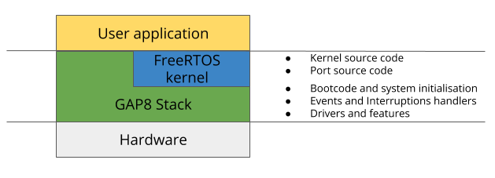

# Introduction


[//]: # ()

FreeRTOS is an RTOS designed for small and resource constrained micro-controllers, issued under MIT license. It was developed and maintained, since 2003, by Richard Barry and his Real Time Engineers Ltd. It is now under the aegis of [Amazon Web Services](https://aws.amazon.com/blogs/opensource/announcing-freertos-kernel-v10/) and became Amazon FreeRTOS since 2017. FreeRTOS still remains available under MIT license.
Light and easily configurable, it supports multi-tasking, various synchronization mechanism and communication between tasks, and various others features. You may refer to the official website to learn more about [FreeRTOS and its features](https://www.freertos.org/FreeRTOS_Features.html).

## FreeRTOS Structure
```bash
freeRTOS
├── demos
|   └── gwt                            --- "Hello World" demo
├── freertos_kernel                    --- FreeRTOS kernel source code
|    ├── include                       --- FreeRTOS kernel headers and macros
|    ├── License                       --- FreeRTOS License file
|    └── portable                      --- FreeRTOS port source files
└── vendors                            --- Vendors specific drivers and libraries
     └── gwt
```

FreeRTOS is a small kernel for embedded systems. To make use of GAP8 and GAPUINO, a stack has been added between the kernel and the hardware as follows.



[//]: # ()

The GAP8 stack makes use of [PMSIS_API](https://github.com/GreenWaves-Technologies/pmsis_api).

## Port details

The port essentially concerns 3 files :
```bash
~/gap_sdk/rtos/freeRTOS$ tree freertos_kernel/portable/GCC/RI5CY-GAP8/
freertos_kernel/portable/GCC/RI5CY-GAP8/
├── chip_specific_extensions           --- RISC-V chips extensions definitions and macros
│   └── gap8                           --- GAP8 extensions
│       └── freertos_risc_v_chip_specific_extensions.h
├── port_asm.S                         --- Functions written in RISC-V assembly
├── port.c                             --- Functions needed for the port
└── portmacro.h                        --- macros used for the port
```

# Hello World test

In *demos* folder, there is a simple there is a simple "Hello World" example for FreeRTOS.
Before trying this example, the shell environment shall be configured. To do so, start a terminal and navigate to *gap_sdk* folder and then execute `source` command. When prompted, select GAP8(1) or GAP8_V2(2) :
```bash
~/gap_sdk$ source sourceme.sh
Which chip you want to use: 1-GAP8 2-GAP8_V2 [1]: 1
The target chip you have chosen is : GAP8
```

Then navigate to the 'HelloWorld' demo and execute the following command :
```bash
~/gap_sdk$ cd freeRTOS/demos/gwt/gap8/common/application_code/
~/gap_sdk/freeRTOS/demos/gwt/gap8/common/application_code$ make clean all run
```

You should get this as the output
~~~
	 *** FreeRTOS HelloWorld ***

Entering main controller
[32 0] Hello World!
Detected end of application, exiting with status: 0
~~~

## Hello World Explanation:

```c
/* PMSIS includes */
#include "pmsis.h"

/* Variables used. */
PI_L2 char hello[20];

void helloworld(void)
{
    printf("Entering main controller\n");
    uint32_t errors = 0;
    uint32_t core_id = pi_core_id(), cluster_id = pi_cluster_id();

    sprintf(hello, "[%d %d] Hello World!\n", cluster_id, core_id);
    printf(hello);

    pmsis_exit(errors);
}

/* Program Entry. */
int main(void)
{
    printf("\n\n\t *** FreeRTOS HelloWorld *** \n\n");
    return pmsis_kickoff((void *) helloworld);
}
```

This helloworld example has 2 functions : `main()` and `helloworld()`.
The `main()` function is used to create threads, kernel objects(semaphore, mutex,...), and start the scheduler. Once the scheduler has started, there is no return to the `main()` function. Therefore, if you need to share variables or objects between tasks, do not instantiate inside the `main()` function. `helloworld()` is the actual function printing "Hello World". The created task's core function.

* The stack size must suit the application. Here the macro `configMINIMAL_STACK_SIZE` is used to indicate the minimal stack size for the Idle Task(task with the lowest priority, 0).
Stack overflow can be checked during runtime by the kernel if `configCHECK_FOR_STACK_OVERFLOW` is set in *FreeRTOSConfig.h*. If `configCHECK_FOR_STACK_OVERFLOW` is set, a hook function must be defined by the user.
The released FreeRTOS is set to check overflows and the associated hook function is defined in *FreeRTOS_util.c*. The program is terminated in case of stack overflow. You are free to edit it to suit your application.
* The task priority can be set between the Idle Task priority and `configMAX_PRIORITIES` - 1.
* A `Task handler` is always linked to a task. It can be used to stop, resume or kill a task by another one.

More details on task creation are available [here](https://www.freertos.org/a00019.html) and [FreeRTOS API Reference](https://www.freertos.org/a00106.html).

If the task creation is successful, the scheduler can then be called. From here on, the `main()` function is not reachable.

In `vTestHelloWorld()`, the task prints "Hello World" with its name, core ID and cluster ID. When it is done, the task suspends its execution( `vTaskSuspend( NULL )` ) and the Idle task takes place on the core and cleans memory allocated for the deleted task. When a task is deleted using `vTaskDelete( taskHandle )`, the Idle task must not be starved of processing time to free allocated memory. The *Idle Task hook* should not use any blocking API.

In the released FreeRTOS, *Idle Task hook* is used to get details of tasks or delete suspended tasks. Once again, you may edit *FreeRTOS_util.c* to your convenience.

## Use uart for printf
Console through uart will be triggered by flag PRINTF_UART, which should be add in the user makefile:

```bash
FREERTOS_FLAGS += -DPRINTF_UART=1
# or
APP_CFLAGS     += -DPRINTF_UART=1
```

# FreeRTOS Scheduler

Tasks in FreeRTOS are classified in 4 states :
* **Running** : Task is currently using the core.
* **Ready** : Task is in ready list, ready to take place on the core.
* **Blocked** : Task is waiting for an event. Task can be in this state if the task has called `vTaskDelay()` function, or if a non-null timeout has been defined when the task was waiting for a semaphore, mutex or queue and is not yet available. If the timeout is reached and the object is not available, the task enters in **Ready** state.
* **Suspended** : Same as the **Blocked** state, but without timeout. `vTaskSuspend()` and `xTaskResume()` are the API calls to get in and out of this state.

The states transition diagram is given below.
.

FreeRTOS scheduler is preemptive, with Round-Robin policy. User can modify its behaviour with `configUSE_PREEMPTION` and `configUSE_TIME_SLICING`, *FreeRTOSConfig.h*.

* `configUSE_PREEMPTION` = 0 :

  * Preemptive mode disabled. Tasks take place on core when
    * the running task enters **Blocked** or **Suspended** state
    * the running task explicitly leaves the core when calling `taskYIELD()`

* `configUSE_PREEMPTION` = 1 :

  * `configUSE_TIME_SLICING` = 0 :

    Preemptive mode enabled without time slicing, i.e processing time(quantum) will not be equal between tasks. Tasks are preempted from the core if

    * a higher priority task enters **Ready** state
    * the running task enters **Blocked** or **Suspended** state
    * the running task explicitly leaves the core when calling `taskYIELD()`

  * `configUSE_TIME_SLICING` = 1 :

    Preemptive mode enabled with time slicing, i.e equal processing time between tasks of equal priority. Tasks are preempted from the core if

    * one or more tasks of equal priority are in **Ready** state.
    * a higher priority task enters **Ready** state
    * the running task enters **Blocked** or **Suspended** state
    * the running task explicitly leaves the core when calling `taskYIELD()`

FreeRTOS is released with preemptive mode and time slicing enabled.

# Memory allocation

## Memory locations

On GAP8, there are 3 locations for data storage :

| Name | Address | Size | Type |
|:---:|:---:|:---:|:---:|
| L2_RAM | 0x1C000000 | 512kB | Primary memory used for both data and instructions storage |
| FC_TCDM | 0x1B000000 | 16kB | Memory used by Fabric Controller for fast access |
| L1_TCDM | 0x10000000 | 64kB | Shared memory between Feature Cluster cores |

## Malloc implementations

FreeRTOS offers 5 algorithms to allocate memory.

`configSUPPORT_DYNAMIC_ALLOCATION` must be set in order to use the following malloc implementations.
* **heap_1** : Simplest implementation of `pvPortMalloc( size )`, malloc function. The requirements to use this implementation : memory size, defined with `configTOTAL_HEAP_SIZE`, and an array for the heap if `configAPPLICATION_ALLOCATED_HEAP` is set.
This implementation allows memory allocation but does not allow to free the allocated memory.

* **heap_2** : Same requirements as of heap_1. This implementation allows allocated memory to be freed, but does not combine adjacent free blocks into a single larger one, so the memory is likey to be fragmented.

* **heap_3** : This implementation is simply a wrapper of the compiler's malloc and free functions. No requirements are needed.

* **heap_4** : Same requirements as of heap_1. This implementation is similar to heap_2, but this one combines adjacent free blocks into a larger one.

* **heap_5** : This implementation requires memory regions for memory allocation. A memory region is defined by the start address of the memory region and its size. Several memory regions can be defined to allocate memory. Memory region initialization must occur before any memory allocation. It is done by a call to `vPortDefineHeapRegions( xHeapRegions )` function.
	In `main()`, this call should be the first instruction, before task creation.

In order to optimize memory allocations, we have added our own memory allocation implementation. You can find it in *rtos/pmsis/pmsis_driver/pmsis_malloc/malloc_internal.c*. It is a simple allocator which do not keep metadata used to allocate memory.
Therefore this implementation requires, to free an allocated memory block, a pointer to the block to free along with its size.

```c
/*!
 * @brief Allocate memory from an allocator.
 *
 * This function allocates a memory chunk.
 *
 * @param a      Pointer to a memory allocator.
 * @param size   Size of the memory to be allocated.
 *
 * @return Start address of an allocated memory chunk or NULL if there is not enough memory to allocate.
 */
void *__malloc(malloc_t *a, int32_t size);

/*!
 * @brief Free an allocated memory chunk.
 *
 * This function frees an allocated memory chunk. The freed memory chunk is chained back to the list of free space to allocate again.
 *
 * @param a      Pointer to a memory allocator.
 * @param _chunk Start address of an allocated memory chunk.
 * @param size   Size of the allocated memory chunk.
 */
void __malloc_free(malloc_t *a, void *_chunk, int32_t size);
```
All three memory allocation(in memory locations previously mentionned) strategies rely on this implementation.


If this implementation does not suit your application, you may switch for another implementation or use compiler's implementation. In that case, you will have to edit the Makefile rules(*freeRTOS_rules.mk*) to add/remove the correct heap implementation in order to compile the project.

## GAP8 Memory allocations

In GAP8, it is possible to allocate memory in each of the 3 memory locations.

| Location | Function | Arg | Type |
|:---:|:---:|:---:|:---:|
| L2_RAM | void *pmsis_l2_malloc() | int size | Allocate a chunk of *size* bytes in L2 and returns a pointer |
| L2_RAM | void pmsis_l2_malloc() | void *_chunk, int size | Free an allocated memory chunk |
| FC_TCDM | void *pmsis_fc_tcdm_malloc() | int size | Allocate a chunk of *size* bytes in FC memory and returns a pointer |
| FC_TCDM | void pmsis_fc_tcdm_malloc_free() | void *chunk, int size | Free an allocated memory chunk. |
| L1_TCDM | void *pmsis_l1_malloc() | int size | Allocate a chunk of *size* bytes in shared L1 memory and returns a pointer |
| L1_TCDM | void *pmsis_l1_malloc_free() | void *chunk, int size | Free an allocated memory chunk. |

Few notes :
* Before any call to malloc functions, it is necessary to initialize memory allocators for each memory allocations(`pmsis_l2_malloc_init(heapstart, size)` for instance, which takes an address to heap and the size of the heap).
This initialization is already done by default.
* In order to make it easier to use, a wrapper has been implemented to to allocate memory either in `FC_TCDM` or `L2_RAM` depending on available heap. This implementation is more standard like.
It tries to allocate in `FC_TCDM` first then in `L2_RAM`.

```c
/*!
 * @brief Allocate memory from FC or L2 memory allocator.
 *
 * This function allocates a memory chunk in FC if there is enough memory to allocate
 * required chunk of memory otherwise in L2.
 *
 * @param size   Size of the memory to be allocated.
 *
 * @return Pointer to an allocated memory chunk or NULL if there is not enough memory to allocate.
 */
void *pmsis_malloc(size_t size);

/*!
 * @brief Free an allocated memory chunk.
 *
 * This function frees an allocated memory chunk.
 *
 * @param _chunk Start address of an allocated memory chunk.
 */
void pmsis_malloc_free(void *_chunk);
```
## UDMA usage

GAP8 possess a DMA to transfer data between IO peripherals and 'L2_RAM', called `UDMA`, as you can see on the picture above.
There is a limitation to the UDMA usage : the data buffer to send to peripherals or to retrieve data from peripheral can only be in `L2_RAM`.
Thus if you need to send or receive data from IO peripherals, you have to use `pmsis_l2_malloc()` explicitly in order to make sure the allocated buffer is in `L2_RAM`.
There is also the simpler option to have the buffer in L2 memory by declaring it as a global variable(since global variables are by default in `L2_RAM`).

## About stacks

| Type | Size | Location |
|:---:|:---:|:---:|
| Cluster Task Stack | 1KB | L1_TCDM |
| Main Stack | 4KB | FC_TCDM |
| ISR Stack | 1KB | FC_TCDM |
| Idle Task Stack | 512B | L2_RAM |
| FC Task Stack | User choice | L2_RAM |

**Main  Stack** refers to the stack allocated for the `main()` function only. In FreeRTOS, when tasks are created and the scheduler called, there is no coming back to this function, meaning the stack can also not be accessed. If variables/objects are to be passed to tasks, consider using global variables or dynamically allocate them in L2.

For each created task, a memory chunk is allocated in L2_RAM, with th size depending on task's function. This is the **FC Task Stack**. When a part of the task is executed on the Cluster, then for each core enabled, 1KB memory is allocated in L1_TCDM(**Cluster Task Stack**).


# Kernel configuration

In this release, kernel is configured as follows :
* **configUSE_PREEMPTION** : Enabled. You can disable preemptive mode by adding this to the Makefile :
~~~
NO_PREEMPTION	= true
~~~
* **configTICK_RATE_HZ** : Set to 1000. Meaning the SysTick interrupt occurs every 1ms.
* **configUSE_IDLE_HOOK** : Enabled. An associated hook function is defined to delete and exit program.
* **configMINIMAL_STACK_SIZE** : Set to 128. The size here is given in number of words, the real stack size is 128\*4=512B. This macro is used to set the Idle Task's stack. If you do not use Idle Task hook function, the size can be decreased.
* **configUSE_TIMERS** : Disabled to reduce binary size. Setting this macro will enable the use of Software Timers API, but the user should also define  **configTIMER_TASK_PRIORITY**, **configTIMER_QUEUE_LENGTH**, **configTIMER_TASK_STACK_DEPTH**.

All the other configurations are in *FreeRTOSConfig.h*, you can edit it to suit your application.

Hook functions and memory regions are defined in *FreeRTOS_util.c* and *FreeRTOS_util.h*.

More details and information are available in [Amazon Reference Manual](https://docs.aws.amazon.com/freertos-kernel/latest/ref/reference130.html) and in [FreeRTOS Kernel Configuration](https://www.freertos.org/a00110.html).

# FreeRTOS API Reference

Documentation and API Reference can be found on [FreeRTOS API Reference](https://www.freertos.org/a00106.html), [Amazon Reference Manual](https://docs.aws.amazon.com/freertos-kernel/latest/ref/welcome.html) or [Amazon Developer Guide](https://docs.aws.amazon.com/freertos-kernel/latest/dg/about.html).
