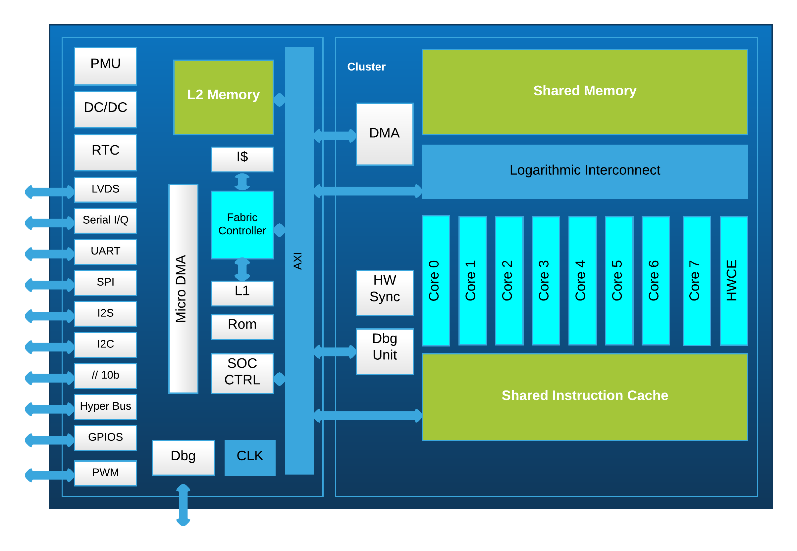

# Introduction to the GAP8 IoT application processor

GAP8 is a RISC-V and PULP (Parallel Ultra-Low-Power Processing Platform) open-source platform based IoT application processor. It enables cost-effective development, deployment and autonomous operation of intelligent devices that capture, analyze, classify and act on the fusion of rich data sources such as images, sounds or vibrations. In particular, GAP8 is uniquely optimized to execute a large spectrum of image and audio algorithms including convolutional neural network inference with extreme energy efficiency. This allows industrial and consumer product manufacturers to integrate artificial intelligence and advanced classification into new classes of wireless edge devices for IoT applications including image recognition, counting people and objects, machine health monitoring, home security, speech recognition, consumer robotics and smart toys.

## GAP8 Micro-architecture

GAP8's hierarchical, demand-driven architecture enables ultra-low-power operation by combining:

+ A series of highly autonomous smart I/O peripherals for connection to cameras, microphones and other capture and control devices.
+ A fabric controller core for control, communications and security functions.
+ A cluster of 8 cores with an architecture optimized for the execution of vectorized and parallelized algorithms combined with a specialized Convolutional Neutral Network accelerator (HWCE).

All cores and peripherals are power switchable and voltage and frequency adjustable on demand. DC/DC regulators and clock generators with ultra fast reconfiguration times are integrated. This allows GAP8 to adapt extremely quickly to the processing/energy requirements of a running application. All elements share access to a L2 memory area. The cluster cores and HWCE share access to a L1 memory area and instruction cache. Multiple DMA units allow autonomous, fast, low power transfers between memory areas. A memory protection unit is included to allow secured execution of applications on GAP8.

All 9 cores share the same extended RISC-V instruction set architecture. The I (integer), C (compressed instruction), M (Multiplication and division) extensions and a portion of the supervisor ISA subsets are supported. These are extended with specific instructions to optimize the algorithms that GAP8 is targeted at. These extensions include zero overhead hardware loops, pointer post/pre modified memory accesses, instructions mixing control flow with computation (min, max, etc), multiply/subtract and accumulate, vector operations, fixed point operations, bit manipulation and dot product. All of these instruction extensions are optimized by the compiler or can be used 'by hand'.

## GAP8 Features

+ 1+8 high performance extended RISC-V ISA based cores.
	+ 1 - A high performance micro-controller
	+ 8 - 8 cores that execute in parallel for compute intensive tasks
+ A hardware Convolution Engine (HWCE) for Convolutional Neural Networks based applications.
+ A level 2 Memory (512KB) for all the cores
+ A level 1 Memory (64 KB) shared by all the cores in Cluster
+ A level 1 memory (8  KB) owned by FC
+ A smart, lightweight and completely autonomous DMA (micro-DMA) capable of handling complex I/O schemes.
+ A multi-channel 1D/2D cluster-DMA controls the transactions between the L2 Memory and L1 Memory.
+ A rich set of peripheral interface
+ 2 programmable clocks
+ Memory Protection Unit

{ width=480px }

As shown in the GAP8 block diagram above, GAP8 has a rich set of I/O interfaces, which includes:

 Interface | Number | Description
--- | --- | ---
 LVDS      | 1 | A 128 Mb/s interface for RF
 ORCA	   | 1 | A low debit interface for RF.
 I2C	   | 2 | Standard I2C interfaces.
 I2S	   | 2 | Standard I2S interface for connecting digital audio devices.
 CPI 	   | 1 | A parallel interface for connecting camera
 HyperBus  | 1 | A high speed memory bus interface
 SPI-M     | 2 | A quad SPI-M and an additional SPI-M
 SPI-S     | 1 | A SPI Slave
 UART      | 1 | A standard UART interface
 GPIOs     | 32| General Purpose Input Output

Other peripherals:

 Peripherals | Number | Description
|---|:---:|---|
 RTC 		 | 1      | 32K real-time clock
 PWM 		 | 4      | PWMs, 12 Output channels

## The Fabric Controller and The Cluster

As mentioned in previous section, GAP8 has 8+1 high performance cores, which play two different roles. The cluster contains 8 cores that can execute in parallel, and provide high performance calculation for image processing, audio processing or signal modulation, etc. The single core, referred to as the “Fabric Controller” or "FC", is used as micro-controller. It is in charge of controlling all the operations of GAP8, like the micro-DMA to capture 1 image from the CPI interface, starting up the cluster and dispatching a job to it, etc. You can think of the cluster as a 'peripheral' of the FC.

Cores are identified using two identification numbers. The cluster ID which identifies the group of cores that the core belongs to and the core ID which identifies the core in that group. The IDs can be used to start a particular task on a core.

ENTITY | CLUSTER ID | CORE ID
|---|:---:|:---:|
CORE0  |    0x00    |   0x00
CORE1  |    0x00    |   0x01
CORE2  |    0x00    |   0x02
CORE3  |    0x00    |   0x03
CORE4  |    0x00    |   0x04
CORE5  |    0x00    |   0x05
CORE6  |    0x00    |   0x06
CORE7  |    0x00    |   0x07
FC     |    0x20    |   0x00

The table above shows:

 + Core 0-7: which have the same cluster ID, but have different core ID.
 + FC: which has the same core ID as the cluster core 0, but its cluster ID is equal to 0x20.

By default, the cluster is powered down and cannot be used. It must first be powered-up by the FC. Once the cluster is awake, its core 0 plays the role of "master". Core 0 is in charge of the following jobs:

 + The communication with the Fabric Controller. For example, getting a task from the FC, sending a data request to the FC, getting synchronized with the FC, etc.
 + Dispatching tasks/applications to other cores.

Before receiving a task from the core 0, the rest of the cores stay at a dispatch barrier which clock gates them (i.e. they are stopped and use only a low leakage current).

When a task/application is finished on the cluster, it should be shut down to save power. IT IS IMPORTANT TO MOVE DATA IN THE SHARED L1 MEMORY TO THE L2 MEMORY BEFORE YOU SHUTDOWN THE CLUSTER.

## Memory areas

There are 2 different levels of memory internal to GAP8. A larger level 2 area of 512KB which is accessible by all processors and DMA units and two smaller level 1 areas, one for the FC (16KB) and one shared by all the cluster cores (64KB). The shared level 1 memory is banked and cluster cores can usually access their bank in a single cycle. GAP8 can also access external memory areas over the HyperBus (Flash or RAM) or quad-SPI (Flash) peripherals. We refer to RAM accessed over the HyperBus interface as level 3 memory. Since the energy cost and performance cost of accessing external RAM over the HyperBus is very high compared to the internal memory generally this should be avoided as much as possible. Code is generally located in the L2 memory area. The instruction caches of the FC (4KB) and cluster (16KB) will automatically cache instructions as needed. The cluster instruction cache is shared between all the cores in the cluster. Generally the cluster cores will be executing the same area of code on different data so the shared cluster instruction cache exploits this to reduce memory accesses for loading instructions.

## Micro-DMA and cluster-DMA

To reduce power consumption GAP8 does not include data caches in its memory hierarchy. Instead GAP8 uses autonomous DMA units that can be used to transfer data to and from peripherals and in between internal memory areas.

Good management of memory is absolutely crucial to extracting the most energy efficiency from GAP8. GreenWaves supplies a tool, the GAP8 auto-tiler, which can significantly aid in managing memory transfers between the different memory areas.

The micro-DMA unit is used to transfer data to and from peripherals including level 3 memory. At the end of a transaction the FC can be woken up to queue a new task. To allow the micro-DMA to continue working at the end of a transaction up to 2 transfers can be queued for each peripheral. The micro-DMA schedules active transfers based on signals from the peripherals in a round-robin fashion. Generally the micro-DMA is not used directly by a programmer. It is used by the drivers for each of the peripherals.

As the micro-DMA, the cluster-DMA is a smart, lightweight and completely autonomous unit. It is used to transfer data between the L2 and L1 memory areas. It supports both 1D and 2D transfers and can queue up to 16 requests. The commands for the cluster-DMA unit are extremely short which minimizes SW overhead and avoids instruction cache pollution.

\newpage

# Introduction to the GAP SDK

The GAP8 SDK allows you to compile and execute applications on the GAP8 IoT Application Processor. This SDK is an extract of the necessary elements from the pulp-sdk (https://github.com/pulp-platform/pulp-sdk) produced by the PULP project, to provide a development environment for the GAP8 series processors.

We provide you with all the necessary tools and two different operating systems for GAP8:

*   Tools
    -   GAP8 RISCV GNU tool chain: a pre-compiled tool chain inherited from RISC V project with support for our extensions to the RISC-V Instruction Set Architecture.
    -   PLPBRIDGE: a tool from the PULP project which allows communication between your PC and a GAP8 processor. Using this tool you can:
            - Program / control GAP8
            - Debug your application using GDB
            - Program the GAPuino flash memory with applications

*   Operating Systems
    -   PULP OS - The open source embedded RTOS produced by the PULP project
    -   Arm® Mbed™ OS - Arm Mbed OS is an open source embedded operating system. GreenWaves Technologies has ported it to GAP8.

\newpage
# Installing the GAP SDK

These instructions were developed using a fresh Ubuntu 16.04 Xenial 64-Bit virtual machine from https://www.osboxes.org/ubuntu/#ubuntu-16-04-info.

The following packages needed to be installed:

~~~~~shell
sudo apt-get install -y build-essential git libftdi-dev libftdi1 doxygen python3-pip libsdl2-dev
sudo ln -s /usr/bin/libftdi-config /usr/bin/libftdi1-config
~~~~~

The debug bridge uses a python3 application. Python3 is already included in the Ubuntu image above however one extra package was required:

~~~~~shell
pip3 install pyelftools
~~~~~

For the USB serial connection GAPuino uses an FDDI 2 port serial to USB controller. This needs to be set up (the driver is installed in the apt-get install step above).

Add your username to the dialout group:

~~~~~shell
sudo usermod -a -G dialout <username>
~~~~~

Logout from your session and login again. Now create a udev rule for gapuino ftdi2232 usb chip

~~~~~shell
touch 90-ftdi_gapuino.rules
echo 'ATTRS{idVendor}=="0403", ATTRS{idProduct}=="6010", MODE="0666", GROUP="dialout"'> 90-ftdi_gapuino.rules
sudo mv 90-ftdi_gapuino.rules /etc/udev/rules.d/
sudo udevadm control --reload-rules && sudo udevadm trigger
~~~~~

If you are using a Virtual Machine make sure that you give control of the FTDI device to your virtual machine. Plug the GAPuino into your USB port and then allow the virtual machine to access it. For example, for VirtualBox go to Devices->USB and select the device.

Please also make sure that your Virtual Machine USB emulation matches your PC USB version. A mismatch causes the USB interface to be very slow.

The following instructions assume that you install the GAP SDK into your home directory. If you want to put it somewhere else then please modify them accordingly.

Now clone the GAP8 SDK and the GAP8/RISC-V tool chain:

~~~~~shell
git clone https://github.com/GreenWaves-Technologies/gap_sdk.git
git clone https://github.com/GreenWaves-Technologies/gap_riscv_toolchain.git
~~~~~

Install the tool chain:

~~~~~shell
cd ~/gap_riscv_toolchain
./install.sh
~~~~~

Initialize and download all the sub projects of the SDK:

~~~~~shell
cd ~/gap_sdk
git submodule update --init --recursive
~~~~~

Build the GAP8 SDK:

~~~~~shell
make all
~~~~~

## Getting the Autotiler

The autotiler code generation library needs to be downloaded from https://greenwaves-technologies/get-auto-tiler. Once you register for the autotiler you will receive an email with a link to the autotiler tarball. The autotiler is currently compiled for 64 bit Ubuntu 16.04 only. The tarball should be extracted in the gap_sdk/tools directory.

~~~~~shell
cd ~/gap_sdk/tools
tar xvf received_file.tar.gz
~~~~~

# Compiling, running and debugging programs

The following command configures the shell environment correctly for the GAP8 SDK. It must be done for each terminal session:

~~~~~shell
source ~/gap_sdk/sourceme.sh
~~~~~

Tip: You can add an "alias" command as following in your .bashrc file:

~~~~~shell
alias GAP_SDK='cd ~/gap_sdk && source sourceme.sh'
~~~~~

Typing GAP_SDK will now change to the gap_sdk directory and execute the source command.

Finally try a test project. First connect your GAPuino to your PCs USB port and then type:

~~~~~shell
cd ~/gap_sdk/examples/pulp-examples/helloworld
make clean all run
~~~~~

After the build you should see:
~~~~~
Entering main controller
Entering cluster on core 0
There are 8 cores available here.
[clusterID: 0x 0] Hello from core 0
[clusterID: 0x 0] Hello from core 1
[clusterID: 0x 0] Hello from core 2
[clusterID: 0x 0] Hello from core 3
[clusterID: 0x 0] Hello from core 4
[clusterID: 0x 0] Hello from core 5
[clusterID: 0x 0] Hello from core 6
[clusterID: 0x 0] Hello from core 7
Leaving cluster on core 0
[clusterID: 0x20] Hello from core 0
Test success: Leaving main controller
Detected end of application, exiting with status: 0
~~~~~

## Debugging Programs

The JTAG bridge allows for printf's in your code to generate messages on your PC. GAP8 also has support for gdb server over JTAG for both pulp-os and mbed-os programs.

To enable gdbserver run mode execute the make target gdbserver:

~~~~~shell
make clean all gdbserver
~~~~~

The program will load and gdbserver will be started. Connect to the target with gdb from another shell:

~~~~~shell
riscv32-unknown-elf-gdb BUILD/GAP8/GCC_RISCV/test
~~~~~

Once gdb has loaded connect to the gdbserver on the target:

~~~~~
(gdb) target remote localhost:1234
Remote debugging using localhost:1234
~~~~~

## What is in the gap8_sdk folder?

This folder contains all the files of the GAP8 SDK, the following table illustrate all the key files and folders:

Name | Descriptions
------------ |---------------------------------------------------------------------------
docs | Runtime API, auto-tiler and example application documentation
pulp-os | a simple, PULP Runtime based, open source operating system for GAP8.
mbed-os | ARM Mbed OS based operating system
sourceme.sh | A script for configuring the GAP SDK environment
examples | Examples of runtime API usage
tools | All the tools necessary for supporting the GAP8 usage

