# Introduction

Arm® Mbed™ OS is an open source embedded operating system designed specifically for the "things" in the Internet of Things developed by Arm for the Cortex-M series of micro-controllers. It includes all the features you need to develop a connected product including security, connectivity, an RTOS and drivers for sensors and I/O devices.

GreenWaves has ported Mbed OS to the RISC-V based GAP8 IoT Application Processor.

# Porting Arm® Mbed™ OS to GAP8

Arm® Mbed™ OS is based on Cortex Micro-controller Software Interface Standard (CMSIS) which provides a ground-up software framework for embedded applications that run on Cortex-M based micro-controllers. CMSIS was started in 2008 and the initiative is in close cooperation with various silicon and software vendors. CMSIS enables consistent and simple software interfaces to the processor and the peripherals, simplifying software reuse and reducing the learning curve for micro-controller developers.

GreenWaves Technologies has ported Arm® Mbed™ OS to help developers familiar with CMSIS shorten the time spent developing and deploying applications onto GAP8. Included in the port are the CMSIS-HAL, CMSIS-Driver and CMSIS-RTOS API sets. The GAP8 port is released under the same open source license as Arm® Mbed™ OS. The included GAP8 CMSIS implementation can also be used as a basis for ports of other RTOS's to GAP8.

# Introduction
 Here is the global software struct of the Arm® Mbed™ OS, from now we provide developpers all resources except communication interfaces (under developing and testing).
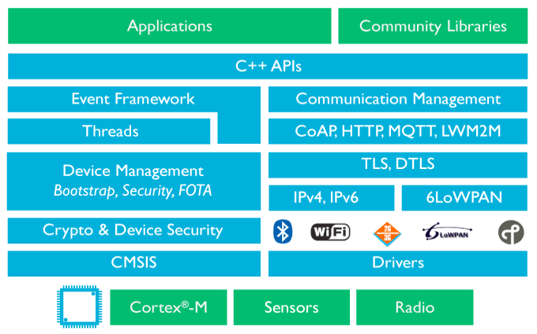{ width=500px }

The mbed library provides abstractions for the microcontroller (MCU) hardware (in particular drivers for the MCU peripherals) and it is divided in the following [software layers and APIs](https://os.mbed.com/handbook/mbed-library-internals):
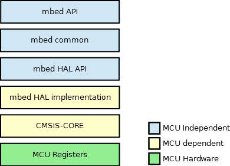{ width=400px }
To port the mbed library to a GAP8, we provide the two software layers marked as "MCU dependent" and one basic software layer for RISC-V 32-bit based "MCU Registers" in the above diagram. So if users are also interested in othe RTOS like freeRTOS, you can reuse the three lowest layers to your own project. In addiction, you can even reuse the "MCU Registers" for other RISC-V 32-bit based MCU like (SIFIVE E310).

## Porting details
###[Memory model](https://docs.mbed.com/docs/mbed-os-handbook/en/5.1/concepts/memory_model/)
As we can see in the gap8 architectrue below, it has three main memories:
 - Shared L1 TCDM (right side in the CLUSTER domain) with one cycles access time, start address is 0x10000000, 64KB;
 - Shared L2 RAM (left side above in the SoC domain) with several cycles access time, start address is 0x1C000000, 512KB;
 - FC L1 TCDM (left side below in the SoC domain) with one cycles access time, start address is 0x1B000000, 16KB.
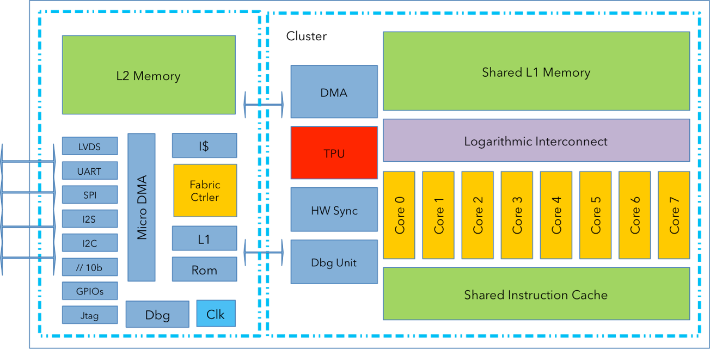{ width=500px }

To use the heap of these memory space:
| Memory Type | Allocator | De-Allocator
|------------- |---------- |-------
| L1 TCDM | void* L1_Malloc(size_t size) | void L1_Free(void *ptr)
| FC TCDM | void* FC_Malloc(size_t size) | void FC_Free(void *ptr)
| L2 RAM | void* malloc (size_t size) | void free (void* ptr);

So how to use these memory resources in Arm® Mbed™ OS to create an efficient software system is our objective, here we give a suggestion for each thread stack configuration for OS.

| STACK | Memory Type
|------------------ |-----------------
| L1_each_core_stack | L1 TCDM
| OS_stack | FC TCDM
| Main_thread_stack | FC TCDM
| Idle_thread_stack | FC TCDM
| Timer_thread_stack | FC TCDM
| APP_thread_stack | L2 RAM

So as we can see, the main thread stack is in FC TCDM, so all local variables in main thread are in FC TCDM with starting address of 0x1B00xxxx. So these variables can not seen by UDMA if you want to transfer data. Here is the examples :
```
#include "mbed.h"
// Read BMP280 ID
I2C i2c(I2C0_SDA, I2C0_SCL);

#define BMP_ADDR  0xEC;

int main() {

    i2c.frequency(200000);

    char reg_addr;
    char id;

    reg_addr = 0xD0;

    i2c.write(BMP_ADDR, &reg_addr, 1, 1);
    i2c.read(BMP_ADDR, &id, 1);

    printf("Read ID = %x\n", id);
    return 0;
}
```
This example can not pass because of `reg_addr` and `id` are local variables in main thread, so UDMA can not transfer buffer with starting address out of the range of L2 memory. So users need to put the local variables in L2 memory. By default, global variables are in L2. Here is the right way :
```
#include "mbed.h"
// Read BMP280 ID
I2C i2c(I2C0_SDA, I2C0_SCL);

#define BMP_ADDR  0xEC;

GAP_L2_DATA char reg_addr;
GAP_L2_DATA char id;

int main() {

    i2c.frequency(200000);
    reg_addr = 0xD0;

    i2c.write(BMP_ADDR, &reg_addr, 1, 1);
    i2c.read(BMP_ADDR, &id, 1);

    printf("Read ID = %x\n", id);
    return 0;
}
```
In conclusion, if users want to use L2 memory for main thread stack, you can checkout to `mbed-os-l2-stack` branch, then, you will not have this problem, but the speed and power consumption of your program will deteriorate.


# PINOUT
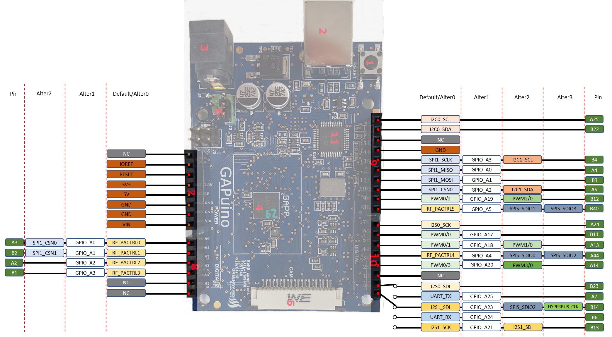{ width=1000px }


# Drivers
## Drivers support situation for GAP8 (1st release)
| Driver type | CMSIS_Driver | Mbed API (C) | Mbed API (C++) | Example
|------------ |------------- |------- |-------- |---------------
| LVDS | NO | - | - | NO
| ORCA | NO | - | - | NO
| SPIM | YES | YES | YES | YES
| HYPERBUS | YES | YES | YES | YES
| UART | YES | YES | YES | YES
| I2C | YES | YES | YES | YES
| TCDM | NO | - | - | NO
| I2S | YES | - | - | YES
| CPI | YES | - | - | YES
| RTC | YES | YES | YES | YES
| SPIS | YES | - | - | YES


## Driver APIs' Differences
In GAP8, all the external peripherals are controlled by a unit we call the micro-DMA (UDMA). This means that all transmissions are asynchronous and explicit. For example, the classic loop waiting for incoming characters from a UART cannot be used in an application running on GAP8. This causes some changes in the standard Mbed OS APIs which need to be noted.

 1 SPI C, C++ API

In normal SPI transfer, users may want to control the chip select signal before and after the transfer, here is the common use in mbed:

```
// Select the device by seting chip select low
cs = 0;

// Send 0x8f, the command to read the WHOAMI register
spi.write(0x8F);

// Deselect the device
cs = 1;
```
However, in GAP8 transfer is controlled by UDMA through command sequences,
users can choose using GPIO in C++ API to control chip select pin (except SPI0_CSN0),
and we also provide users with special control function for chip select:
```
/** Control spi master chip select status
 *
 *  Here we use udma to transfer data, so chip select is controled by udma
 *
 *  @param status Chip select high or low
 *
 *  @returns
 *    uDMA Status
 */
virtual int udma_cs(int status);
```

Here is the usage example :

```
// Select the device by seting chip select low
spi.udma_cs(0);

// Send 0x8f, the command to read the WHOAMI register
spi.write(0x8F);

// Deselect the device
spi.udma_cs(1);
```

GAP8's SPI master 0 supports Quad-SPI mode, so we have added some extension APIs to support QSPI by using command sequence.
In command sequence mode, users do not need to control chip select signal, it will control by UDMA automatically.

For some devices where you need polling status, GAP8 SPI and QSPI interfaces also provide an auto polling mechanism.

```
/** Specify I/O width of SPI transaction (Quad SPI or not)
 *
 * @param[in] obj   The SPI peripheral to use for sending
 * @param[in] qpi   Choose Quad SPI or normal SPI
 */
int spi_master_qspi(spi_t *obj, spi_qpi_t qpi);
```
```
/** SPI auto polling
 *
 * @param[in] obj   The SPI peripheral to use for sending
 * @param[in] conf  The configuration of auto polling
 */
int spi_master_auto_polling(spi_t *obj, spi_polling_config_t *conf);
```
```
/** SPI blocking sequence transaction
 *
 * This function will create udma control sequence according to sequence configuration data
 * And then do blocking transaction read or write
 *
 * @param[in] obj   The SPI peripheral to use for sending
 * @param[in] seq   The command sequence configuration data
 */
int spi_master_transfer_command_sequence(spi_t *obj, spi_command_sequence_t* seq);
```
## SPI Usage
### Example 1
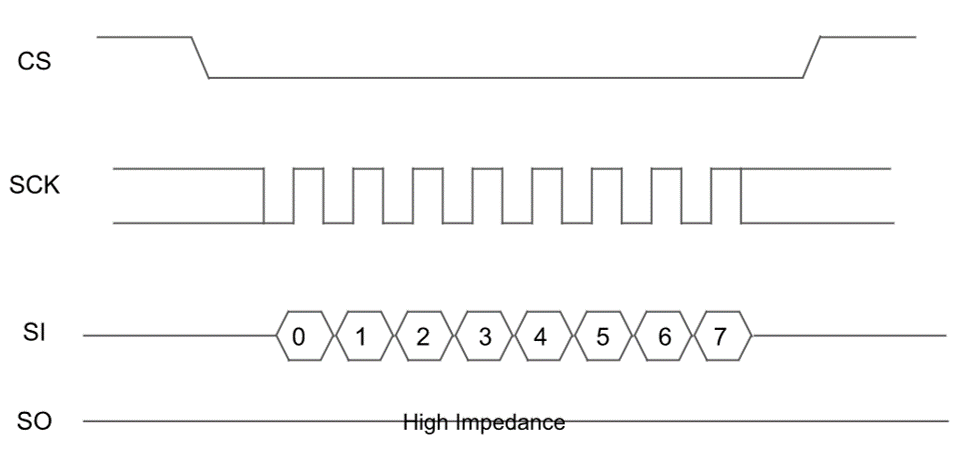{ width=400px }
```
spi.udma_cs(0);
spi.write(0x06);
spi.udma_cs(1);
```
or
```
spi_command_sequence_t sequence;

// Initialize sequence structure to 0
memset(&sequence, 0, sizeof(spi_command_sequence_t));
sequence.cmd       = 0x06;
sequence.cmd_bits  = 8;
sequence.cmd_mode  = uSPI_Single;
spi.transfer_command_sequence(&sequence);
```

### Example 2
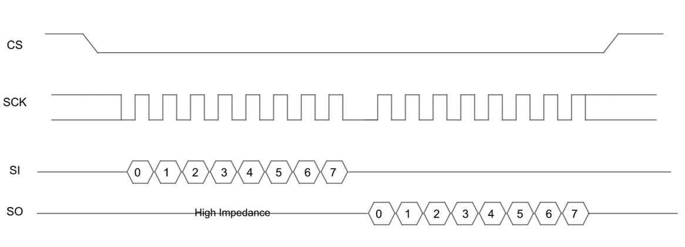{ width=500px }
```
char result;

spi.udma_cs(0);
spi.write(0x06);
result = spi.write(0x00);
spi.udma_cs(1);
```
or
```
spi_command_sequence_t sequence;
char result;

// Initialize sequence structure to 0
memset(&sequence, 0, sizeof(spi_command_sequence_t));
sequence.cmd       = 0x06;
sequence.cmd_bits  = 8;
sequence.cmd_mode  = uSPI_Single;
sequence.rx_bits   = 8;
sequence.rx_buffer = (uint8_t *)&result;
sequence.data_mode = uSPI_Single;

spi.transfer_command_sequence(&sequence);
```

### Example 3
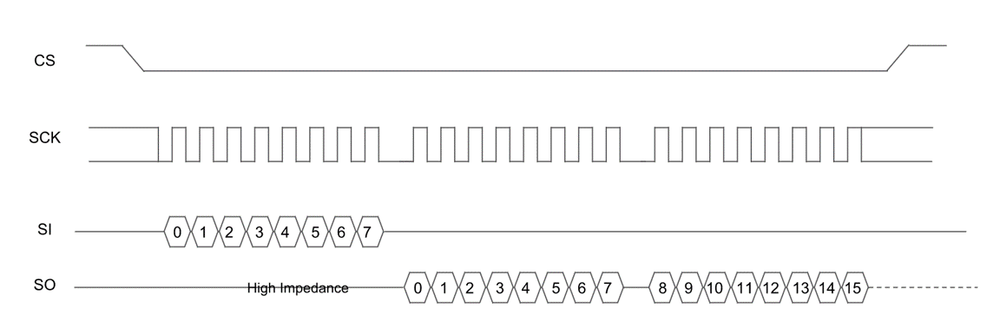{ width=500px }
```
char result[2];

spi.udma_cs(0);
spi.write(0x06);
result[0] = spi.write(0x00);
result[1] = spi.write(0x00);
spi.udma_cs(1);
```
or
```
spi_command_sequence_t sequence;
char result[2];

// Initialize sequence structure to 0
memset(&sequence, 0, sizeof(spi_command_sequence_t));
sequence.cmd       = 0x06;
sequence.cmd_bits  = 8;
sequence.cmd_mode  = uSPI_Single;
sequence.rx_bits   = 8 * 2;
sequence.rx_buffer = (uint8_t *)&result;
sequence.data_mode = uSPI_Single;

spi.transfer_command_sequence(&sequence);
```

### Example 4
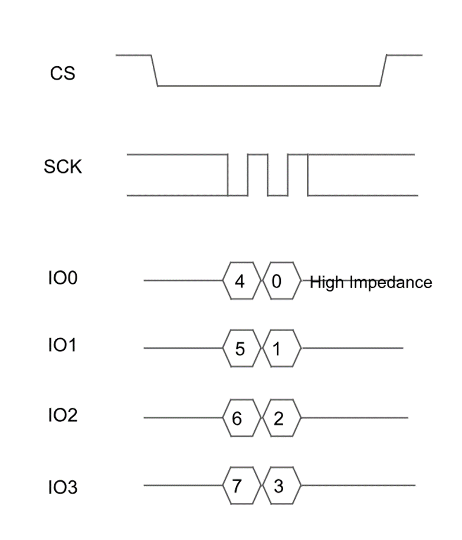{ width=300px }

```
/** Control spi master QSPI
 *
 *  Here we use udma to transfer data, so we can set to use qspi or not.
 *
 *  @param status Use or not use QSPI
 *
 */
virtual void udma_qspi(int status);
```

```
spi.udma_qpsi(1);

spi.udma_cs(0);
spi.write(0x06);
spi.udma_cs(1);
```
or
```
spi_command_sequence_t sequence;

// Initialize sequence structure to 0
memset(&sequence, 0, sizeof(spi_command_sequence_t));
sequence.cmd       = 0x06;
sequence.cmd_bits  = 8;
sequence.cmd_mode  = uSPI_Quad;

spi.transfer_command_sequence(&sequence);
```

### Example 5
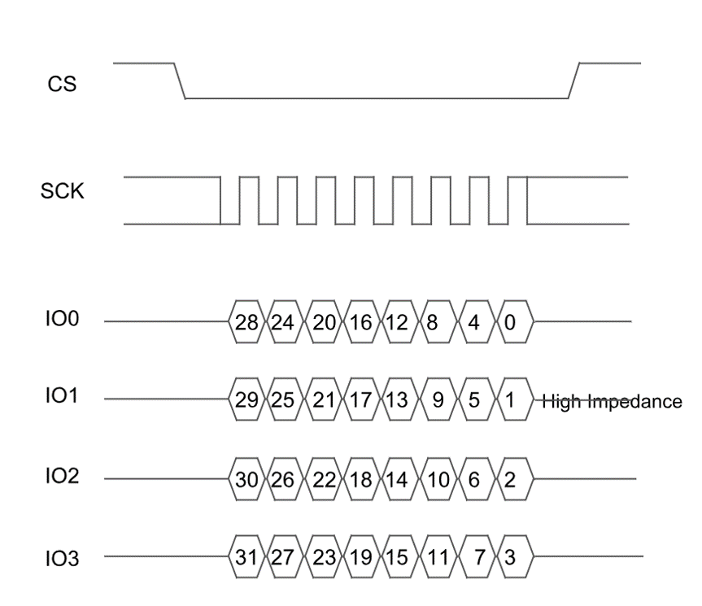{ width=400px }
```
char result[4];

spi.udma_qpsi(1);

spi.udma_cs(0);
spi.write(result[0]);
spi.write(result[1]);
spi.write(result[2]);
spi.write(result[3]);
spi.udma_cs(1);
```
or
```
spi_command_sequence_t sequence;
char result[4];

// Initialize sequence structure to 0
memset(&sequence, 0, sizeof(spi_command_sequence_t));
sequence.tx_bits    = 32;
sequence.tx_data    = (result[0] << 24) | (result[1] << 16) | (result[2] << 8) | (result[3]);
sequence.data_mode = uSPI_Quad;

spi.transfer_command_sequence(&sequence);
```

### Example 6
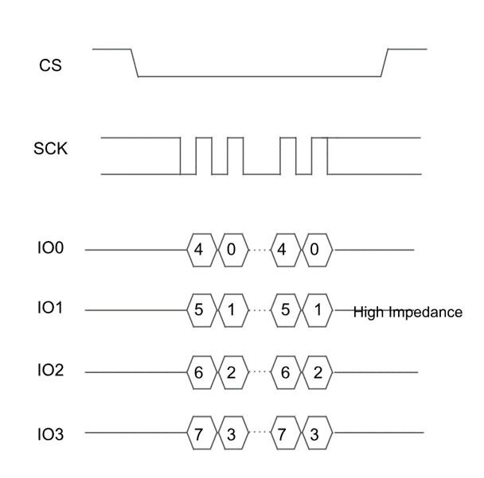{ width=400px }
```
char result;

spi.udma_qpsi(1);

spi.udma_cs(0);
spi.write(0x06);
result = spi.write(0x00);
spi.udma_cs(1);
```
or
```
spi_command_sequence_t sequence;
char result;

// Initialize sequence structure to 0
memset(&sequence, 0, sizeof(spi_command_sequence_t));
sequence.cmd       = 0x06;
sequence.cmd_bits  = 8;
sequence.cmd_mode  = uSPI_Quad;
sequence.rx_bits   = 8;
sequence.rx_buffer = (uint8_t *)&result;
sequence.data_mode = uSPI_Quad;

spi.transfer_command_sequence(&sequence);
```

### Example 7
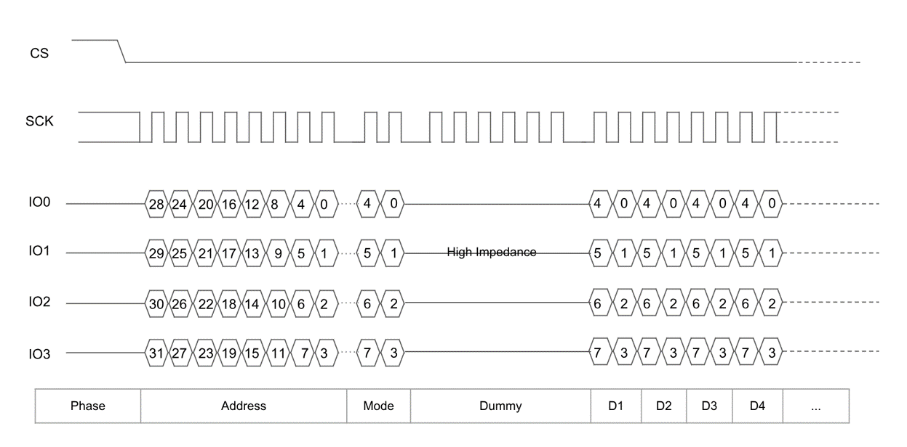{ width=600px }
```
char addr[4];
char result[4];

spi.udma_qpsi(1);

spi.udma_cs(0);
spi.write(addr[3]);
spi.write(addr[2]);
spi.write(addr[1]);
spi.write(addr[0]);

// Mode
spi.write(0x00);

// Dummy 6 cycles
spi.write(0x00);
spi.write(0x00);
spi.write(0x00);

result[0] = spi.write(0x00);
result[1] = spi.write(0x00);
result[2] = spi.write(0x00);
result[3] = spi.write(0x00);
spi.udma_cs(1);
```
or
```
spi_command_sequence_t sequence;
int addr;
char result[4];

// Initialize sequence structure to 0
memset(&sequence, 0, sizeof(spi_command_sequence_t));
sequence.addr_bits = 32;
sequence.addr      = addr;
sequence.addr_mode = uSPI_Quad;

// Mode
sequence.alter_data      = 0x00;
sequence.alter_data_bits = 8;
sequence.alter_data_mode = uSPI_Quad;

// Dummy 6 cycles
sequence.dummy     = 6;

sequence.rx_bits   = BUFFER_SIZE*8;
sequence.rx_buffer = (uint8_t *)result;
sequence.data_mode = uSPI_Quad;

spi.transfer_command_sequence(&sequence);
```

 2 HYPERBUS C, C++ API

Cypress HyperBus Memory is a portfolio of high-speed, low-pin-count memory products that uses our HyperBus interface technology.  The HyperBus interface draws upon the legacy features of both parallel and serial interface memories, while enhancing system performance, ease of design, and system cost reduction.  The 12-pin, HyperBus interface operates at Double Data Rate (DDR) and can scale up to 333 MB/s throughput making it an ideal solution for automotive, industrial and IoT applications that require “instant-on” capability.

GAP8 uses HyperBus to support external flash and RAM memory. We have added new C and C++ APIs to allow use of HyperBus in Arm® Mbed™ OS in the /hal and /driver directories.

 3 For all other APIs and more informations about Arm® Mbed™ OS  - Please refer to the Mbed documentation at https://www.mbed.com

# Running an Arm® Mbed™ OS application on GAP8

## TEST Support
In directory ./gap_sdk/examples/mbed-examples, you can find various tests :
| Test type | Description
|------------ |-------------
| test_os | Arm® Mbed™ OS C APIs tests
| test_driver | Arm® Mbed™ OS C Driver tests
| test_os_c++ | Arm® Mbed™ OS C++ Rtos tests
| test_driver_c++ | Arm® Mbed™ OS C++ Driver tests
| test_event | Arm® Mbed™ OS Event Queue C++ tests
| test_features | Arm® Mbed™ OS Features C or C++ tests
| test_application | Arm® Mbed™ OS GAP8 Apllications tests
| test_autotiler | Arm® Mbed™ OS GAP8 Autotiler (CNN tools) tests

## Two Methods to compile and run your tests
### Use Makefile
Change directory to an example and run as for mbed-os examples.

````shell
cd ./gap_sdk/examples/mbed-examples/test_features/test_Cluster_HelloWorld
make clean all run
````

After compilation and application load to your GAPUINO board by JTAG, Here is the result:

````
Fabric controller code execution for mbed_os Cluster Power On test
Hello World from cluster core 0!
Hello World from cluster core 6!
Hello World from cluster core 1!
Hello World from cluster core 4!
Hello World from cluster core 2!
Hello World from cluster core 7!
Hello World from cluster core 5!
Hello World from cluster core 3!
Test success
Detected end of application, exiting with status: 0
````
### Use uart for printf
Console through uart will be triggered by flag PRINTF_UART, which should be add in the user makefile:

~~~~shell
MBED_FLAGS += -DPRINTF_UART=1
~~~~

###Use [Mbed CLI](https://github.com/ARMmbed/mbed-cli)
 1 Download Arm® Mbed™ OS official examples.

````shell
git clone https://github.com/ARMmbed/mbed-os-example-blinky
````
 2 Here to use our porting project, please change the mbed-os.lib

````shell
echo https://github.com/GreenWaves-Technologies/mbed-os > mbed-os.lib
````
 3 Please following [Mbed CLI](https://github.com/ARMmbed/mbed-cli) instruction

````shell
mbed deploy
````
 4 Compile your code, before compilation, please remember to export your compiler path, for example:

````shell
export PATH=/usr/lib/gap_riscv_toolchain/bin:$PATH
````
Then,
````shell
mbed compile -t GCC_RISCV -m GAP8
````
 5 Run with your binary in GAPUINO
````shell
run_mbed ./BUILD/GAP8/GCC_RISCV/mbed-os-example-blinky.elf
````
 6 For more informations, please see [mbed-gapuino-sensorboard](https://github.com/GreenWaves-Technologies/mbed-gapuino-sensorboard)
# Trademark

Arm® and Arm® Mbed™ OS are registered trademarks or trademarks of Arm Limited (or its subsidiaries) in the USand/or elsewhere.
