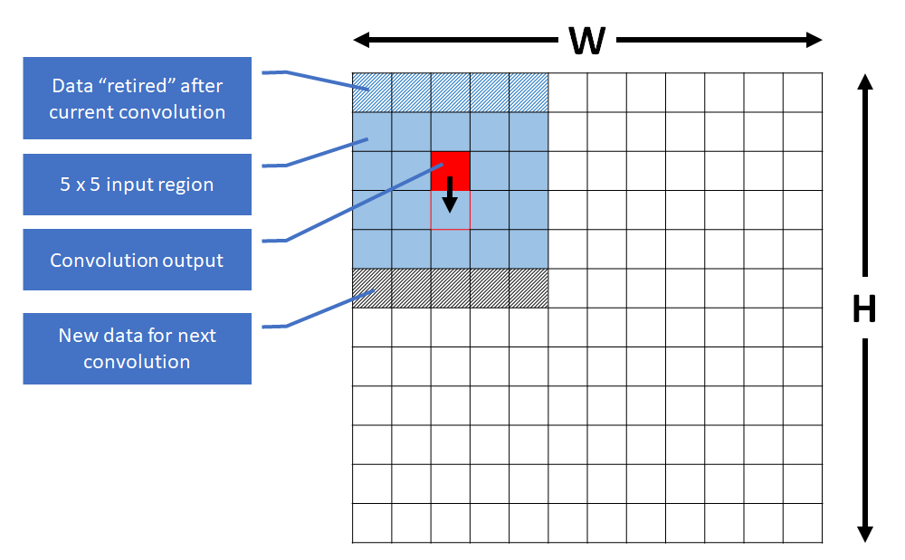
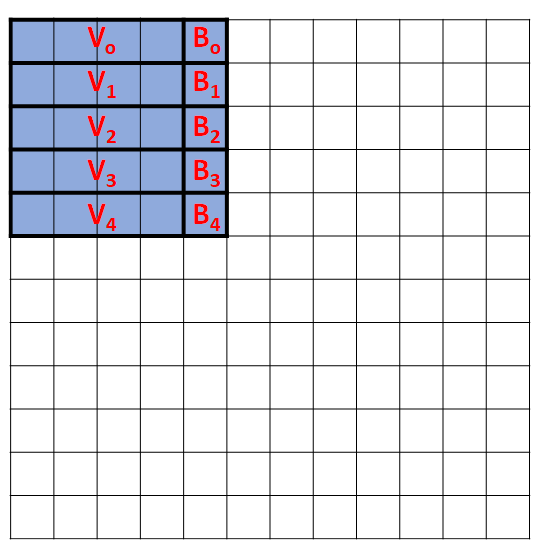
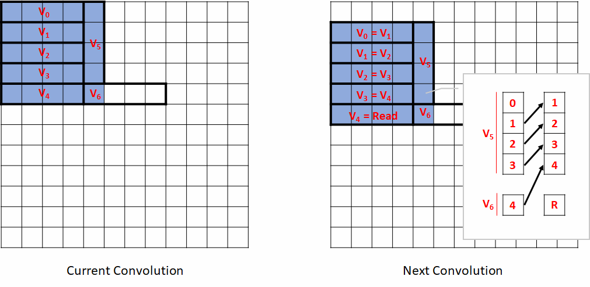
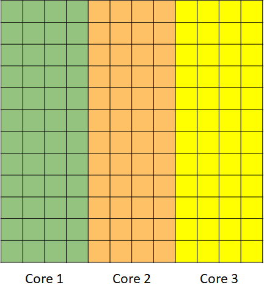

## Example of optimization with vectors and parallelization

### Introduction

In this section we will illustrate step by step how to optimize a
5 x 5, 2D convolution operating on byte inputs and using byte filter
coefficients.

All cycle measurements in these examples were obtained from actual measurements on simulation of GAP8.

We start from a straightforward single core, fixed point implementation in both a basic and then partially unrolled version. Then we use vectorization to improve performance and then further refine the vectorized version. The first step speeds up the code by a factor of 2.84 and the second step by a factor of 2.6. The combination of the two techniques runs with 7.3 times the speed of the straight scalar implementation on one core.

We then show how this single core code is modified to run on the 8 cores of
GAP8's cluster, increasing speed by an almost ideal factor of 8. The
combination of single core centric optimizations with parallelization
leads to an increase in performance of 56.8 times versus the basic single core implementation. It runs in as little as 2.5 processor cycles per full 5 x 5 convolution.

A 5 x 5, 2D convolution is simply a dot product (the sum of the multiplication of each element with the corresponding element) between all the values in
the 5 x 5 coefficient matrix and the content of the 5 x 5 square below the
coefficient matrix in the input plane.

We obtain all the convolution outputs by sliding the fixed value 5 x 5 coefficient matrix in the 2 directions of the input plane by a step of 1. If the input plane has dimension \[WxH\] the dimension of the output plane will be \[(W-4)x(H-4)\].

We assume input data and filter coefficients are fixed point numbers in
the \[-1.0 .. 1.0\] range, in Q^7^ format[^1]. When two Q^7^ numbers are
multiplied the result is a Q^14^ number, to normalize it back to Q^7^ we
simply have to shift its content by 7 bits to the right.

A single 5 x 5 convolution output is the result of a sum of 25 products
where each product has arguments in the \[-1.0 .. 1.0\] range, therefore
a convolution output is in the \[-25.0 .. 25.0\] range. In order to
avoid overflow we need to right shift the result by 7 + 5, 7 coming from the Q^7^ format of the inputs and 5 from ceil(log~2~(25)).

We choose to move down columns first, so we slide the window vertically down
the whole height of the input plane before moving to the next vertical
strip. This is illustrated in the diagram below:

{ width=460px }

### Basic scalar implementation

~~~~~c
void __attribute__ ((noinline)) Straight2D_5x5_Convolution( 
  signed char *__restrict__ In, 
  signed char *__restrict__ Out, 
  signed char *__restrict__ Coeff, 
  unsigned int W, 
  unsigned int H) 

{ 
  int i, j, k0, k1; 

  for (i=0; i<(W-4); i++) { 
    for (j=0; j<(H-4); j++) { 
      int Result = 0; 
      for (k1=0; k1<5; k1++) { 
        for (k0=0; k0<5; k0++) {
          Result = Result + In[(j+k1)*W+i+k0]*Coeff[5*k1+k0]; 
        } 
      } 
      Out[j*(W-4)+i] = Result>>(7+5); // Normalize and avoid overflow
    }
  } 
} 
~~~~~

For this first implementation the **number of cycles per convolution output is 142**.

Below we list the Extended ISA RISC-V assembly code generated by the compiler for the central part of the kernel where most of the complexity is:

~~~~~as
1c0012c8: 00df407b lp.setup x0,t5,1c0012e2
1c0012cc: 8896 mv a7,t0
1c0012ce: 887e mv a6,t6
1c0012d0: 005350fb lp.setupi x1,5,1c0012dc
1c0012d4: 00180e8b p.lb t4,1(a6!)
# t3 load
1c0012d8: 00188e0b p.lb t3,1(a7!)
# t3 used in MAC
1c0012dc: 43ce8333 p.mac t1,t4,t3
1c0012e0: 9fb6 add t6,t6,a3
1c0012e2: 0295 addi t0,t0,5
~~~~~

Firstly, notice that the compiler has optimized the loops using the GAP8 extended ISA loop setup instructions.

We see that the inner loop is iterated 5 times and at each iteration we
do 2 reads and a MAC (multiply/accumulate). Unfortunately the t3 input of the MAC comes from the load in the instruction right before it so we have a 1 cycle stall since the data is not immediately ready. The total impact of this 1 cycle penalty is 25 cycles per convolution output. If we can get rid of this penalty we should be able to get down to 117 cycles per output.

The compiler is pipeline aware and schedules the code in order to minimize stall cycles. Unfortunately in this case the scheduling window is one iteration of the inner loop, there is simply no solution to remove this penalty. One possibility is to try unrolling the loop by compiling in -O2 mode to avoid the code bloating effect coming from systematic in-lining performed with -O3.

Another alternative is to perform partial unrolling of the loop manually. This is what we are going to do in the inner loop:

### Partially unrolled scalar implementation

~~~~c
for (i=0; i<(W-4); i++) { 
  for (j=0; j<(H-4); j++) { 
    int Result = 0; 
    for (k1=0; k1<5; k1++) { // Inner loop is unrolled
      Result = Result + In[(j+k1)*W+i+0]*Coeff[5*k1+0]; 
      Result = Result + In[(j+k1)*W+i+1]*Coeff[5*k1+1]; 
      Result = Result + In[(j+k1)*W+i+2]*Coeff[5*k1+2]; 
      Result = Result + In[(j+k1)*W+i+3]*Coeff[5*k1+3]; 
      Result = Result + In[(j+k1)*W+i+4]*Coeff[5*k1+4]; 
    } 
    Out[j*(W-4)+i] = Result>>(7+5); 
  } 
} 
~~~~

Running this new code we are now getting **97 cycles per convolution output** instead of 142. This is more than expected mostly because the generated code now is also more compact with optimal usage of post modified memory accesses. 

If we again dump the generated code we see that the inner loop is now
optimally scheduled with no more load use penalty. With this unrolled form we are now very close to the minimum number of instructions needed for a 5 x 5 convolution, 5 \* (10 loads + 5 macs) = 75. Here we have 80 (5 x 16) instructions executed:

~~~~~assembly
1c001372: 01f6c0fb lp.setup x1,a3,1c0013b0
1c001376: 00070e03 lb t3,0(a4)
1c00137a: 0058830b lb t1,5(a7!)
1c00137e: 00170d83 lb s11,1(a4)
1c001382: 0058038b lb t2,5(a6!)
1c001386: 00270283 lb t0,2(a4)
1c00138a: 00550f8b lb t6,5(a0!)
1c00138e: 00370f03 lb t5,3(a4)
1c001392: 00558e8b lb t4,5(a1!)
1c001396: 426e07b3 p.mac a5,t3,t1
1c00139a: 00470e03 lb t3,4(a4)
1c00139e: 0056030b lb t1,5(a2!)
1c0013a2: 9722 add a4,a4,s0
1c0013a4: 427d87b3 p.mac a5,s11,t2
1c0013a8: 43f287b3 p.mac a5,t0,t6
1c0013ac: 43df07b3 p.mac a5,t5,t4
1c0013b0: 426e07b3 p.mac a5,t3,t1
~~~~~

### First vectorial implementation

GAP8 has built-in support for vectors of 4 byte elements or 2 short elements. Among the supported vectorial instructions there is a one cycle dot product. In our case our input data and coefficients are bytes so they are perfect candidates for vectors of 4 elements. A dot product in this configuration computes 4 products and sums them into a 32 bit output optionally accumulating the sum with an existing value in a register in a single cycle.

If V~0~ and V~1~ are 2 vectors of 4 bytes each then:

Acc = Acc + V~0~\[0\] \* V~1~\[0\] + V~0~\[1\] \* V~1~\[1\] + V~0~\[2\] \* V~1~\[2\] + V~0~\[3\] \* V~1~\[3\].

Each individual product produces a 32 bit result and this is what makes this instruction extremely interesting because the width of its output is much larger than the width of its inputs avoiding overflow.

The diagram below shows how vectors can be used to compute a given convolution. V~0~, V~1~, V~2~, V~3~, V~4~ are vector accesses while B~0~ to B~4~ are regular byte accesses: 

{ width=300px }

Here is the code that uses this vector layout:

~~~~~c
void __attribute__ ((noinline)) VectorStraight2D_5x5_Convolution( 
  signed char *__restrict__ In, 
  signed char *__restrict__ Out, 
  signed char *__restrict__ Coeff, 
  unsigned int W, 
  unsigned int H) 
{ 
  int i, j, k0; 

  for (i=0; i<(W-4); i++) { 
    for (j=0; j<(H-4); j++) { 
      int Result = 0; 
      for (k0=0; k0<5; k0++) { 
        v4s Vin = *((v4s *) (&In[(j+k0)*W+i])); // Input vector
        v4s Vc  = *((v4s *) (&Coeff[k0*5])); // Coefficients accessed as vectors
        // We use a built-in to evaluate 4 of the 5 products in 1 cycle
        Result = gap8_sumdotp4(Vin, Vc, Result);
        // The last product is as usual 
        Result += In[(j+k0)*W+i+4]*Coeff[k0*5+4]; 
      } 
      Out[j*(W-4)+i] = Result>>(7+5); 
    } 
  } 
} 
~~~~~

The gap8_sumdotp4() macro expands to the appropriate gcc built-in. Refer to the API documentation for more information.

If we measure the number of cycles obtained with this new code the **number of cycles per convolution output is 50**.

### Aggressive vectorial optimization

We could likely save a little bit unrolling the inner loop as in the earlier scalar example however if we look more carefully at this code we can see an even greater optimization possibility by looking at the data that changes between 2 consecutive convolution evaluations. 

Obviously the filter stays constant for the entire input plane however 4/5th of the input plane data is also the same between convolution evaluations since we are just sliding the convolution window down by one value. If we can exploit this then we will not only save cycles but also reduce the memory accesses from shared level 1 memory by 80%.

The diagram bellow shows how the vectors are mapped for this strategy and how the vectors are updated when moving from one convolution to the next:

{ width=460px }

As you can see most of the vectors follow the natural order of the input. V~5~ is an exception since it is vertical. Only the first element of V~6~ is used. The right call-out box explains how we build next V~6~ from current V~5~ and V~6~. This process is called vectorial shuffling and is supported by a standard gcc built-in: \_\_builtin\_shuffle(V~0~, V~1~, ShuffleVector).

In the gcc built-in, the vector's elements are labeled from 0 to N-1 where N is the size of the vector. In our case N=4. ShuffleVector indicates which element to pick from V~0~ or V~1~ to produce the i^th^ output. The elements of V~0~ are numbered from 0 to 3 and V~1~ from 4 to 7, so for example \_\_builtin\_shuffle(V~0~, V~1~, (v4s) {7, 0, 1, 5}) will return {V~1~\[3\], V~0~\[0\], V~0~\[1\], V~1~\[1\]}. For our case, the permutation vector we need is (v2s) {1, 2, 3, 4}, a simple shift of one value.

Putting everything together we obtain the following code. As you will see there is a bit more going on since we have to take care of priming the vectors at the beginning of each vertical strip in the input data and we also have to use type casts to convert the input data from bytes to vectors:

~~~~~c
void __attribute__ ((noinline)) VectorOpt2D_5x5_Convolution( 
  signed char *__restrict__ In, 
  signed char *__restrict__ Out, 
  signed char *__restrict__ Coeff, 
  unsigned int W, 
  unsigned int H) 

{ 
  // If we promote all coefficients to vectors, notice that the layout has to 
  // be the same as the one we are using for the data
  v4s C0 = *((v4s *) &Coeff[5*0 + 0]); 
  v4s C1 = *((v4s *) &Coeff[5*1 + 0]); 
  v4s C2 = *((v4s *) &Coeff[5*2 + 0]); 
  v4s C3 = *((v4s *) &Coeff[5*3 + 0]); 
  v4s C4 = *((v4s *) &Coeff[5*4 + 0]); 
  v4s C5 = (v4s) {Coeff[5*0 + 4], Coeff[5*1 + 4], Coeff[5*2 + 4], Coeff[5*3 + 4]}; 
  v4s C6 = (v4s) (unsigned int) (((unsigned char *)Coeff)[5*4+4]); 
  int i, j, k0; 

  for (i=0; i<(W-4); i++) { 
    v4s V0; 
    // Here we have to prime the pipeline
    v4s V1 = *((v4s *) &In[(0)*W+i]); 
    v4s V2 = *((v4s *) &In[(1)*W+i]); 
    v4s V3 = *((v4s *) &In[(2)*W+i]); 
    v4s V4 = *((v4s *) &In[(3)*W+i]); 
    v4s V5 = (v4s) {0, In[(0)*W+i+4],  In[(1)*W+i+4],  In[(2)*W+i+4]}; 
    v4s V6 = (v4s) (unsigned int)(((unsigned char *)In)[(3)*W+i+4]); 
    for (j=0; j<(H-4); j++) { 
      int Result; 
      v4s *Vin = (v4s *) &In[j*W+i]; 

      // Implements the shuffle from previous output to current
      V0 = V1; V1 = V2; V2 = V3; V3 = V4;
      V5 = __builtin_shuffle(V5, V6, (v4s) {1,2,3,4}); 
      // Now these 2 reads is what is left from the original 50 ones
      V4 = Vin[0]; V6 = Vin[1]; 

     // Now we evaluate the 25 sums of products
      Result = gap8_dotp4(V0, C0); 
      Result = gap8_sumdotp4(V1, C1, Result); 
      Result = gap8_sumdotp4(V2, C2, Result); 
      Result = gap8_sumdotp4(V3, C3, Result); 
      Result = gap8_sumdotp4(V4, C4, Result); 
      Result = gap8_sumdotp4(V5, C5, Result); 
      Result = gap8_sumdotp4(V6, C6, Result); 

      Out[j*(W-4)+i] = Result>>(7+5); 
    } 
  } 
} 
~~~~~

Here is the generated assembly for this version looking only at what is done for the loop going through an entire vertical strip `(for (j=0; j<(H-4); j++) {...})`:

~~~~assembly
1c00145e:       01ea40fb                   lp.setup        x1,s4,1c00149a
1c001462:       987797d7                   pv.dotsp.b      a5,a5,t2
1c001466:       b88e17d7                   pv.sdotsp.b     a5,t3,s0
1c00146a:       000f2703                   lw      a4,0(t5)
1c00146e:       b89317d7                   pv.sdotsp.b     a5,t1,s1
1c001472:       b92897d7                   pv.sdotsp.b     a5,a7,s2
1c001476:       c9681657                   pv.shuffle2.b   a2,a6,s6
1c00147a:       b93717d7                   pv.sdotsp.b     a5,a4,s3
1c00147e:       004f2803                   lw      a6,4(t5)
1c001482:       b9f617d7                   pv.sdotsp.b     a5,a2,t6
1c001486:       b85817d7                   pv.sdotsp.b     a5,a6,t0
1c00148a:       40c7de93                   srai    t4,a5,0xc
1c00148e:       01daccab                   sb      t4,s9(s5!)
1c001492:       87f2                       mv      a5,t3
1c001494:       9f36                       add     t5,t5,a3
1c001496:       8e1a                       mv      t3,t1
1c001498:       8346                       mv      t1,a7
1c00149a:       88ba                       mv      a7,a4
~~~~

As you can see it is extremely compact.

If we measure the number of cycles obtained with this new code the **number of cycles per convolution output is 19**.

The table below summarizes the cycles per convolution for our 4 versions.

| Algorithm                  | cycles |
|:---------------------------|-------:|
| Initial version            |    142 |
| With unrolling             |    97  |
| Using vectors              |    50  |
| Aggressively using vectors |    19  |

### Parallel versions

So far we have been using a single core. Now we will see how to modify the code to use all the available cores in the GAP8 cluster.

To parallelize the code the most important thing to notice is that the evaluation of one vertical strip is completely independent from the evaluation of the other vertical strips in the input. Given this, it is straightforward to see that if we split the output plane on groups of vertical strips we will be able to provide work to all the cores that are available. The figure below
illustrates this. In the diagram below for simplicity we assume we have 3 cores:

{ width=300px }

The code below shows our initial basic scalar implementation extended to a parallel version:

~~~~~c
void __attribute__ ((noinline)) Straight2D_5x5_Convolution_Par(ArgConv_T *Arg) 
{ 
  // For parallel calls we use the rt_team_fork() dispatcher so in this case
  // arguments have to be grouped into a single structure and then we pass the
  // address of this structure to the function in the fork.
  // Here we simply extract arguments:
  signed char *__restrict__ In = Arg->In; 
  signed char *__restrict__ Out = Arg->Out; 
  signed char *__restrict__ Coeff = Arg->Coeff; 
  unsigned int W = Arg->W; 
  unsigned int H = Arg->H; 
  unsigned int CoreId = gap8_coreid();  // core number on which this code 
                                        // runs, in 0..MaxCore-1
  unsigned int Chunk = ChunkSize(W-4);  // Returns (W-4)/NumbeOfCores
  // Now we have the chunk size we can compute first and last positions
  // for this core
  unsigned int First = CoreId*Chunk, Last = Min(First+Chunk, W-4); 

  int i, j, k0, k1; 

  // for (i=0; i<(W-4); i++) { 
  for (i=First; i<Last; i++) { 
    for (j=0; j<(H-4); j++) { 
      int Result = 0; 
      for (k1=0; k1<5; k1++) { 
        for (k0=0; k0<5; k0++) {
          Result = Result + In[(j+k1)*W+i+k0]*Coeff[5*k1+k0]; 
        } 
      } 
      Out[j*(W-4)+i] = Result>>(7+5); 
    } 
  } 
  gap8_waitbarrier(0);  // Synchronizes with the other worker
} 
~~~~~

For all the other code variants the approach is identical.

The table bellow gives the number of cycles per convolution output for
our 4 versions, running on 1, 2, 4 and 8 cores.

|                            | 1 core | 2 cores | 4 cores | 8 cores |
|:---------------------------|:------:|:-------:|:-------:|:-------:|
| Initial version            |   142  |    71   |    35   |    19   |
| With unrolling             |   97.4 |   48.9  |   25.2  |   14.2  |
| Using vectors              |    50  |   25.2  |    13   |    7.4  |
| Aggressively using vectors |   19.2 |    9.5  |    4.8  |    2.5  |

You will notice that moving to a parallel implementation has nearly no impact on the performance on 1 core. Also the scaling factor is very close to the ideal as we increase cores, i.e. the cycles decrease proportionally to the number of cores used. In the most aggressive implementation we move from 19.2 down to 2.5 cycles per convolution as we move from 1 to 8 cores, a speed up of a factor 7.68.

If we omit the initial version and compare the result for 1 core with the unrolling version to 8 cores with the most aggressive version we move from 97.4 to 2.5 cycles, an improvement of nearly 39 times. 

The way to understand why we are seeing this much improvement is to look at the resources we are using. First we used 4 dimensional vectors, we can expect a 4 times improvement in performance. Next we parallelized the code with 8 cores, another 8 times faster on top of our original 4 times, so 32 times faster in total, consistent with our 39 times observed improvement.

[^1]: See [Q fixed point number format - https://en.wikipedia.org/wiki/Q_\(number_format\)](https://en.wikipedia.org/wiki/Q_\(number_format\))
