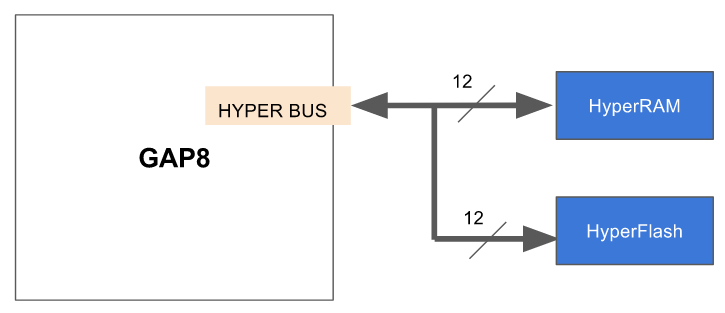

# Introduction to the PULP OS

# How to start compiling and running applications

## Configure the GAP8 Development Environment

The following command configures the shell environment correctly for the GAP8 SDK. It must be done for each terminal session:

~~~~~shell
source ~/gap_sdk/sourceme.sh
~~~~~

Tip: You can add an "alias" command as following in your .bashrc file:

~~~~~shell
alias GAP_SDK='cd ~/gap_sdk && source sourceme.sh'
~~~~~

Typing GAP_SDK will now change to the gap_sdk directory and execute the source command.

## What is in the gap8_sdk folder?

This folder contains all the files of the GAP8 SDK, the following table illustrate all the key files and folders:

Name | Descriptions
------------ |---------------------------------------------------------------------------
docs | Runtime API, auto-tiler and example application documentation
pulp-os | a simple, PULP Runtime based, open source operating system for GAP8.
mbed-os | ARM Mbed OS based operating system
sourceme.sh | A script for configuring the GAP SDK environment
examples | Examples of runtime API usage
tools | All the tools necessary for supporting the GAP8 usage

## How to compile and run the “Hello World” example on GAPUINO Devlopment Board

The hello world example gets each core to print out a hello message. We will go through this example in detail so that you can learn how to schedule tasks on the cluster.

Like other examples and applications, this example is located in the "examples" folder:

~~~~~shell
	cd examples/pulp-examples/hello_world
~~~~~

Then execute this command for compiling and running the example on GAPUINO:

~~~~~shell
	make clean all run
~~~~~

You can also compile and execute the example separately.

~~~~~shell
	make clean all
	make run
~~~~~

In the result, you will see the Hello from all the cores in FC and in Cluster, with their Cluster IDs and Core IDs.

All the examples can be built and run with the same procedure.

### Explanation of hello world example

While reviewing this please refer to the runtime API reference.

The hello world `main()` function is executed on the FC. The runtime uses a simple yet powerful asynchronous event system to synchronize activity between tasks on the FC and the cluster. The first thing the example does is to get a pointer to the default scheduler created when the runtime starts.

~~~~~c
  rt_event_sched_t * p_sched = rt_event_internal_sched();
~~~~~

You can create more schedulers if your application requires more complex hierarchical scheduling structures.

Each scheduler can queue a certain amount of events. To save memory a fixed amount of space is reserved for queued events. To make sure that we have an adequate amount of queued event space we next add room for 4 queued events.

~~~~~c
  if (rt_event_alloc(p_sched, 4)) return -1;
~~~~~

Now we allocate an event and bind it to a function that will be called when it completes, `end_of_call()`. We will use this event a little bit later. Note that we bind the CID constant as an argument for the end_of_call function.

~~~~~c
  rt_event_t *p_event = rt_event_get(p_sched, end_of_call, (void *) CID)
~~~~~

Since our hello world example is going to dispatch a task onto the cluster we first need to switch it on. The `rt_cluster_mount()` call will block until the cluster is switched on when used with a NULL 4th parameter. Many of the asynchronous event based APIs can take NULL as the event argument which transforms them into blocking calls. Whenever blocked the core is clock gated so it consumes minimal power.

~~~~~c
  rt_cluster_mount(MOUNT, CID, 0, NULL);
~~~~~

Each cluster task is a function called on one of the cluster cores. A cluster function first executes on cluster core 0 which acts as a dispatcher to the other cores. Each cluster core function requires an allocated portion of memory to use as a call stack. We may want to allocate slightly more stack to core 0 to cover the extra tasks associated with dispatching to and collecting results from the other cores. In the case of the hello world example there is not much to do so we allocate the same amount of stack for all the cores.

We allocate the stacks in the cluster level 1 shared memory (`RT_ALLOC_CL_DATA`) and we get the number of cores in the cluster using `rt_nb_pe()`.

~~~~~c
  void *stacks = rt_alloc(RT_ALLOC_CL_DATA, STACK_SIZE*rt_nb_pe());
  if (stacks == NULL) return -1;
~~~~~

Now we can actually call the function that we want to execute on the cluster using the `rt_cluster_call()` function. This call will start the function `cluster_entry()` on core 0 of the cluster and will trigger the event allocated in `p_event` when the function `cluster_entry()` exits on core 0. Most APIs that use events can take a NULL pointer for the event parameter. In this case the function will block until completed.

We pass the pointer to the stack area that we have allocated and indicate the size of the stack for core 0 and the size for the other cores and the number of cores that we want to use for this function (all of them).

Just after calling the cluster we trigger events on our scheduler using `rt_event_execute()`. If no events are ready then this call will block and the core will sleep until one is.

~~~~~c
  rt_cluster_call(NULL, CID, cluster_entry, NULL, stacks,
  	STACK_SIZE, STACK_SIZE, rt_nb_pe(),
    p_event);
  rt_event_execute(p_sched, 1);
~~~~~

The function `cluster_entry()` now executes on core 0. We print a message so that you can see the order of execution and start the `hello()` function on all the cores.

~~~~~c
  rt_team_fork(8, hello, (void *)0x0);
~~~~~

The `rt_team_fork()` function will block on core 0 until all the cores have exited the `hello()` function. The `hello()` function is now executed on all cores **including core 0**.

Each core in the cluster prints our its core and cluster IDs.

Control now returns to after the `rt_team_fork()` call which then exits triggering the `p_event` event on the FC which calls the function `end_of_call()`. This function executes on the FC and prints out the FC cluster and core IDs. The `rt_event_execute()` then returns since an event has been serviced. Often we would enclose the call to this function in a loop since we would want to continue waiting for and consuming events but in this simple case we then just turn the cluster off and return terminating the program.

Here is an example of the output:

~~~~~sh
Entering main controller
Entering cluster on core 0
[clusterID: 0x 0] Hello from core 1
[clusterID: 0x 0] Hello from core 0
[clusterID: 0x 0] Hello from core 2
[clusterID: 0x 0] Hello from core 3
[clusterID: 0x 0] Hello from core 4
[clusterID: 0x 0] Hello from core 5
[clusterID: 0x 0] Hello from core 6
[clusterID: 0x 0] Hello from core 7
Leaving cluster on core 0
[clusterID: 0x20] Hello from core 0
Leaving main controller
~~~~~

Notice the control flow, main on FC, then cluster_entry, then hello on all the cores, then return to cluster_entry, then end_of_call and then back to main.

## How to console through uart

In pulp os, the printf will go through JTAG by default. If you want to console via uart, please define parameter "__rt_iodev" in your program as below:

~~~~c
unsigned int __rt_iodev=RT_IODEV_UART;
~~~~

This global variable will trigger the console on serial port.

## How to allocate memory

As mentioned before, there are three areas of memory in GAP8, the FC L1 memory, the shared L1 cluster memory and the L2 memory. The L2 memory is the home for all code and data. The L1 areas are the location for temporary blocks of data that requires very fast access from the associated core. The shared L1 cluster memory is only accessible when the cluster has been mounted.

All memory allocations are executed by the FC. As opposed to a classic malloc function the amount of memory allocated must be supplied both when allocated and when freed. This reduces the meta data overhead associated with the normal malloc/free logic.

The most portable memory allocator is the one provided by rt_alloc and rt_free.

~~~~~c
void* rt_alloc(rt_alloc_e flags, int size)
void rt_free(rt_alloc_e flags, void * chunk, int size)
~~~~~

This takes a first parameter that indicates what the memory is intended to contain. In GAP8 the following areas are used:

| L2 | FC L1 | Cluster L1 |
|:--------------------:|:----------------:|:----------------:|
| RT_ALLOC_FC_CODE | RT_ALLOC_FC_DATA | RT_ALLOC_CL_DATA |
| RT_ALLOC_FC_RET_DATA |  |  |
| RT_ALLOC_CL_CODE |  |  |
| RT_ALLOC_L2_CL_DATA |  |  |
| RT_ALLOC_PERIPH |  |  |

## How to use the event and thread scheduler APIs

The asynchronous interactions between the fabric controller, the cluster and the peripherals are managed with events on the fabric controller side.

An event is a function callback which can be pushed to an event scheduler, for a deferred execution. All events in the same scheduler are executed in-order, in a FIFO manner.

In order to manage several levels of event priorities, there may be several event schedulers at the same time. The application is entered with one event scheduler already created in the runtime, which is the one which can be used as the default scheduler. However the application can then create multiple event schedulers in order to build a more complex multi-priority scenario.

Event schedulers are only executed when specific actions are executed by the application. They can be either invoked explicitly by calling rt_event_execute or implicitly when for example no thread is active and the application is blocked waiting for something.

The pool of events which can be pushed to schedulers must be explicitly managed by the application. There is by default no event allocated. They must be first allocated before they can be pushed to schedulers. This allows the application to decide the optimal number of events that it needs depending on the various actions which can occur.

When a scheduler is invoked, it executes all its pending events, unless the current thread is preempted to schedule another thread. To execute an event, it removes it from the queue and executes the associated callback with its argument, until the callback returns. This scheduler can not execute any other event until the callback has returned.

Each thread is assigned an event scheduler. By default, when a thread is created, it is assigned the internal event scheduler. Another scheduler can then be assigned by the application. This scheduler is the one implicitly invoked when the thread is calling a blocking operation such as waiting for an event.

The runtime on the fabric controller is always running a thread scheduler. This scheduler is priority-based and preemptive. Only the ready threads of the highest priority are scheduled following a round-robin policy. It is intended that threads be preempted at a fixed frequency in order to let other threads of the same priority run however this feature is not present in the runtime in the first release of the SDK.

If the application only uses one thread and uses events to schedule tasks (cooperative multi-tasking) it will always run in the main thread. If the application needs to use preemptive threading then it can use the thread API to create new threads. You can find an example of threads and events in the `examples/threads_events` directory.

## How to use the DMA

The DMA unit that is directly used by the programmer is the cluster-DMA. The micro-DMA is used by peripheral drivers.

The cluster-DMA is used to move data between its 'home location' in L2 memory and the shared L1 cluster memory.

DMA transactions are executed in parallel with code executing on any of the cores. Cluster DMA unit transactions can only be carried out on the cluster. The API should not be used on the FC.

### Transfer identifier synchronization

Generally core 0 will be used to set up DMA transfers and then dispatch tasks to the other cores on completion. Each transfer is assigned a transaction identifier. Optionally a new transfer can be merged with a previous one i.e. they shared the same transaction identifier. The `rt_dma_wait()` function waits until a specific transaction ID has completed.

### 1D/2D copies

The DMA queuing function has a 1D and 2D variant. A 1D DMA operation is a classic linear copy. The 2D functions allow a 2D tile where lines have spaces between them to be copied in a single DMA transfer to a continuous memory space.

### Note

Take care to declare `rt_dma_copy_t copy` as a variable and use its address in functions requesting `rt_dma_copy_t *copy`.

By example, you can find in `app_release/examples/dma/test.c`:
~~~~~c
rt_dma_copy_t dmaCp;
rt_dma_memcpy((int)l2_buff0, (int)cluster_l1_buff, BUFF_SIZE, RT_DMA_DIR_EXT2LOC, 0, &dmaCp);

// Wait for the operation to finish
rt_dma_wait(&dmaCp);
~~~~~

## How to synchronize the cluster cores

Since the cluster is viewed as a peripheral to the fabric controller the synchronization model between the two is simple. You start a task on the cluster and it reports a result with an event.

For some algorithms on the cluster you will launch a task on all the cores and each core will carry out the task on its data but may need to synchronize with the other cores at some intermediate step in the operation.

There is a simple scheme to do this using the `rt_team_barrier()` function. If a cluster core calls this function it will block (clock gated and therefore in a low power state) until all cluster cores in the team have executed `rt_team_barrier()`. The *team* is composed of all the cores that were involved in the last `rt_team_fork()`.

You can see this mechanism in operation in the example `examples/cluster_sync`.

## Cluster HW Convolution Engine

The GAP8 cluster includes a hardware convolution engine which accelerates convolution operations used in CNN. This is not supported in the GVSOC simulator so is not documented in this SDK release.

## How to measure performance

You can measure performance in two ways, performance counters for cycle level performance and the 32kHz clock for overall execution time.

### Performance counters

The cluster and the FC have a range of performance counters that can be used to measure cycle accurate performance on the GVSOC simulator and on the GAP8 hardware.

The following counters are supported on GAP8:

~~~~~c
  RT_PERF_CYCLES        /* Total number of cycles (also includes the cycles where the core is sleeping). */
  RT_PERF_ACTIVE_CYCLES /* Counts the number of cycles the core was active (not sleeping). */
  RT_PERF_INSTR         /* Counts the number of instructions executed. */
  RT_PERF_LD_STALL      /* Number of load data hazards. */
  RT_PERF_JR_STALL      /* Number of jump register data hazards. */
  RT_PERF_IMISS         /* Cycles waiting for instruction fetches, i.e. number of instructions wasted due to non-ideal caching. */
  RT_PERF_LD            /* Number of data memory loads executed. Misaligned accesses are counted twice. */
  RT_PERF_ST            /* Number of data memory stores executed. Misaligned accesses are counted twice. */
  RT_PERF_JUMP          /* Number of unconditional jumps (j, jal, jr, jalr). */
  RT_PERF_BRANCH        /* Number of branches. Counts both taken and not taken branches. */
  RT_PERF_BTAKEN        /* Number of taken branches. */
  RT_PERF_RVC           /* Number of compressed instructions executed. */
  RT_PERF_LD_EXT        /* Number of memory loads to EXT executed. Misaligned accesses are counted twice. Every non-TCDM access is considered external (cluster only). */
  RT_PERF_ST_EXT        /* Number of memory stores to EXT executed. Misaligned accesses are counted twice. Every non-TCDM access is considered external (cluster only). */
  RT_PERF_LD_EXT_CYC    /* Cycles used for memory loads to EXT. Every non-TCDM access is considered external (cluster only). */
  RT_PERF_ST_EXT_CYC    /* Cycles used for memory stores to EXT. Every non-TCDM access is considered external (cluster only). */
  RT_PERF_TCDM_CONT     /* Cycles wasted due to TCDM/log-interconnect contention (cluster only). */
  RT_PERF_CSR_HAZARD    /* Cycles wasted due to CSR access. */
~~~~~

On GAP8 you can monitor `RT_PERF_CYCLES` and one other event simultaneously on FC and cluster. On the GVSOC simulator it is possible to measure all events simultaneously.

To use the performance counters first initialize an rt_perf_t structure:

~~~~~c
  rt_perf_t *perf;
  perf = rt_alloc(RT_ALLOC_L2_CL_DATA, sizeof(rt_perf_t));
  rt_perf_init(perf);
~~~~~

Now set the events that you want to monitor:

~~~~~c
  rt_perf_conf(perf, (1<<RT_PERF_CYCLES) | (1<<RT_PERF_INSTR));
~~~~~

You can now start and stop the counters around any code that you want to measure.

~~~~~c
  rt_perf_start(perf);
  /* code to monitor */
  rt_perf_stop(perf);
~~~~~

The counters are cumulative so you can do this multiple times. Whenever you want to get a measurement you call `rt_perf_save()` and then `rt_perf_get()` to get individual values:

~~~~~c
    rt_perf_save(perf);
    int instr = rt_perf_get(perf, RT_PERF_INSTR);
    int cycles = rt_perf_get(perf, RT_PERF_CYCLES);
~~~~~

You can reset the counters at any time with:

~~~~~c
  rt_perf_reset(perf);
~~~~~

Remember that you need to call these functions on the core that you want to monitor.

### 32kHz timer

The 32kHz timer allows you to measure overall execution time. The timer has a resolution of approximately 31us. You can get the value of the 32kHz timer using the function `rt_time_get_us()`.

## Using peripherals

### HyperBus

The HyperBus interface allows external flash and RAM to be connected to GAP. It draws upon the legacy features of both parallel and serial interface memories, while enhancing system performance, ease of design, and system cost reduction. For GAP8 HyperBus, the read throughput is up to `50 MB/s` (Max Frequency = 25 MHz).

![Hyperbus Diagram [http://www.cypress.com/products/hyperbus-memory]](images/hyperbus_diagram.png){ width=300px }

#### Connection

For GAP8 HyperBus usage, we recommend implementing HyperFlash and HyperRAM together. For example : GAP8 is connected with S71KS256SC0 [1.8 V, 512 Mbit HyperFlash and 64 Mbit HyperRAM]

{ width=300px }

#### Micro-DMA HyperBus Driver

In GAP8 all peripheral access, including HyperBus, is controlled by the micro-DMA unit.

The HyperBus micro-DMA implementation has two channels which both support Flash or RAM. It is normal to configure the two channels as one for Flash and the other for RAM. For example, one for S26KS512S [1.8 V, 512 Mbit (64 Mbyte), HyperFlash™] and the other for S27KS0641 [1.8 V, 128 Mbit (16 Mbyte), HyperRAM™ Self-Refresh DRAM].

In the HyperBus driver, the default channel allocation is channel 0 for HyperRAM and channel 1 for HyperFlash however users can adjust the channel allocation to match their requirements. The driver is responsible for configuring the HyperBus and reading and writing in HyperFlash and HyperRAM.
It supports 4 or 2 byte aligned and unaligned access in the following way:

~~~~c
if (READ) {
   if (BYTES_LENGTH % 4 == 0) {
      // Read BYTES_LENGTH
   } else {
      // Read the last 4 bytes for remainder
      // Read the rest (BYTES_LENGTH - BYTES_LENGTH % 4) bytes
   }
}

if (WRITE) {
   if (BYTES_LENGTH % 4 == 0) {
      // Write BYTES_LENGTH
   } else {
      // Read the last 4 bytes for remainder, and Renew the data
      // Write back the last 4 bytes
      // Write the rest (BYTES_LENGTH - BYTES_LENGTH % 4) bytes
   }
}
~~~~

#### Examples

Here are two HyperBus examples, one for HyperRAM and the other for HyperFlash. You can find the examples in the SDK/examples/peripherals/hyper folder.

##### HyperRAM example

To indicate to GVSOC that it needs to simulate the HyperRAM, the following line has been added to the Makefile:

~~~~~sh
  override CONFIG_OPT += hyperram
~~~~~

- The HyperRam example has `read` and `write` functions
    + Firstly, it opens and configures the HyperRAM device. The function `rt_hyperram_open` opens the correct RAM according to the given device name.
    + Then the function `rt_hyperram_write` writes 1024 bytes from address 0 in HyperRAM. When it finishes, it puts the function `end_of_tx` in event queue.
    + Then the function `rt_hyperram_write` writes 1024 bytes from address 1024 in HyperRAM. When it finishes, it puts the function `end_of_tx` in event queue.
    + When the two write requests end and the two `end_of_tx` functions are executed, two read requests read from address 0 and address 1024 separately
      and will put two functions `end_of_rx` in event queue.
    + When the two read requests end and the two `end_of_rx` functions are executed then the program exits.

##### HyperFlash example

To indicate to GVSOC that it needs to simulate the HyperFlash the following line has been added to the Makefile:

~~~~~sh
override CONFIG_OPT += hyperflash
~~~~~

- The HyperFlash example only has a `read` function.
    + Firstly, it opens and configures the HyperFlash device. The `rt_flash_open` function opens the correct Flash according to device name.
    + Then the function `rt_flash_read` reads 128 bytes from address 0 in HyperFlash, when it finishes, it puts the function `end_of_rx` in event queue.
    + Finally the function `rt_flash_read` reads 128 bytes from address 128 in HyperFlash, when it finishes, it puts the function `end_of_rx` in event queue.
    + When the two read requests end and the two `end_of_rx` functions are executed, then the program exits.

#### File system

You may want to locate some external files in the HyperFlash simulated by GVSOC so you can use them in a test.

Since the HyperFlash is used by the simulator for the boot code we have provided a read only file system that can be initialized by GVSOC to allow the added files to be read.

The example in the SDK/examples/file_system folder shows how to use the mini file system to locate and read two simulated files.

To use the file system with GVSOC, you need to put this in your makefile:

~~~~~c
	override CONFIG_OPT += hyperflash hyperflash/fs/files=<path to the file you want to load into the file system>
~~~~~

This will tell GVSOC to load this file into the file system, which can then be mounted, opened, seeked and read by using the file system API.

As the example, you need to use these API as below:

1. Define the file system configuration structure and initialize it with default values

~~~~~c
  		rt_fs_conf_t conf;
  		rt_fs_conf_init(&conf);
~~~~~

2. Mount a file-system from hyper_flash.

~~~~~c
  		rt_fs_t *fs = rt_fs_mount("hyperflash", &conf, event);
~~~~~

3. Open one file in this file system

~~~~~c
  		file = rt_fs_open(fs, "file_name", flag, event);
~~~~~

4. Read data from this file

~~~~~c
		int size = rt_fs_read(file, &buff_of_recv, SIZE, event);
~~~~~

5. Close the file when it is not needed anymore

~~~~~c
		rt_fs_close (file, event);
~~~~~

6. Unmount the opened file-system

~~~~~c
		rt_fs_unmount(fs, event);
~~~~~

### Sound interface (I2S)

There is an example of using the I2S interface to capture a sound in the directory: SDK/examples/i2s.
The example illustrates how to use the I2S driver to connect to digital microphones.

GAP8 embeds 2 I2S modules. Each modules can be connected to 2 microphones so 4 digital microphone can be connected to GAP8.
Each modules supports PDM or PCM transfers, sampling frequency initialization, and decimation specification in case of PDM transfer

#### Driver Description

The following structure is used to configure each I2S module:

~~~~~c
typedef struct rt_i2s_conf_s {
  unsigned short frequency;
  unsigned short  decimation_log2;
  unsigned char  pdm;
  unsigned char  dual;
} rt_i2s_conf_t;
~~~~~

By default, this structure is initialized with :

~~~~~c
  conf->frequency = 44100;
  conf->decimation_log2 = 8;
  conf->pdm = 1;
  conf->dual = 0;
~~~~~

The default settings are:

+ 44.1kHz sampling frequency is selected
+ PDM mode is selected
+ 64 decimation is selected
+ Single digital microphone is connected

Initialize an I2S configuration with default values.

~~~~~c
void rt_i2s_conf_init(rt_i2s_conf_t *conf);
~~~~~

Open an I2S device.

~~~~~c
rt_i2s_t *rt_i2s_open(char *dev_name, rt_i2s_conf_t *conf, rt_event_t *event);
~~~~~

Capture a sequence of samples.

~~~~~c
static inline void rt_i2s_capture(rt_i2s_t *handle, void *buffer, size_t size, rt_event_t *event);
~~~~~

Close an opened I2S device.

~~~~~c
void rt_i2s_close(rt_i2s_t *handle, rt_event_t *event);
~~~~~

#### Example description

The example initializes the configuration structure, opens the microphone, and starts the transfer. The transfer is double buffered, optimizing data transfer.

#### Test description
In the folder of examples ($SDK/examples/peripherals/I2S), we provides you a test of a pdm microphones. This test shows you how to use the I2S interface to capture sounds. Thanks to the software model on the platform GVSOC, we can run the microphones without HW.

In this example, a 500Hz sin wave is genarated with sox. The sampling frequency is 44.1kHz. The format of this wave is the standard ".wav".
The model of gvsoc will read the stim.wav, and send it to GAP8 via I2S interface. After 1024 samples are received the test will apply a check for verifing the reception is correct.

#### Befor starting
Be sure that sox and libsndfile are installed :

~~~~~c
    sudo apt-get install sox libsndfile1-dev
~~~~~

#### Test on GVSOC
For testing this example or your application with one microphone on GVSOC platform, please:

1. Prepare the "stim.wav" file with the wanted sample frequency:

~~~~~c
    make gen all SAMPLING_FREQ=44100
~~~~~

2. Run the test

~~~~~c
    make run SAMPLING_FREQ=44100 FORMAT=wav > samples_wav.txt
~~~~~

At the end of the test, a file storing the received samples is created : samples_waves.hex

3. Check that the received samples are OK
Use this file to check that the received frequency is correct

~~~~~c
    extract_freq.py --samples=samples_waves.txt --frequency=500 --error=0.1 --sample-freq=44100
~~~~~

#### Makefile useful tips for I2S

You can specify the following options in the CONFIG_OPT variable in the Makefile:

+ its frequency (in Hz) : --freq=
+ if the transfer is PDM (is PCM if not specifed) : --pdm
+ if 2 micro are connected to the I2S interface : --lr
+ the stimulus file for the single or the left microphone : stim_left=
+ the stimulus file for the right microphone in the case that 2 microphones are connected

For example :

~~~~~c
override CONFIG_OPT += microphone system/microphone/stim_left=$(CURDIR)/stim.txt
~~~~~

### Camera Interface (CPI)

GAP8 provides a 8 bits parallel interface to connect with an imager, such as HIMAX HM01B0 and Omnivision OV7670. Drivers for these two image sensors have already been implemented in the runtime. There is a high level API in the runtime which abstracts the interface to these cameras.

To use the camera API, the following sequence should be respected:

1. Initialize the configuration structure
2. Open the camera

~~~~~c
	rt_camera_t * 	rt_camera_open (char *dev_name, rt_cam_conf_t *conf, rt_event_t *event)
~~~~~

3. Configure the camera by using the control function (optional)

~~~~~c
	static void  	rt_cam_control (rt_camera_t *handle, rt_cam_cmd_e cmd, void *arg)
~~~~~

4. Capture the image

~~~~~c
    static void 	rt_camera_capture (rt_camera_t *handle, void *buffer, size_t size, rt_event_t *event)
~~~~~

5. Start/Stop the camera by using the control function

6. Close the camera if we don't need it any more.

~~~~~c
	static void 	rt_camera_close (rt_camera_t *handle, rt_event_t *event)
~~~~~

#### Camera Example

In the folder of examples (SDK/examples/peripherals/camera_HIMAX), there is an example of using the camera API to capture an image from a Himax imager. Thanks to the emulation in the GVSOC simulator, we can run the camera without hardware.

In this example, the GVSOC reads the file imgTest0.pgm, and sends it to GAP8 via the CPI interface. Once the transfer is finished, the test will apply a check for verifying that the received image is correct. This example takes 2 pictures with different modes:

 * Full image mode: Taking a full picture with size (324 * 244) by default
 * Sliced image mode: Taking a picture in an interest area only. The interest area is defined by your configuration:

~~~~~c
		   // Activate the slice mode by configuring the camera with CMD_SLICE and the structure slicer:
		   // The structure of slicer contains two corner coordinates:
		   // ll - lower left corner
		   // ur - upper right corner
		   rt_img_slice_t slicer;
		   slicer.slice_ll.x = LL_X;
		   slicer.slice_ll.y = LL_Y;
		   slicer.slice_ur.x = UR_X;
		   slicer.slice_ur.y = UR_Y;
		   rt_cam_control(camera1, CMD_SLICE, &slicer);
~~~~~

#### Test on GVSOC

To test this example or your application with camera on GVSOC platform:

1. Prepare one or several pgm images:
Please note, the HIMAX model only supports QVGA resolution (324 * 244) as the HIMAX image sensor.
This means, the model will always send you 324 * 244 bytes of image whether the pgm image is larger or smaller.

 - If the image is larger, the pixels out of the range (W > 324, H > 244) will be dropped

 - If the image is smaller, the rest of the pixels will be filled by 0xFF.
 	For example, we use an image pgm with size (3 * 3), the image sent by model will be like this:

      						W=324
      		0x55, 0x55, 0x55, 0xFF, 0xFF, 0xFF, ... 0xFF
      		0x55, 0x55, 0x55, 0xFF, 0xFF, 0xFF, ... 0xFF
      		0x55, 0x55, 0x55, 0xFF, 0xFF, 0xFF, ... 0xFF   H=244
      		0xFF, 0xFF, 0xFF, ....                  0xFF
      		............................................
      		0xFF....................................0xFF

    If you want to use more than 1 image in your application, please name all your image like this: imgTest0.pgm, imgTest1.pgm, imgTest2.pgm ...
Then the model will start from the imgTest0.pgm until the last image, and restart from imgTest0.img.

2. Put this in your Makefile:

~~~~~makefile
  	override CONFIG_OPT += camera=himax system/camera/image-stream=$(CURDIR)/imgTest%d.pgm
~~~~~

## How to create your first application

### Source of application

Firstly, please include the runtime header file "rt/rt_api.h", which include sall the libraries in the runtime.

~~~~~c
	#include "rt/rt_api.h"
~~~~~

Secondly, please refer to the reference documentation for the GAP8 runtime API.

### Makefile

The Makefile calls the compiler to compile the application with the arguments defined in the Makefile, like how to optimize, which libraries need to be linked, etc.

The name of the final binary can be specified with PULP_APP variable :

~~~~~c
PULP_APP = test
~~~~~

The source files that must be compiled to build the binaries can be specified with the PULP_APP_FC_SRCS variable :

~~~~~c
PULP_APP_FC_SRCS = test.c
~~~~~

The flags (optimize, debug, defines, include paths for examples) that needed to be send to the gcc compiler can be specified with the PULP_CFLAGS variables :

~~~~~c
PULP_CFLAGS = -O3 -g -DDUMP_LAYER -Iinc_gen
~~~~~

The flags (library paths, libraries for example) that needed to be send to the gcc linker can be specified with the PULP_CFLAGS variables :

~~~~~c
PULP_LDFLAGS += -L$(PULP_SDK_HOME)/install/ws/lib -ldebugbridge-dpi
~~~~~

The flabs that need to be passed to the gvsoc simulator can be specified with the CONFIG_OPT variable. Some uses of this variable can be seen in the hyperram, cpi, i2s or file system examples :

~~~~~c
override CONFIG_OPT += hyperram
override CONFIG_OPT += hyperflash
override CONFIG_OPT += hyperflash hyperflash/fs/files=$(CURDIR)/test.c hyperflash/fs/files=$(CURDIR)/hello.txt hyperflash/fs/files$(CURDIR)/hello2.txt
override CONFIG_OPT += camera=himax system/camera/image-stream=$(CURDIR)/imgTest.pgm
override CONFIG_OPT += camera=ov7670 system/camera/image=$(CURDIR)/frame0.img

~~~~~

At the end of your Makefile, please don't forget to add the following include:

~~~~~makefile
	include $(PULP_SDK_HOME)/install/rules/pulp_rt.mk
~~~~~

# Example Applications

Several larger examples are available in the applications directory. These are compiled and run as the other application.

In the first version of the SDK we provide 4 complete applications that highlight examples of various types of image processing:

- applications/cannyEdgeDetection : Shows a vectorized and parallelized version of a classic image edge detection algorithm. This example uses the simulation of the Camera Parallel Interface to read in an image and carry out edge detection.
- applications/cifar10 : Implements a CNN that can find the class (dog, cats, etc) of an object in an image stream.
- applications/mnist : Implements a CNN that can find a digit (0-9) in an image stream.
- applications/countingPeople : Implements an algorithm based on HoG and boosting to count the number of people in an image. This is for people standing in front of the camera when the image is taken.

\newpage

# Advanced topics

