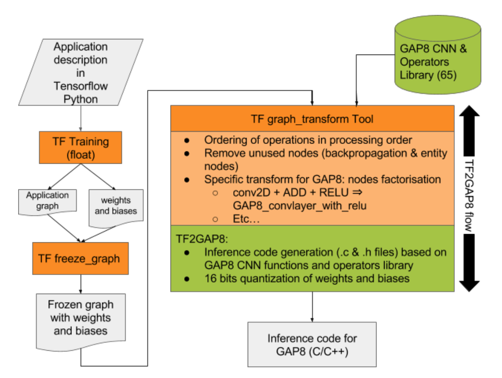
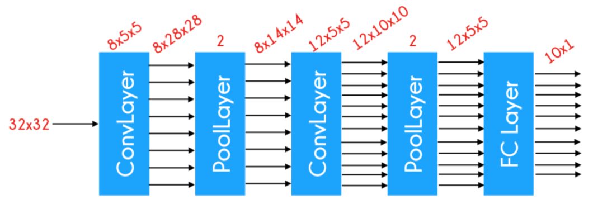
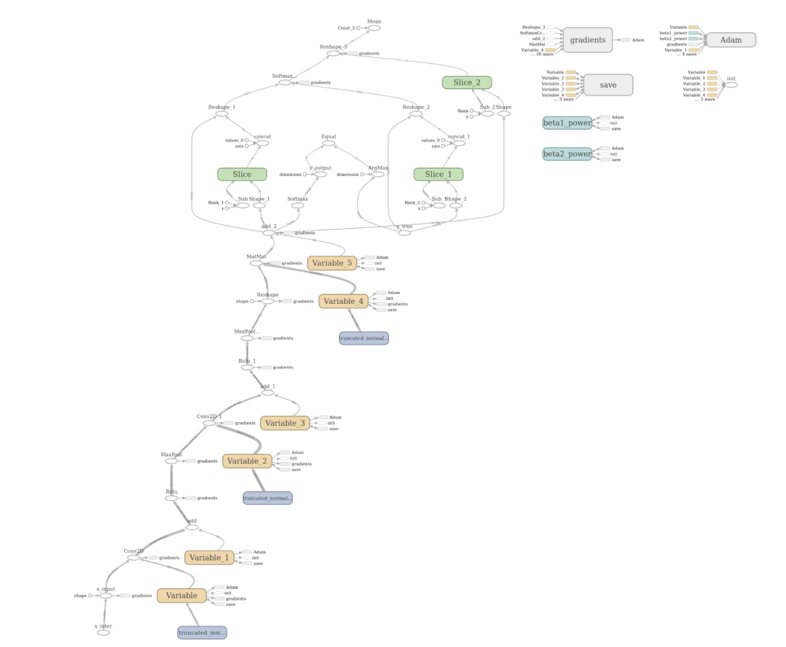

# Introduction

This manual describes the TF2GAP8 tool that we have developed for automatically translating TensorFlow CNN applications to source code for GAP8. This tool is delivered in a virtual machine along with the TensorFlow and GAP8 SDKs that allows you to experiment with the whole work-flow of training your application with TensorFlow, visualizing the graph through TensorBoard, generating the corresponding GAP8 source code via TF2GAP8 flow and simulating this code on the GAP8 SDK.

The TensorFlow version used for this demonstration version of TF2GAP8 is the 1.4 branch for which documentation can be found [here](https://www.tensorflow.org/versions/r1.4/api_docs/).

You should also refer to the GAP8 SDK documentation when reviewing this manual.

# Preparing the TF2GAP environment

To reduce file size we do not include the TensorFlow install in the VM however it is required to execute the examples. Execute the following commands to install it:

~~~~~shell
cd ~/gap_sdk/tf2gap
make install
~~~~~

The script will prompt for the root password with is, by default on the GAP SDK VM, 'gwt2017'.

\newpage

# The TF2GAP8 work-flow 

TF2GAP8 is a tool that we have developed to allow you to be able to automatically generate GAP8 processor source code from a Convolutional Neural Network (CNN) application described using the [TensorFlow r1.4 API](https://www.tensorflow.org/versions/r1.4/api_docs/).

Figure 1 shows the entire development work-flow for an application from its TensorFlow description through to its representation in GAP8 C/C++ source code using the GAP8 CNN and operators library.

The steps are as follows:

+  Training of the TensorFlow CNN application written with TF API and Python
+  Freezing the graph and weights of the TensorFlow application.
+  Using the [TensorFlow Graph Transform Tool](https://goo.gl/33h7ma) to transform the graph to prepare it for the inference phase on the GAP8 processor. The main tasks of this transformation will be to:
    1. Remove the parts of the graph that are not needed for inference
    2. Turn certain sub-expressions into single nodes
    3. Order nodes in processing order for inference
    4. Re-factor some nodes to fit the GAP8 CNN functions Library
+   Inference code generation from the application graph that has been previously transformed, using GAP8 auto-tiler CNN and operators generator library.

## Training the application 

For both sample applications we have included training data in the GAP SDK however you can choose to retrain the examples if you wish.

The application needs to be written in python, using the python TF API V1.2. As an example, please refer to the `~/gap_sdk/tf2gap/examples/cifar10/cifar10.py` or `~/gap_sdk/tf2gap/examples/mnist/mnist.py` files in the Virtual Machine.

When describing your application, TF2GAP8 supports the major TF API V1.2 [Convolutional Neural Network functions](https://www.tensorflow.org/versions/r1.2/api_guides/python/nn):

+ Add
+ Conv2D
+ Softmax
+ Matmul
+ Reshape
+ Relu

During the training process, information about the TensorFlow graph needs to be generated to be used during the processing of the TF2GAP8 flow:

1. A textual protobuf representation of the application graph (file extension `.pbtxt`)
    1. `cifar10.pbtxt` for the CIFAR10 example
    2. `mnist.pbtxt` for the MNIST example
2.  The last model simulation variables of the application (called a checkpoint). This checkpoint is composed of many files: `checkpoint`, `model.ckpt.index`, `model.ckpt.meta`, `model.ckpt.data-00000-of-00001` for example

To generate the protobuf representation of a graph, you must add the following line after the training of your model:

~~~~python
tf.train.write_graph(<your session >.graph.as_graph_def(add_shapes=True),
    '<your data directory>', '<your application name>.pbtxt', as_text=True)
~~~~

For example, for the MNIST application, as we decided to store all data generated in the data directory and the name of our application is "mnist", we added the following line at the end of the MNIST application training:

~~~~python
tf.train.write_graph(session.graph.as_graph_def(add_shapes=True), 
    './data/', 'mnist.pbtxt', as_text=True)
~~~~

To generate model variables (checkpoint), please refer to the TF [Saving and Restoring documentation](https://www.tensorflow.org/programmers_guide/saved_model). 

In the MNIST example, we saved the last step variables (weights and biases) of the trained model by using the following commands after the training loop: 

First create the "saver" variable

~~~~python
saver = tf.train.Saver(sharded=True)
~~~~

Then save the last step 

~~~~python
saver.save(session, './data/model.ckpt')
~~~~

You can start the training of the CIFAR10 example by running the following command in the `~/gap_sdk/tf2gap8/examples/cifar10` directory: 

~~~~bash
$python3 cifar10.py
~~~~

You can start the training in the MNIST example by running the following command in the `~/gap_sdk/tf2gap8/examples/mnist` directory:

~~~~bash
$python3 mnist.py
~~~~

## Running TF2GAP8 flow

After the training of the application has been performed and the necessary graph protobuf file and last checkpoint data has been saved, the build process can be started using the command:

~~~~~shell
make clean all run
~~~~~

NOTE: In this release of the SDK it may be necessary to run this command twice due to a build issue. This will be corrected in a subsequent release.

The Makefile rules to run the different tools used to transform the TensorFlow graph, extract its structure and weights and generate GAP8 code are contained in the file `~/gap_sdk/gen/tf2gap8.mk`. This file defines a macro which is called from the main project Makefile. e.g.

~~~~~make
$(eval $(call tf2gap8_rules,$(CURDIR)/data,mnist.pbtxt, \
  model.ckpt,x_inter,y_output,$(CURDIR)/$(T2G_BUILD_DIR),mnist))
~~~~~

The parameters to this macro are as follows:

+ $1 = Absolute path to the directory with input TensorFlow graph
+ $2 = Input graph filename e.g. mnist.pbtxt
+ $3 = Input graph checkpoint filename prefix e.g. model.ckpt
+ $4 = Input node name e.g. x_inter
+ $5 = Output node name e.g. y_output
+ $6 = Absolute path to the build directory e.g. $(CURDIR)/tfbuild
+ $7 = Make phony target for generation e.g. mnist

Executing this macro will add a PHONY rule mnist which triggers the code generation process.

The process implemented by the macro is as follows:

### Step 1: Freeze_graph Tool

Before running [the Graph Transform Tool](goo.gl/PjYNYk) (GTT) on our graph, it needs to contain the weights and biases of the last training step as they are not stored inside the protobuf file. Instead, they're held in separate checkpoint files, and there are Variable ops in the graph that load the latest values when they are initialized. 

The GTT requires the information to be contained in one file, so the [freeze_graph.py](https://goo.gl/3VUchj) script is used to take a graph definition and a set of checkpoints and freeze them together into a single file. What this does is to load the GraphDef, pull in the values for all the variables from the latest checkpoint file, and then replace each Variable op with a Const that has the numerical data for the weights stored in its attributes. It then strips away all the extraneous nodes that are not used for forward inference, and saves the resulting GraphDef into an output file. 

The freeze_graph tool usually generates a file with a ".pb" suffix. 

### Step 2 : Graph Transform Tool (GTT)

The [GTT](goo.gl/1YFNAS) is a TensorFlow tool that can modify a graph to better run in its final environment. As we are targeting to run the application on GAP8, we might want to shrink the file size by quantizing the weights, or optimize away batch normalization or other training-only features. The Graph Transform framework offers a suite of tools for modifying computational graphs, and a framework to make it easy to write your own modifications.

#### GTT GAP8 Specific Transformations

In this first version of the TF2GAP8 tool, GreenWaves Technologies (GWT) supports the following CNN operations of TensorFlow: 

+ Add
+ Conv2D
+ Softmax
+ Matmul
+ Reshape
+ Relu

In order to match to the operators of the GAP8 CNN Library,  we have added some node factorizations to GTT under different options of the command `--transforms`. During this processing, the following transformations can occur:

|     TensorFlow Operators Combination      | GAP8 Corresponding Operator |
| ----------------------------------------- | --------------------------- |
| Conv2D + ADD + Relu + Maxpool             | GAP8_Conv2D                 |
| Conv2D + ADD + Maxpool                    | GAP8_Conv2D                 |
| conv2D + ADD + RELU                       | GAP8_Conv2D                 |
| conv2D + ADD                              | GAP8_Conv2D                 |
| Reshape + Matmul + ADD + Relu + Softmax   | GAP8_DenseLayer             |
| Reshape + Matmul + ADD + Softmax          | GAP8_DenseLayer             |
| Reshape + Matmul + ADD                    | GAP8_DenseLayer             |

The options of the graph_transform tool corresponding to those fusions are the following ones:

+ fuse_conv2d_add_relu_maxpool
+ fuse_conv2d_add_maxpool
+ fuse_conv2d_add_relu
+ fuse_conv2D_add
+ fuse_reshape_matmul_add_relu_softmax
+ fuse_reshape_matmul_add_softmax
+ fuse_reshape_matmul_add

The TF2GAP8 bridge also applies the following GTT build-in transformations: 

+ strip_unused_nodes
+ remove_nodes(op=Identity)

### Step 3 : GAP8 Source Code Generation

During this phase, the TF2GAP8 tool will read the optimized graph description resulting from the GTT tool transformations and generate the GAP8 source code to be simulated with the GAP8 SDK.

The result of the source code generation will be put in the `./tfbuild/GAP8Code` directory within the example main directory. This will be :

The GAP8Code directory will contain the following files: 
Weights_bias.h
  : contains data structures for storing the weights and Biases
Weights_bias.c
  : contains all the data structures for the weights and biases values of the graph. 
Network_process.c
  : contains the network_process() function, the main function of the inference process.
Define.h
  : contains some constants definitions
Param_layers.h
  : contains data structures storing the parameters of the main NN layers. 

### Quantization

As GAP8 has limited internal memory (512K), it is very important to try to reduce the size of the inference application. As most memory is used for weights and biases the TF2GAP8 tool allows 16 bits quantization of the weights and biases during the GAP8 source code generation phase. In future versions of the TF2GAP8 tool we will provide more flexible options for quantization. Please do not hesitate to contact GreenWaves Technologies support if this is a limitation for you. 

## Simulation on GAP8 SDK

Once the GAP8 source code has been generated, it is run using the command:

~~~~~shell
make run
~~~~~

# Examples

IN the VM We provide you with two examples applications that we have processed through the TF2GAP8 flow. They are located in the `~/gap_sdk/tf2gap8/examples` directory.

## CIFAR10

The first one, CIFAR10 is an image classification application based on [CIFAR10 reference data base](https://www.cs.toronto.edu/~kriz/cifar.html) of 60,000 images that belong in one of the ten image classes represented: Airplane, Automobile, bird, Cat, Deer, Dog, Frog, Horse, Ship, Truck.

All the images are 32 x 32 pixels large coded in RGB. This application CNN structure is represented below: 

As it can be seen on the figure above, the network starts with a convolutional layer with a filter size of 5 and a number of input of 8, then is made a 2 by 2 max-pooling. Followed by another convolutional layer with this time 12 outputs, another 2 by 2 max-pooling and finally and fully connected layer to finish this network.

Note that the third dimension is not specified, actually CIFAR10 is in RGB so the input should be 3 x 32 x 32 and all the output would have an additional dimension of 3, but as our test camera only works in relative luminance level, all the RGB images have been converted to relative luminance images. Thus, the network can be seen as a 3 dimensional TensorFlow but is actually a 4 dimensional one.

It has been implemented in the three files:

+ cifar10.py : the main file with training and evaluation functions
+ cnn.py : creation of the different layers of the CNN
+ data.py : contains the functions for loading the training and test data. 

### Training

To retrain the network, run the following command: 

~~~~bash
python3 cifar10.py
~~~~

For the training, if you didn't change the number of training sets in the cifar10.py file, you should obtain a 64% success rate. Please note that training will take some time.

### CNN Graph Visualization

To visualize the graph after the training, run [Tensorboard](https://www.tensorflow.org/get_started/summaries_and_tensorboard) with the full path of the logs file generated during the training: 

~~~~bash
tensorboard --logdir=/home/gwt/gap_sdk/tf2gap8/examples/cifar10/logs
~~~~

Then, in your browser, type the URL localhost:6006 and you will be able to see the graph of the cifar10 application.

### Generate the code

To run TF2GAP8 and generate the GAP8 source code from the TF representation, enter:

~~~~bash
make all
~~~~

You will find the source code in the GAP8Code directory

### Run the GAP8 simulation

To run the GAP8 simulation for the CIFAR10 example, please use the `make run` command.

~~~~bash
make run
~~~~

### Results

For this inference run, we chose to test the recognition of the first image of the CIFAR10 dataset. Its feature type is 6 (a frog). It corresponds to the image stored in the cifr10/test_images/test_0_6.c file. By vizualizing the corresponding test_0_6.pgm file, you can see that it's a frog. 

At the end of the inference run, you should see the following results. A score is displayed in front of each feature type of the CIFAR10 data set (car, truck, etc..). The feature type with the highest score determines the category of the test image. A frog (feature 6) has been successfully recognized. 

~~~~bash
============> cycles 191138

 feat 0: 116  
  feat 1: 3655  
  feat 2: 8151  
  feat 3: 13142  
  feat 4: 5713 
  feat 5: 12971  
  feat 6: 20426  
  feat 7: 4801
  feat 8: 896  
  feat 9: 0  
 found 6
Detected end of application, exiting with status: 0
~~~~

Note that it could happen that one image is not correctly recognized as the success rate obtained after the training phase is only 64%. 

By copying other .c files from the test-images directory to the cifar10/l2_x_cifar10.c directory, you can test other images. The "y" variable of a test_x_y.c image file represents the class number of the image (cifar10 dataset has 10 classes). The corresponding .pgm file represents the image in PGM format. 

## MNIST

MNIST is another reference test. This time, the goal is to recognize handwritten numbers. The MNIST network is similar to the CIFAR10 one.

First,  there is a convolutional layer of 32 5 x 5 filters, then a 2 x 2 pooling layer. Then, the network expands itself with 64 5 x 5 filters on a second convolutional layer, a 2 x 2 max-pooling and a dense layer with 10 outputs for the prediction.

The example has been implemented in the following python files:

+ mnist.py: main training source code
+ cnn.py: source code for creating the different layers

### Training

For training, run the following command: 

~~~~bash
python3 mnist.py
~~~~

For the training, if you didn't change the number of training sets in the mnist.py file, you should obtain a 98% success rate. 

### CNN Graph Visualization

To visualize the graph after the training, run [Tensorboard](https://www.tensorflow.org/get_started/summaries_and_tensorboard) with the full path of the logs file generated during the training: 

~~~~bash
tensorboard --logdir=/home/gwt/gap_sdk/tf2gap8/examples/mnist/logs
~~~~

This visualization will show the following application graph. Clicking on the nodes will give you detailed information of the node. 

### Run TF2GAP8

To run TF2GAP8 and generate the GAP8 source code from the TF representation, and run the simulation enter:

~~~~bash
make clean all run
~~~~

You can find the source code in the 'tfbuild/GAP8Code' directory.

### Results

For this inference run, we chose to test the recognition of the first hand written digit of the MNIST data set that happens to be a 5

At the end of the inference run, you should see the following results. A score is displayed in front of each digit type of the MNIST data set (0, 1, 2, etc..). The digit type with the highest score determines the category of the test image. The digit "5" (score -1213) has been successfully recognized. 

~~~~bash
 ============> cycles 1626122

 feat 0: -16003  
  feat 1: -15541  
  feat 2: -7852  
  feat 3: -7584  
  feat 4: -24881  
  feat 5: -9739 
  feat 6: -31061  
  feat 7: 7861  
  feat 8: -14895  
  feat 9: -8855 
 found (7)
Detected end of application, exiting with status: 0
~~~~

Note that the success rate of the corresponding training being 98%, it could happen that some handwritten digits are not well recognized. This would be a normal result. 

