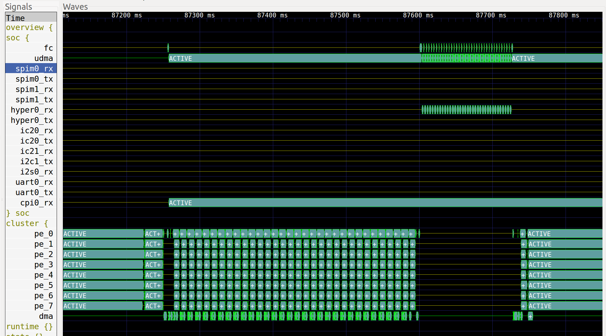
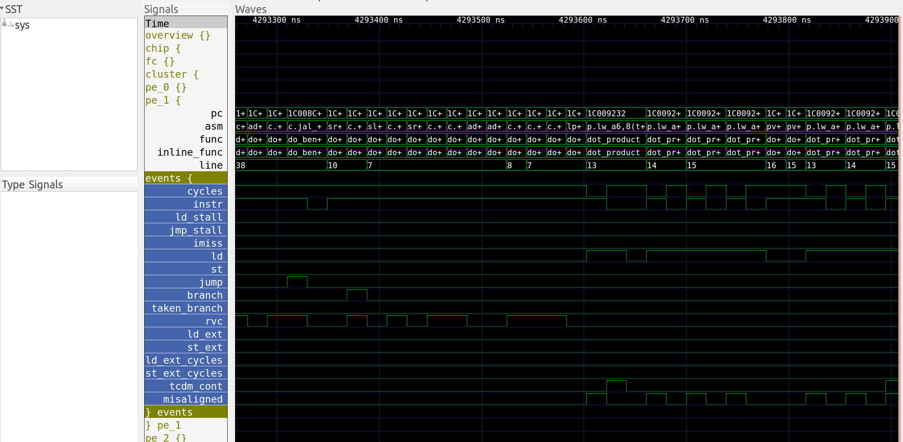

VCD traces
----------

The virtual platform can dump VCD traces which show the state of several components over the time, like the cores PC, the DMA transfers, etc, and thus gives a better overview than the system traces.

Configuration
.............

VCD tracing can be activated through option *\-\-vcd*: ::

  pulp-run --platform=gvsoc --config=gap_rev1 --binary=test prepare run --vcd

Once the platform is run, this will generate a VCD file called *all.vcd* in the build folder. This file is a raw file containing all the signals value.

Another file called *view.gtkw* is generated and can be opened using Gtkwave. This is a script file which will setup the view with the most interesting signals. The command to be executed is displayed at the beginning of the simulation when VCD traces are enabled.

Trace format
............

The default format is the FST gtkwave format, as it is much faster and smaller than VCD. However, it is less robust and can make Gtkwave crash. The following option can be used to change the format to VCD: ::

  pulp-run --platform=gvsoc --config=gap_rev1 --binary=test prepare run --vcd --event-format=vcd

Display
.......

Any VCD viewer can be used to display the traces. On Linux the free Gtkwave viewer can be used. For example to display the PC traces, you can launch it with: ::

  gtkwave <vcd file path>

Then click on Search->Search Signal Regexp, enter "pc", click on Select All and Insert, and close the box. You should now see the PC traces in the view, you can zoom out to see the full window.

It is also possible to open the generated script file mentioned above with this command: ::

  gtkwave <script path>

Trace selection
...............

More traces can be activated by either specifying trace tags or names. Tags will activate a set of traces while names will activate specific traces.

Tags can be activated with the option *\-\-event-tag=<name>*. This option can be given several times to specify several tags. The tag *overview* is always selected, and others can be selected from this list: debug, asm, pc, core_events, clock.

Here is an example: ::

  pulp-run --platform=gvsoc --config=gap_rev1 --binary=test prepare run --vcd --event-tag=debug --event-tag=core_events

Specific events can be selected with the option *\-\-event=<name*. This option can be given several times to specify several traces. Like for system traces, the name is a regular expression which will be compared against the path of each trace. Any trace which will match the regular expression will be enabled.

Here is an example to activate all traces: ::

  pulp-run --platform=gvsoc --config=gap_rev1 --binary=test prepare run --vcd --event-tag=debug --event=.*

View description
................

The view displayed from the Gtkwave script is made of 2 parts.

The first part, on the top (see the image below), is showing an overview of the execution with the most useful signals. It basically shows the state of each important block in the system. This is useful to quickly check what is being executed in the whole system.

Some groups of this part are by default closed, and can be opened by double-clicking on them, like the group *stats* which shows the number of instructions per cycle (IPC) for each core. This number is an average and can be slightly shifted with respect to the instructions executed.

The second (see the image below), is showing a more detailed view of the execution (additional tags or traces must be specified). The program counter is shown, with also debug information about the function being executed, the disassembled instructions and so on. For each core, a group called *events* contained information about the state of the core (stalls, loads, instructions, etc). This is useful to understand why a core is being stalled.

Interactive mode
................

In case the trace file becomes too big, it is possible to open gtkwave in interactive mode so that it is getting the traces in real time. For that launch the platform with this option: ::

  pulp-run --platform=gvsoc --config=gap_rev1 --binary=test prepare run --event=.* --gtkw

This will automatically open Gtkwave and the traces are automatically updated.
