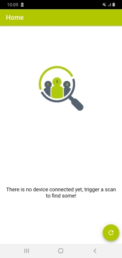
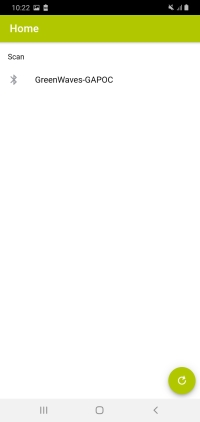
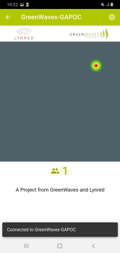
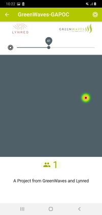

# Occupancy Management on GAP8 with Lynred ThermEye

# Getting Started

At this link you can find the **android application** that connects to the board and shows the people detection:

https://drive.google.com/file/d/1JKyn6CHFynOI8ym8vJu0uJacWb1q4RUS/view?usp=sharing

To install it you need need to enable unknown source in your android smartphone.

# Running the demonstrator on pre-flahed GAPoC B boards

To reproduce the demo on the board:

1. **Turn on the GAPoC B board with the on/off switch**.

The board can be power with a 3 pack of 1.2 Volts AA batteries or with a single 3.6 Volts AA battery. For reliability reasons, on this board **we would recommend using a 3.6V lithium battery** inserted in the on-board single AA holder. A suitable reference is SAFT LS14500 [available from Amazon or component distributors such as Farnell or Mouser]

2. **Open the android application and look for devices with the search button.**

3. **You should see the GAPoC B BLE in the list of devices. If this doesn't happen, push the button reset on the board and try again.**

4. **Once the android application is connected you should be able to see the people detected.**

In the main screen you have a button on the top right corner to set the detection threshold of the algorithm. You can use it to properly set it to your environment. The best value should be around 45.

The higher the value the less false positives. In other words you are filtering the detection by the confidence that the algorithm gives to them.
