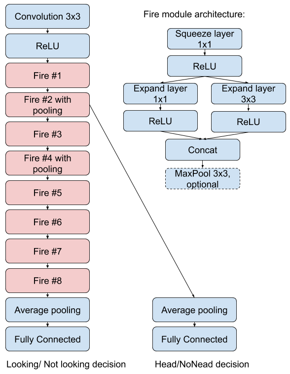

# HEAD Pose Detection

This application implements a squeezenet based NN for Head Classification and look/no-look classification.

## Run the project
To change the tflite model to build change the "MODEL_TFLITE" variable in the Makefile (emul.mk for the emul version).

See the models/nntool_script_quant_tflite to inspect and change the settings of the AT model. If the model.tflite is already a quantized tflite graph you will not need to run the aquant command. To build the AT model run:

	make model

it will execute nntool to create the AT model code and run it to generate the final inference network code which you will see in the BUILD_MODEL_SQ8BIT folder.

See also "APP_CFLAGS" variable for the extra settings like frequency and peripheral (i.e. if you do not have an LCD eliminate "-DHAVE_LCD").

The main.c file is the application run on the platform for the DEMO. After the initialization of all the needed peripherals, the main loop starts. It operates in this way:
	- read an image (from camera if HAVE_HIMAX is defined otherwise from file, add different camera devices if needed)
	- resize the image to the intermediate size (NEW_WIDTH, NEW_HEIGHT)
	- crop the image to the network input size 128x128 --> [NOTE: the intermediate size is a tradeoff between how much you want to zoom the centered objects and the borders that you will get rid of]
	- move the image to L3 (so we can free the allocated L2 memory)
	- construct the graph (allocate all the L2 tensors needed during inference) --> [this step needs to be done here where you have mostly of your L2 free]
	- launch inference on the cluster
	- get the result and accumulate in a temporal vector which will be averaged over multiple inference [ENSEMBLE_ITERATIONS] \(even only 1 if this feature is not needed, it should increase your predicted confidence)
	- Destruct the network, i.e. deallocate the allocated buffers for the inference.

# Emul

	make -f emul.mk clean all

will build your application for x86 execution. It will generate an executable file "vww17_emul" which can be run with:

	./vww17_emul img/path.ppm

It executes the code in main_emul.c. Basically it is the same as main.c but without a continuous loop (it applies inference only on one image at the time) and always reading the image from your file system. If the image file is already resized to 128x128 you need to define ALREADY_RESIZED otherwise it will run the GAP resizer, as it does in the real application.

# Accuracy

Once you generated the executable you can asses accuracy over a specific dataset. evaluation_with_emul.py launches the indicated executable on batch over a list of images in a specific folder and prints out the confusion matrix on head/no head and look/no look predictions:
	
	python3 evaluation_with_emul.py vww17_emul --dataset_path=path/to/dataset

NOTE: the dataset must have the following structure and the images must be in the .ppm format with a fixed size specified in the main_emul.c (INPUT_WIDTH and INPUT_HEIGHT):

	dataset
	├── looking
	├── looking_away
	└── no_person

You can also test the accuracy of the original tflite model:

	python3 evaluation_with_tflite.py path/to/model.tflite --dataset_path=path/to/dataset

NOTE: you can set a threshold for both head and look prediction under which you don't consider a true prediction. To set it change the value maually in the evaluation_with_*.py scripts