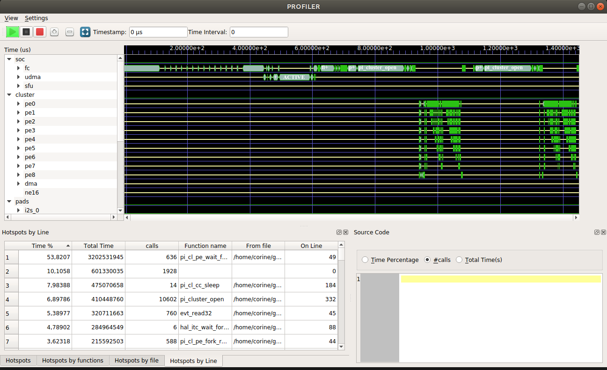

.. _starting:

Starting the Gvsoc Simulation
=============================

For starting the Gvsoc simulation, just click on the green arrow button on the left of the actions bar. The simulation can be paused by clicking on the black square button. It can be continued by re-clicking on the green arrow. 

The simulation can be cancelled by clicking on the red square button. It can be started again by clicking on the green arrow. 

**Fig2: Profiler Actions Bar**

During the simulation, the GAP9 signals are displayed on the Timeline Window as soon as they are transmitted by the Gvsoc simulator.
Two dock windows are simultaneoulsy displayed: 

- The Hotspots dock window with its different tab views (by time, by function, by file, by line) 
- The Source code dock window, which is empty at this stage

