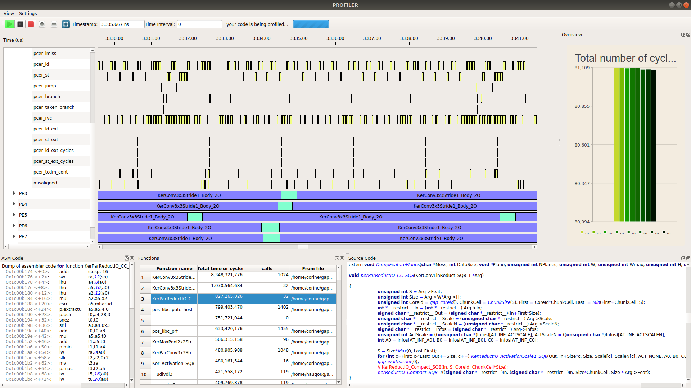
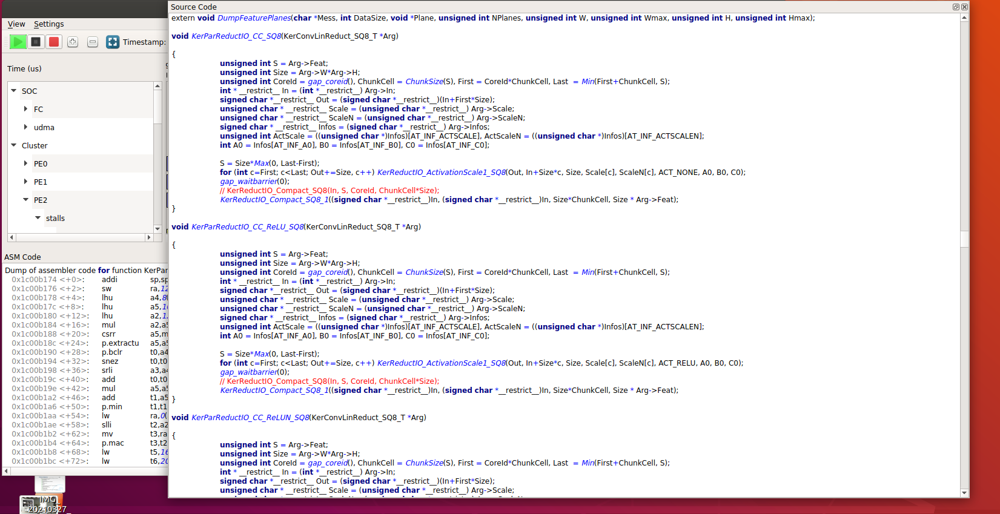

.. _windows:

Other Profiler Windows
======================

Around the central Profiler Window, which comprises the Signals Tree , the Timeline and the Signals Time up statistics (optional) windows, many other dock windows can be displayed. Whether they show up or not can be monitored by the user through the View Menu. 

This menu displays the name of all those optional windows, along with a button that can be checked or not by the user, depending on whether he wants this window to show up or not. 

* Overview

* Functions

* Source Code

* ASM Code

* Signals Statistics

Additionally, each of those dock windows is independent and can be:

* Moved in some location around the central Profiler Window by left clicking on the window bar and moving the mouse

* Moved outside the profiler window by left clicking on the window bar and moving the mouse

* Expanded by left clicking on its edges

* Closed by clicking on the "cross button “ on its upper right corner

**Fig 13: Dock Windows Placement within the profiler window**

**Fig 14: Source code Dock Window independent placement above the Profiler window**

.. toctree::
   :maxdepth: 2
   :caption: Contents:
   
   overview 
   functions
   source_code
   asm_code
   